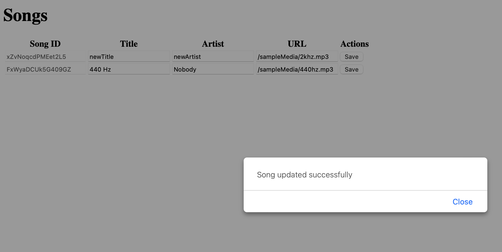

- [README.txt](https://github.students.cs.ubc.ca/CPSC304-2023W-T1/project_p8z8g_u0z5v_v2u0q/blob/main/milestones/README.txt)

# SQL script
(also at setup.sql)
```SQL
--Drop tables
DROP TABLE Comments;
DROP TABLE Listings;
DROP TABLE ProductCategories;
DROP TABLE Messages;
DROP TABLE Blocks;
DROP TABLE Follows;

DROP TABLE UserPosts;
DROP TABLE Likes;
DROP TABLE Media;
DROP TABLE Posts;
DROP TABLE Songs;
DROP TABLE AdShowing;
DROP TABLE AdRoles;
DROP TABLE Advertisements;
DROP TABLE MessageGroupMembers;
DROP TABLE MessageGroups;
DROP TABLE Users;
DROP TABLE Zodiac;
DROP TABLE Locations;
DROP TABLE Regions;

--Create tables
CREATE TABLE Regions(
    Latitude NUMBER(15, 12),
    Longitude NUMBER(15, 12),
    City VARCHAR2(256),
    Country VARCHAR2(256),
    PRIMARY KEY (Latitude, Longitude)
);

CREATE TABLE Locations(
    LocationID CHAR(16) PRIMARY KEY,
    LocationName VARCHAR2(64) NOT NULL,
    Latitude NUMBER(15, 12) NOT NULL,
    Longitude NUMBER(15, 12) NOT NULL,
    Altitude NUMBER(15, 12),
    UNIQUE (LocationName, Latitude, Longitude, Altitude),
    FOREIGN KEY (Latitude, Longitude) REFERENCES Regions(Latitude, Longitude) ON DELETE CASCADE
);

CREATE TABLE Zodiac(
    Birthday DATE PRIMARY KEY,
    Zodiac INTEGER
);

CREATE TABLE Users(
    UserID CHAR(16) PRIMARY KEY,
    Username VARCHAR2(32) UNIQUE,
    DisplayName VARCHAR2(32),
    Bio VARCHAR2(4000),
    PasswordHash CHAR(60) UNIQUE NOT NULL,
    IsAdmin INTEGER NOT NULL,
    LocationID CHAR(16),
    Birthday DATE,
    FOREIGN KEY (LocationID) REFERENCES Locations(LocationID) ON DELETE SET NULL,
    FOREIGN KEY (Birthday) REFERENCES Zodiac(Birthday)
);

CREATE TABLE MessageGroups(
    MessageGroupID CHAR(16) PRIMARY KEY,
    MessageGroupName VARCHAR2(32)
);

CREATE TABLE MessageGroupMembers(
    MessageGroup CHAR(16),
    UserID CHAR(16),
    PRIMARY KEY (MessageGroup, UserID),
    FOREIGN KEY (MessageGroup) REFERENCES MessageGroups(MessageGroupID) ON DELETE CASCADE,
    FOREIGN KEY (UserID) REFERENCES Users(UserID) ON DELETE CASCADE
);

CREATE TABLE Advertisements(
    AdID CHAR(16) PRIMARY KEY,
    ImageURL VARCHAR2(512) NOT NULL,
    ClickURL VARCHAR2(512) NOT NULL,
    RemainingViews INTEGER NOT NULL
);

CREATE TABLE AdRoles(
    UserID CHAR(16),
    AdID CHAR(16),
    "Role" INTEGER NOT NULL,
    PRIMARY KEY (UserID, AdID),
    FOREIGN KEY (UserID) REFERENCES Users(UserID) ON DELETE CASCADE,
    FOREIGN KEY (AdID) REFERENCES Advertisements(AdID) ON DELETE CASCADE
);

CREATE TABLE AdShowing(
    AdShowingID CHAR(16),
    "Time" DATE NOT NULL,
    Clicked INTEGER NOT NULL,
    AdID CHAR(16),
    UserID CHAR(16),
    PRIMARY KEY (AdShowingID, AdID, UserID),
    FOREIGN KEY (AdID) REFERENCES Advertisements(AdID) ON DELETE CASCADE,
    FOREIGN KEY (UserID) REFERENCES Users(UserID) ON DELETE CASCADE
);

CREATE TABLE Songs(
    SongID CHAR(16) PRIMARY KEY,
    SongTitle VARCHAR2(32) NOT NULL,
    Artist VARCHAR2(32) NOT NULL,
    "URL" VARCHAR2(512) UNIQUE NOT NULL
);

CREATE TABLE Posts(
    PostID CHAR(16) PRIMARY KEY,
    "Time" DATE NOT NULL,
    Caption VARCHAR2(4000),
    LocationID CHAR(16),
    Expires DATE,
    SongID CHAR(16),
    FOREIGN KEY (LocationID) REFERENCES Locations(LocationID) ON DELETE SET NULL,
    FOREIGN KEY (SongID) REFERENCES Songs(SongID) ON DELETE SET NULL
);

CREATE TABLE Media(
    MediaID CHAR(16),
    "URL" VARCHAR2(512) NOT NULL,
    PostID CHAR(16),
    UserID CHAR(16),
    "Index" INTEGER NOT NULL,
    "Type" VARCHAR2(32) NOT NULL,
    PRIMARY KEY (MediaID, PostID),
    UNIQUE (PostID, "Index"),
    FOREIGN KEY (PostID) REFERENCES Posts(PostId) ON DELETE CASCADE,
    FOREIGN KEY (UserID) REFERENCES Users(UserID) ON DELETE CASCADE
);

CREATE TABLE Likes(
    UserID CHAR(16),
    PostID CHAR(16),
    PRIMARY KEY (UserID, PostID),
    FOREIGN KEY (UserID) REFERENCES Users(UserID) ON DELETE CASCADE,
    FOREIGN KEY (PostID) REFERENCES Posts(PostID) ON DELETE CASCADE
);

CREATE TABLE UserPosts(
    UserID CHAR(16),
    PostID CHAR(16),
    "Role" INTEGER NOT NULL,
    PRIMARY KEY (UserID, PostID),
    FOREIGN KEY (UserID) REFERENCES Users(UserID) ON DELETE CASCADE,
    FOREIGN KEY (PostID) REFERENCES Posts(PostID) ON DELETE CASCADE
);

CREATE TABLE Follows(
    Follower CHAR(16),
    "Following" CHAR(16),
    PRIMARY KEY (Follower, "Following"),
    FOREIGN KEY (Follower) REFERENCES Users(UserID) ON DELETE CASCADE,
    FOREIGN KEY ("Following") REFERENCES Users(UserID) ON DELETE CASCADE
);

CREATE TABLE Blocks(
    Blocker CHAR(16),
    Blocked CHAR(16),
    PRIMARY KEY (Blocker, Blocked),
    FOREIGN KEY (Blocker) REFERENCES Users(UserID) ON DELETE CASCADE,
    FOREIGN KEY (Blocked) REFERENCES Users(UserID) ON DELETE CASCADE
);

CREATE TABLE Messages(
    MessageID CHAR(16),
    "Time" DATE NOT NULL,
    "Text" LONG NOT NULL,
    MessageGroup CHAR(16),
    Sender CHAR(16) NOT NULL,
    ReplyTo CHAR(16),
    PRIMARY KEY (MessageID, MessageGroup),
    FOREIGN KEY (MessageGroup) REFERENCES MessageGroups(MessageGroupID) ON DELETE CASCADE,
    FOREIGN KEY (Sender) REFERENCES Users(UserID) ON DELETE SET NULL,
    FOREIGN KEY (ReplyTo) REFERENCES Posts(PostID) ON DELETE SET NULL
);

CREATE TABLE ProductCategories(
    ProductCategoryID CHAR(16) PRIMARY KEY,
    ProductCategoryName VARCHAR2(32) NOT NULL
);

CREATE TABLE Listings(
    PostID CHAR(16) PRIMARY KEY,
    ListingTitle VARCHAR2(32) NOT NULL,
    Price INTEGER NOT NULL,
    ProductCategoryID CHAR(16) NOT NULL,
    FOREIGN KEY (PostID) REFERENCES Posts(PostID) ON DELETE CASCADE,
    FOREIGN KEY (ProductCategoryID) REFERENCES ProductCategories(ProductCategoryID) ON DELETE SET NULL
);

CREATE TABLE Comments(
    CommentID CHAR(16),
    "Time" DATE NOT NULL,
    "Text" LONG NOT NULL,
    UserID CHAR(16) NOT NULL,
    PostID CHAR(16),
    PRIMARY KEY (CommentID, PostID),
    FOREIGN KEY (UserID) REFERENCES Users(UserID) ON DELETE CASCADE,
    FOREIGN KEY (PostID) REFERENCES Posts(PostID) ON DELETE CASCADE
);

--Populate tables
--Locations
INSERT INTO Regions(Latitude, Longitude, City, Country)
    VALUES (49.2666155, -123.2526006, 'Vancouver, BC', 'Canada');
INSERT INTO Locations(LocationID, LocationName, Latitude, Longitude)
    VALUES ('7rvn832cn01z18HA', 'AMS Nest', 49.2666155, -123.2526006);
INSERT INTO Regions(Latitude, Longitude, City, Country)
    VALUES (49.2778358, -123.1088227, 'Vancouver, BC', 'Canada');
INSERT INTO Locations(LocationID, LocationName, Latitude, Longitude)
    VALUES ('oqpxYMSGyj2z2EbQ', 'Rogers Arena', 49.2778358, -123.1088227);
INSERT INTO Regions(Latitude, Longitude, City, Country)
    VALUES (37.6191671, -122.3816108, 'Millbrae, CA', 'United States');
INSERT INTO Locations(LocationID, LocationName, Latitude, Longitude)
    VALUES ('2P8oHqP0AkcZypRx', 'San Francisco International Airport', 37.6191671, -122.3816108);

--Product categories
INSERT INTO ProductCategories(ProductCategoryID, ProductCategoryName)
    VALUES ('oea24GvBIWyXXsyO', 'Electronics');
INSERT INTO ProductCategories(ProductCategoryID, ProductCategoryName)
    VALUES ('7kjC97fcXbo0tvzN', 'Collectibles');
INSERT INTO ProductCategories(ProductCategoryID, ProductCategoryName)
    VALUES ('WM6Zm3PB8fMTtnjW', 'Vehicles');

--Songs
INSERT INTO Songs(SongID, SongTitle, Artist, "URL")
    VALUES ('xZvNoqcdPMEet2L5', '2 kHz', 'Nobody', '/sampleMedia/2khz.mp3');
INSERT INTO Songs(SongID, SongTitle, Artist, "URL")
    VALUES ('FxWyaDCUk5G409GZ', '440 Hz', 'Nobody', '/sampleMedia/440hz.mp3');

--Admin accounts for all collaborators, passwords are 1234
--TODO add locations and birthdays
INSERT INTO Users(UserID, Username, DisplayName, Bio, PasswordHash, IsAdmin)
    VALUES ('IyGj2UbaelBweKAU', 'bruce', 'Bruce', 'CPSC 304 student', '$2b$12$687MkkgRcOjydCiZaZgpx.gVm5u10cNrKiFYWwYwiK/AIXbMh3OAO', 1);
INSERT INTO Users(UserID, Username, DisplayName, Bio, PasswordHash, IsAdmin)
    VALUES ('VSCpGjK9iXJXj2NQ', 'banu', 'Banu', 'CPSC 304 student', '$2b$12$yD5WWaePc2nKUfe1QJJl2OFlmvOIxKNLOmPtvFqsv0Luq6VGIc222', 1);
INSERT INTO Users(UserID, Username, DisplayName, Bio, PasswordHash, IsAdmin)
    VALUES ('hLOndHN7ojKxuUpj', 'ege', 'Ege', 'CPSC 304 student', '$2b$12$rHbhSkTmBqQ7TBqZqkQSFuMW18u50zN0yJ2gpxoMHIjAcka5l/kvm', 1);
--Bruce follows Banu and Ege, Banu and Ege follow each other but not Bruce (to test filtering)
INSERT INTO Follows(Follower, "Following")
    VALUES ('IyGj2UbaelBweKAU', 'VSCpGjK9iXJXj2NQ');
INSERT INTO Follows(Follower, "Following")
    VALUES ('IyGj2UbaelBweKAU', 'hLOndHN7ojKxuUpj');
INSERT INTO Follows(Follower, "Following")
    VALUES ('VSCpGjK9iXJXj2NQ', 'hLOndHN7ojKxuUpj');
INSERT INTO Follows(Follower, "Following")
    VALUES ('hLOndHN7ojKxuUpj', 'VSCpGjK9iXJXj2NQ');

--Two ads, with 5 viewings purchased, but not viewed yet.
INSERT INTO Advertisements(AdID, ImageURL, ClickURL, RemainingViews)
    VALUES ('gvHzqXK7PpWeRfTj', '/sampleMedia/take304.png', 'https://ubccsss.org/services/courses/cpsc-304/', 5);
INSERT INTO Advertisements(AdID, ImageURL, ClickURL, RemainingViews)
    VALUES ('5Gn5iBvnYKPVrYbG', '/sampleMedia/useLinux.png', 'https://fedoraproject.org/', 5);
--The ads were created by Bruce, with Banu and Ege invited as collaborators
INSERT INTO AdRoles(UserID, AdID, "Role")
    VALUES ('IyGj2UbaelBweKAU', 'gvHzqXK7PpWeRfTj', 2);
INSERT INTO AdRoles(UserID, AdID, "Role")
    VALUES ('IyGj2UbaelBweKAU', '5Gn5iBvnYKPVrYbG', 2);
INSERT INTO AdRoles(UserID, AdID, "Role")
    VALUES ('VSCpGjK9iXJXj2NQ', 'gvHzqXK7PpWeRfTj', 0);
INSERT INTO AdRoles(UserID, AdID, "Role")
    VALUES ('VSCpGjK9iXJXj2NQ', '5Gn5iBvnYKPVrYbG', 0);
INSERT INTO AdRoles(UserID, AdID, "Role")
    VALUES ('hLOndHN7ojKxuUpj', 'gvHzqXK7PpWeRfTj', 0);
INSERT INTO AdRoles(UserID, AdID, "Role")
    VALUES ('hLOndHN7ojKxuUpj', '5Gn5iBvnYKPVrYbG', 0);

--Two posts per user, each with two images.
--TODO add locations
--Bruce's posts
INSERT INTO Posts(PostID, "Time", Caption)
    VALUES ('vhDNgXkI8U9EdCaA', TO_DATE('2023-11-11', 'YYYY-MM-DD'), 'First post!');
INSERT INTO UserPosts(UserID, PostID, "Role")
    VALUES ('IyGj2UbaelBweKAU', 'vhDNgXkI8U9EdCaA', 2);
INSERT INTO Media(MediaID, "URL", PostID, UserID, "Index", "Type")
    VALUES ('zYTe82i0hSKpjSr3', '/sampleMedia/bruce-1.1.png', 'vhDNgXkI8U9EdCaA', 'IyGj2UbaelBweKAU', 1, 'image/png');
INSERT INTO Media(MediaID, "URL", PostID, UserID, "Index", "Type")
    VALUES ('kFDzKkxhGyPaafYC', '/sampleMedia/bruce-1.2.png', 'vhDNgXkI8U9EdCaA', 'IyGj2UbaelBweKAU', 2, 'image/png');
INSERT INTO Posts(PostID, "Time", Caption)
    VALUES ('icQX8mTGz8MikqmM', TO_DATE('2023-11-12', 'YYYY-MM-DD'), 'Bruce''s second post!');
INSERT INTO UserPosts(UserID, PostID, "Role")
    VALUES ('IyGj2UbaelBweKAU', 'icQX8mTGz8MikqmM', 2);
INSERT INTO Media(MediaID, "URL", PostID, UserID, "Index", "Type")
    VALUES ('cCbMQsPRZevCiVsd', '/sampleMedia/bruce-2.1.png', 'icQX8mTGz8MikqmM', 'IyGj2UbaelBweKAU', 1, 'image/png');
INSERT INTO Media(MediaID, "URL", PostID, UserID, "Index", "Type")
    VALUES ('3pAejXSB0jxiVgnx', '/sampleMedia/bruce-2.2.png', 'icQX8mTGz8MikqmM', 'IyGj2UbaelBweKAU', 2, 'image/png');
--Second post has Banu and Ege invited as collaborators
INSERT INTO UserPosts(UserID, PostID, "Role")
    VALUES ('VSCpGjK9iXJXj2NQ', 'icQX8mTGz8MikqmM', 0);
INSERT INTO UserPosts(UserID, PostID, "Role")
    VALUES ('hLOndHN7ojKxuUpj', 'icQX8mTGz8MikqmM', 0);
--Banu's posts
INSERT INTO Posts(PostID, "Time", Caption)
    VALUES ('GIMNEZsNvW6Cbhsk', TO_DATE('2023-11-11', 'YYYY-MM-DD'), 'First post!');
INSERT INTO UserPosts(UserID, PostID, "Role")
    VALUES ('VSCpGjK9iXJXj2NQ', 'GIMNEZsNvW6Cbhsk', 2);
INSERT INTO Media(MediaID, "URL", PostID, UserID, "Index", "Type")
    VALUES ('Xg2UuTYhrPnzPaOo', '/sampleMedia/banu-1.1.png', 'GIMNEZsNvW6Cbhsk', 'VSCpGjK9iXJXj2NQ', 1, 'image/png');
INSERT INTO Media(MediaID, "URL", PostID, UserID, "Index", "Type")
    VALUES ('w6gjUI7gglnvZ95Z', '/sampleMedia/banu-1.2.png', 'GIMNEZsNvW6Cbhsk', 'VSCpGjK9iXJXj2NQ', 2, 'image/png');
INSERT INTO Posts(PostID, "Time", Caption)
    VALUES ('oTDRs1lMgiQ7xQDb', TO_DATE('2023-11-12', 'YYYY-MM-DD'), 'Banu''s second post!');
INSERT INTO UserPosts(UserID, PostID, "Role")
    VALUES ('VSCpGjK9iXJXj2NQ', 'oTDRs1lMgiQ7xQDb', 2);
INSERT INTO Media(MediaID, "URL", PostID, UserID, "Index", "Type")
    VALUES ('NOgsgHwJGKOufAWg', '/sampleMedia/banu-2.1.png', 'oTDRs1lMgiQ7xQDb', 'VSCpGjK9iXJXj2NQ', 1, 'image/png');
INSERT INTO Media(MediaID, "URL", PostID, UserID, "Index", "Type")
    VALUES ('5XI0sVa887F1ZY78', '/sampleMedia/banu-2.2.png', 'oTDRs1lMgiQ7xQDb', 'VSCpGjK9iXJXj2NQ', 2, 'image/png');
--Second post has Bruce as an accepted collaborator
INSERT INTO UserPosts(UserID, PostID, "Role")
    VALUES ('IyGj2UbaelBweKAU', 'oTDRs1lMgiQ7xQDb', 1);
--Ege's posts
INSERT INTO Posts(PostID, "Time", Caption)
    VALUES ('B2U4rfpslWT8MsLA', TO_DATE('2023-11-11', 'YYYY-MM-DD'), 'First post!');
INSERT INTO UserPosts(UserID, PostID, "Role")
    VALUES ('hLOndHN7ojKxuUpj', 'B2U4rfpslWT8MsLA', 2);
INSERT INTO Media(MediaID, "URL", PostID, UserID, "Index", "Type")
    VALUES ('ijAlQXkbaEkaBDLp', '/sampleMedia/ege-1.1.png', 'B2U4rfpslWT8MsLA', 'hLOndHN7ojKxuUpj', 1, 'image/png');
INSERT INTO Media(MediaID, "URL", PostID, UserID, "Index", "Type")
    VALUES ('KLvaztnIJ4zcRkwV', '/sampleMedia/ege-1.2.png', 'B2U4rfpslWT8MsLA', 'hLOndHN7ojKxuUpj', 2, 'image/png');
INSERT INTO Posts(PostID, "Time", Caption)
    VALUES ('AYVlifYcUJXfnonl', TO_DATE('2023-11-12', 'YYYY-MM-DD'), 'Ege''s second post!');
INSERT INTO UserPosts(UserID, PostID, "Role")
    VALUES ('hLOndHN7ojKxuUpj', 'AYVlifYcUJXfnonl', 2);
INSERT INTO Media(MediaID, "URL", PostID, UserID, "Index", "Type")
    VALUES ('BwTtp0so3ndoIMIY', '/sampleMedia/ege-2.1.png', 'AYVlifYcUJXfnonl', 'hLOndHN7ojKxuUpj', 1, 'image/png');
INSERT INTO Media(MediaID, "URL", PostID, UserID, "Index", "Type")
    VALUES ('AYWfV0OIHuZ8hHQ9', '/sampleMedia/ege-2.2.png', 'AYVlifYcUJXfnonl', 'hLOndHN7ojKxuUpj', 2, 'image/png');

--Expired and current stories for each user
--Bruce
INSERT INTO Posts(PostID, "Time", Expires, SongID)
    VALUES ('mXo3SLlWcNfM05C3', TO_DATE('2022-01-01', 'YYYY-MM-DD'), TO_DATE('2022-01-02', 'YYYY-MM-DD'), 'xZvNoqcdPMEet2L5');
INSERT INTO UserPosts(UserID, PostID, "Role")
    VALUES ('IyGj2UbaelBweKAU', 'mXo3SLlWcNfM05C3', 2);
INSERT INTO Media(MediaID, "URL", PostID, UserID, "Index", "Type")
    VALUES ('Iz8gWxUQAGoLdlaY', '/sampleMedia/bruce-expired.png', 'mXo3SLlWcNfM05C3', 'IyGj2UbaelBweKAU', 1, 'image/png');
INSERT INTO Posts(PostID, "Time", Expires, songID)
    VALUES ('0DjFnHijmfErYoFq', TO_DATE('2023-11-15', 'YYYY-MM-DD'), TO_DATE('3023-11-15', 'YYYY-MM-DD'), 'xZvNoqcdPMEet2L5');
INSERT INTO UserPosts(UserID, PostID, "Role")
    VALUES ('IyGj2UbaelBweKAU', '0DjFnHijmfErYoFq', 2);
INSERT INTO Media(MediaID, "URL", PostID, UserID, "Index", "Type")
    VALUES ('69PWfAV1KqgZKJr3', '/sampleMedia/bruce-story.png', '0DjFnHijmfErYoFq', 'IyGj2UbaelBweKAU', 1, 'image/png');
--Banu
INSERT INTO Posts(PostID, "Time", Expires, SongID)
    VALUES ('IAwIGZJrHbkRRJ3F', TO_DATE('2022-01-01', 'YYYY-MM-DD'), TO_DATE('2022-01-02', 'YYYY-MM-DD'), 'xZvNoqcdPMEet2L5');
INSERT INTO UserPosts(UserID, PostID, "Role")
    VALUES ('VSCpGjK9iXJXj2NQ', 'IAwIGZJrHbkRRJ3F', 2);
INSERT INTO Media(MediaID, "URL", PostID, UserID, "Index", "Type")
    VALUES ('pJnDsAZErHe8JXyD', '/sampleMedia/banu-expired.png','IAwIGZJrHbkRRJ3F', 'VSCpGjK9iXJXj2NQ', 1, 'image/png');
INSERT INTO Posts(PostID, "Time", Expires, SongID)
    VALUES ('8ky8pURuKlMEI7bt', TO_DATE('2023-11-15', 'YYYY-MM-DD'), TO_DATE('3023-11-15', 'YYYY-MM-DD'), 'xZvNoqcdPMEet2L5');
INSERT INTO UserPosts(UserID, PostID, "Role")
    VALUES ('VSCpGjK9iXJXj2NQ', '8ky8pURuKlMEI7bt', 2);
INSERT INTO Media(MediaID, "URL", PostID, UserID, "Index", "Type")
    VALUES ('R5KmmtxsgvcZTCJf', '/sampleMedia/banu-story.png','8ky8pURuKlMEI7bt', 'VSCpGjK9iXJXj2NQ', 1, 'image/png');
--Ege
INSERT INTO Posts(PostID, "Time", Expires, SongID)
    VALUES ('X45kel6ueee4AvSq', TO_DATE('2022-01-01', 'YYYY-MM-DD'), TO_DATE('2022-01-02', 'YYYY-MM-DD'), 'xZvNoqcdPMEet2L5');
INSERT INTO UserPosts(UserID, PostID, "Role")
    VALUES ('hLOndHN7ojKxuUpj', 'X45kel6ueee4AvSq', 2);
INSERT INTO Media(MediaID, "URL", PostID, UserID, "Index", "Type")
    VALUES ('Iz8gWxUQAGoLdlaY', '/sampleMedia/ege-expired.png', 'X45kel6ueee4AvSq', 'hLOndHN7ojKxuUpj', 1, 'image/png');
INSERT INTO Posts(PostID, "Time", Expires, SongID)
    VALUES ('J1IbR76v1AQ5m3DC', TO_DATE('2023-11-15', 'YYYY-MM-DD'), TO_DATE('3023-11-15', 'YYYY-MM-DD'), 'xZvNoqcdPMEet2L5');
INSERT INTO UserPosts(UserID, PostID, "Role")
    VALUES ('hLOndHN7ojKxuUpj', 'J1IbR76v1AQ5m3DC', 2);
INSERT INTO Media(MediaID, "URL", PostID, UserID, "Index", "Type")
    VALUES ('ixqe1AOY8mj8gwTp', '/sampleMedia/ege-story.png','J1IbR76v1AQ5m3DC', 'hLOndHN7ojKxuUpj', 1, 'image/png');


COMMIT;
```
# Short description
This is a database of sample social media that allows users to upload posts, stories and list items for sale. Users can add location to things they post and also add songs to stories. Users can also make comments to the other users' posts and stories. Users can also create and join message groups. Users can also create advertisements and show them to other users.
# Final schema differences
- We decided that it would be more reasonable to support one song per story than multiple, as it is not clear how multiple songs per story would work in the UI. As a result, instead of having a table to associate stories and songs, stories now have a foreign key referencing one song.
- We removed the attribute for a user's password salt, because bcrypt, the password hashing algorithm we chose, returns a single string that includes both a salt and a hash together, and it would not make sense to split it up to store it and put it back together on use.
- Because media files are uploaded directly by a user, and only ever need to be managed by that one user (because that one user will be the only one with the ability to delete that post), they only need to be associated with one user in the database. We removed the UserMedia table, and simply added a foreign key to Media referencing the user.
- Renamed foreign keys to match the column name in the table they refer to, and renamed other columns to be unique, enabling natural joins to work as they would be expected to work.
- The maximum length of a location's name was changed to 64, because a limit of 32 felt limiting.
- Messages can reference listings too, because when replying to a user about a listing, it makes sense that the reply should contain a reference to that listing.
- Media MIME types are now stored in database, to prevent the client from having to either rely on the file extension of the URL (which is unreliable), perform an HTTP HEAD request (which would add additional latency), or process the files in javascript (which would be hacky).
## Final ER diagram

# Final schema
Regions(<u>Latitude</u>, <u>Longitude</u>, City, Country)
Locations(<u>LocationID</u>, LocationName, Latitude, **Longitude**, **Altitude**)

Zodiac(<u>Birthday</u>, Zodiac)
Users(<u>UserID</u>, Username, DisplayName, Bio, PasswordHash, IsAdmin, **LocationID**, **Birthday**)

MessageGroups(<u>MessageGroupID</u>, MessageGroupName)
MessageGroupMembers(<b><u>MessageGroup</u></b>, <b><u>UserID</u></b>)

Advertisements(<u>AdID</u>, ImageURL, ClickURL, RemainingViews)
AdRoles(<b><u>UserID</u></b>, <b><u>AdID</u></b>, "Role")
AdShowing(<u>AdShowingID</u>, "Time", Clicked, <b><u>AdID</b></u> <b><u>UserID</b></u>)

Songs(**SongID**, SongTitle, Artist, "URL")

Posts(<u>PostID</u>, "Time", Caption, LocationID, Expires, SongID)
Media(<u>MediaID</u>, "URL", <b><u>PostID</b></u>,	**UserID**, "Index" , "Type")
Likes(<b><u>UserID</u></b>, <b><u>PostID</u></b>)
UserPosts(<b><u>UserID</u></b>, <b><u>PostID</u></b>, "Role")

Follows(<b><u>Follower</u></b>, <b><u>"Following"</u></b>)

Blocks(<b><u>Blocker</u></b>, <b><u>Blocked</u></b>)

Messages(<u>MessageID</u>, "Time", "Text", <b><u>MessageGroup</u></b>, **Sender**, **ReplyTo**)

ProductCategories(<u>ProductCategoryID</u>, ProductCategoryName)

Listings(<b><u>PostID</u></b>, ListingTitle, Price , **ProductCategoryID**)

Comments(<u>CommentID</u>, "Time", "Text", **UserID**, <b><u>PostID</u></b>)
## Initial data
### Regions
| Latitude   | Longitude    | City            | Country         |
| ---------- | ------------ | --------------- | --------------- |
| 49.2666155 | -123.2526006 | 'Vancouver, BC' | 'Canada'        |
| 49.2778358 | -123.1088227 | 'Vancouver, BC' | 'Canada'        |
| 37.6191671 | -122.3816108 | 'Millbrae, CA'  | 'United States' |
### Locations
| LocationID         | LocationName                          | Latitude   | Longitude    |
| ------------------ | ------------------------------------- | ---------- | ------------ |
| '7rvn832cn01z18HA' | 'AMS Nest'                            | 49.2666155 | -123.2526006 |
| 'oqpxYMSGyj2z2EbQ' | 'Rogers Arena'                        | 49.2778358 | -123.1088227 |
| '2P8oHqP0AkcZypRx' | 'San Francisco International Airport' | 37.6191671 | -122.3816108 |
### ProductCategories
| ProductCategoryID  | ProductCategoryName |
| ------------------ | ------------------- |
| 'oea24GvBIWyXXsyO' | 'Electronics'       |
| '7kjC97fcXbo0tvzN' | 'Collectibles'      |
| 'WM6Zm3PB8fMTtnjW' | 'Vehicles'          |
### Zodiac
Empty
### Users
| UserID             | Username | DisplayName | Bio                | PasswordHash                                                   | IsAdmin |
| ------------------ | -------- | ----------- | ------------------ | -------------------------------------------------------------- | ------- |
| 'IyGj2UbaelBweKAU' | 'bruce'  | 'Bruce'     | 'CPSC 304 student' | <small><small><small><small>'\$2b\$12\$687MkkgRcOjydCiZaZgpx.gVm5u10cNrKiFYWwYwiK/AIXbMh3OAO'</small></small></small></small> | 1       |
| 'VSCpGjK9iXJXj2NQ' | 'banu'   | 'Banu'      | 'CPSC 304 student' | <small><small><small><small>'\$2b\$12\$yD5WWaePc2nKUfe1QJJl2OFlmvOIxKNLOmPtvFqsv0Luq6VGIc222'</small></small></small></small> | 1       |
| 'hLOndHN7ojKxuUpj' | 'ege'    | 'Ege'       | 'CPSC 304 student' | <small><small><small><small>'\$2b\$12\$rHbhSkTmBqQ7TBqZqkQSFuMW18u50zN0yJ2gpxoMHIjAcka5l/kvm'</small></small></small></small> | 1       |
### MessageGroups
Empty
### MessageGroupMembers
Empty
### Advertisements
| AdID               | ImageURL                    | ClickURL                                         | RemainingViews |
| ------------------ | --------------------------- | ------------------------------------------------ | -------------- |
| 'gvHzqXK7PpWeRfTj' | '/sampleMedia/take304.png'  | 'https://ubccsss.org/services/courses/cpsc-304/' | 5              |
| '5Gn5iBvnYKPVrYbG' | '/sampleMedia/useLinux.png' | 'https://fedoraproject.org/'                     | 5              |
### AdRoles
| UserID             | AdID               | "Role" |
| ------------------ | ------------------ | ------ |
| 'IyGj2UbaelBweKAU' | 'gvHzqXK7PpWeRfTj' | 2      |
| 'IyGj2UbaelBweKAU' | '5Gn5iBvnYKPVrYbG' | 2      |
| 'VSCpGjK9iXJXj2NQ' | 'gvHzqXK7PpWeRfTj' | 0      |
| 'VSCpGjK9iXJXj2NQ' | '5Gn5iBvnYKPVrYbG' | 0      |
| 'hLOndHN7ojKxuUpj' | 'gvHzqXK7PpWeRfTj' | 0      |
| 'hLOndHN7ojKxuUpj' | '5Gn5iBvnYKPVrYbG' | 0      |
### AdShowing
| AdShowingID | "Time"     | Clicked | AdID               | UserID             |
| ----------- | ---------- | ------- | ------------------ | ------------------ |
| '1'         | 2023-11-11 | 0       | 'gvHzqXK7PpWeRfTj' | 'IyGj2UbaelBweKAU' |
| '1'         | 2023-11-11 | 0       | 'gvHzqXK7PpWeRfTj' | 'VSCpGjK9iXJXj2NQ' |
| '1'         | 2023-11-11 | 1       | 'gvHzqXK7PpWeRfTj' | 'hLOndHN7ojKxuUpj' |
### Songs
| SongID             | SongTitle | Artist   | "URL"                    |
| ------------------ | --------- | -------- | ------------------------ |
| 'xZvNoqcdPMEet2L5' | '2 kHz'   | 'Nobody' | '/sampleMedia/2khz.mp3'  |
| 'FxWyaDCUk5G409GZ' | '440 Hz'  | 'Nobody' | '/sampleMedia/440hz.mp3' |
### Posts
| PostID             | "Time"     | Expires    | Caption                 | SongID             |
| ------------------ | ---------- | ---------- | ----------------------- | ------------------ |
| 'vhDNgXkI8U9EdCaA' | 2023-11-11 |            | 'First post!'           |                    |
| 'icQX8mTGz8MikqmM' | 2023-11-12 |            | 'Bruce''s second post!' |                    |
| 'GIMNEZsNvW6Cbhsk' | 2023-11-11 |            | 'First post!'           |                    |
| 'oTDRs1lMgiQ7xQDb' | 2023-11-12 |            | 'Banu''s second post!'  |                    |
| 'B2U4rfpslWT8MsLA' | 2023-11-11 |            | 'First post!'           |                    |
| 'AYVlifYcUJXfnonl' | 2023-11-12 |            | 'Ege''s second post!'   |                    |
| 'mXo3SLlWcNfM05C3' | 2022-01-01 | 2022-01-02 |                         | 'xZvNoqcdPMEet2L5' |
| 'IAwIGZJrHbkRRJ3F' | 2022-01-01 | 2022-01-02 |                         | 'xZvNoqcdPMEet2L5' |
| 'X45kel6ueee4AvSq' | 2022-01-01 | 2022-01-02 |                         | 'xZvNoqcdPMEet2L5' |
| '0DjFnHijmfErYoFq' | 2023-11-15 | 3023-11-15 |                         | 'xZvNoqcdPMEet2L5' |
| '8ky8pURuKlMEI7bt' | 2023-11-15 | 3023-11-15 |                         | 'xZvNoqcdPMEet2L5' |
| 'J1IbR76v1AQ5m3DC' | 2023-11-15 | 3023-11-15 |                         | 'xZvNoqcdPMEet2L5' |
### Media
| MediaID            | "URL"                            | PostID             | UserID             | "Index" | "Type"      |
| ------------------ | -------------------------------- | ------------------ | ------------------ | ------- | ----------- |
| 'zYTe82i0hSKpjSr3' | '/sampleMedia/bruce-1.1.png'     | 'vhDNgXkI8U9EdCaA' | 'IyGj2UbaelBweKAU' | 1       | 'image/png' |
| 'kFDzKkxhGyPaafYC' | '/sampleMedia/bruce-1.2.png'     | 'vhDNgXkI8U9EdCaA' | 'IyGj2UbaelBweKAU' | 2       | 'image/png' |
| 'cCbMQsPRZevCiVsd' | '/sampleMedia/bruce-2.1.png'     | 'icQX8mTGz8MikqmM' | 'IyGj2UbaelBweKAU' | 1       | 'image/png' |
| '3pAejXSB0jxiVgnx' | '/sampleMedia/bruce-2.2.png'     | 'icQX8mTGz8MikqmM' | 'IyGj2UbaelBweKAU' | 2       | 'image/png' |
| 'Xg2UuTYhrPnzPaOo' | '/sampleMedia/banu-1.1.png'      | 'GIMNEZsNvW6Cbhsk' | 'VSCpGjK9iXJXj2NQ' | 1       | 'image/png' |
| 'w6gjUI7gglnvZ95Z' | '/sampleMedia/banu-1.2.png'      | 'GIMNEZsNvW6Cbhsk' | 'VSCpGjK9iXJXj2NQ' | 2       | 'image/png' |
| 'NOgsgHwJGKOufAWg' | '/sampleMedia/banu-2.1.png'      | 'oTDRs1lMgiQ7xQDb' | 'VSCpGjK9iXJXj2NQ' | 1       | 'image/png' |
| '5XI0sVa887F1ZY78' | '/sampleMedia/banu-2.2.png'      | 'oTDRs1lMgiQ7xQDb' | 'VSCpGjK9iXJXj2NQ' | 2       | 'image/png' |
| 'ijAlQXkbaEkaBDLp' | '/sampleMedia/ege-1.1.png'       | 'B2U4rfpslWT8MsLA' | 'hLOndHN7ojKxuUpj' | 1       | 'image/png' |
| 'KLvaztnIJ4zcRkwV' | '/sampleMedia/ege-1.2.png'       | 'B2U4rfpslWT8MsLA' | 'hLOndHN7ojKxuUpj' | 2       | 'image/png' |
| 'BwTtp0so3ndoIMIY' | '/sampleMedia/ege-2.1.png'       | 'AYVlifYcUJXfnonl' | 'hLOndHN7ojKxuUpj' | 1       | 'image/png' |
| 'AYWfV0OIHuZ8hHQ9' | '/sampleMedia/ege-2.2.png'       | 'AYVlifYcUJXfnonl' | 'hLOndHN7ojKxuUpj' | 2       | 'image/png' |
| 'Iz8gWxUQAGoLdlaY' | '/sampleMedia/bruce-expired.png' | 'mXo3SLlWcNfM05C3' | 'IyGj2UbaelBweKAU' | 1       | 'image/png' |
| '69PWfAV1KqgZKJr3' | '/sampleMedia/bruce-story.png'   | '0DjFnHijmfErYoFq' | 'IyGj2UbaelBweKAU' | 1       | 'image/png' |
| 'pJnDsAZErHe8JXyD' | '/sampleMedia/banu-expired.png'  | 'IAwIGZJrHbkRRJ3F' | 'VSCpGjK9iXJXj2NQ' | 1       | 'image/png' |
| 'R5KmmtxsgvcZTCJf' | '/sampleMedia/banu-story.png'    | '8ky8pURuKlMEI7bt' | 'VSCpGjK9iXJXj2NQ' | 1       | 'image/png' |
| 'Iz8gWxUQAGoLdlaY' | '/sampleMedia/ege-expired.png'   | 'X45kel6ueee4AvSq' | 'hLOndHN7ojKxuUpj' | 1       | 'image/png' |
| 'ixqe1AOY8mj8gwTp' | '/sampleMedia/ege-story.png'     | 'J1IbR76v1AQ5m3DC' | 'hLOndHN7ojKxuUpj' | 1       | 'image/png' |
### Likes
Empty
### UserPosts
| UserID             | PostID             | "Role" |
| ------------------ | ------------------ | ------ |
| 'IyGj2UbaelBweKAU' | 'vhDNgXkI8U9EdCaA' | 2      |
| 'IyGj2UbaelBweKAU' | 'icQX8mTGz8MikqmM' | 2      |
| 'VSCpGjK9iXJXj2NQ' | 'icQX8mTGz8MikqmM' | 0      |
| 'hLOndHN7ojKxuUpj' | 'icQX8mTGz8MikqmM' | 0      |
| 'VSCpGjK9iXJXj2NQ' | 'GIMNEZsNvW6Cbhsk' | 2      |
| 'VSCpGjK9iXJXj2NQ' | 'oTDRs1lMgiQ7xQDb' | 2      |
| 'IyGj2UbaelBweKAU' | 'oTDRs1lMgiQ7xQDb' | 1      |
| 'hLOndHN7ojKxuUpj' | 'B2U4rfpslWT8MsLA' | 2      |
| 'hLOndHN7ojKxuUpj' | 'AYVlifYcUJXfnonl' | 2      |
| 'IyGj2UbaelBweKAU' | 'mXo3SLlWcNfM05C3' | 2      |
| 'IyGj2UbaelBweKAU' | '0DjFnHijmfErYoFq' | 2      |
| 'VSCpGjK9iXJXj2NQ' | 'IAwIGZJrHbkRRJ3F' | 2      |
| 'VSCpGjK9iXJXj2NQ' | '8ky8pURuKlMEI7bt' | 2      |
| 'hLOndHN7ojKxuUpj' | 'X45kel6ueee4AvSq' | 2      |
| 'hLOndHN7ojKxuUpj' | 'J1IbR76v1AQ5m3DC' | 2      |
### Follows
| Follower           | "Following"        |
| ------------------ | ------------------ |
| 'IyGj2UbaelBweKAU' | 'VSCpGjK9iXJXj2NQ' |
| 'IyGj2UbaelBweKAU' | 'hLOndHN7ojKxuUpj' |
| 'VSCpGjK9iXJXj2NQ' | 'hLOndHN7ojKxuUpj' |
| 'hLOndHN7ojKxuUpj' | 'VSCpGjK9iXJXj2NQ' |
### Blocks
Empty
### Messages
Empty
### ProductCategories
Empty
### Listings
Empty
### Comments
Empty
# SQL queries
## INSERT

- appController.js, line 331: `router.post('/newPost', async (req, res) => {...})`
- appService.js, line 517: `async function createPost(post, user, files) {...}`
### Before
#### Posts
| PostID             | "Time"     | Expires    | Caption                 |
| ------------------ | ---------- | ---------- | ----------------------- |
| 'vhDNgXkI8U9EdCaA' | 2023-11-11 |            | 'First post!'           |
| 'icQX8mTGz8MikqmM' | 2023-11-12 |            | 'Bruce''s second post!' |
| 'GIMNEZsNvW6Cbhsk' | 2023-11-11 |            | 'First post!'           |
| 'oTDRs1lMgiQ7xQDb' | 2023-11-12 |            | 'Banu''s second post!'  |
| 'B2U4rfpslWT8MsLA' | 2023-11-11 |            | 'First post!'           |
| 'AYVlifYcUJXfnonl' | 2023-11-12 |            | 'Ege''s second post!'   |
| 'mXo3SLlWcNfM05C3' | 2022-01-01 | 2022-01-02 |                         |
| 'IAwIGZJrHbkRRJ3F' | 2022-01-01 | 2022-01-02 |                         |
| 'X45kel6ueee4AvSq' | 2022-01-01 | 2022-01-02 |                         |
| '0DjFnHijmfErYoFq' | 2023-11-15 | 3023-11-15 |                         |
| '8ky8pURuKlMEI7bt' | 2023-11-15 | 3023-11-15 |                         |
| 'J1IbR76v1AQ5m3DC' | 2023-11-15 | 3023-11-15 |                         |
#### Listings
Empty
#### Media
| MediaID            | "URL"                            | PostID             | UserID             | "Index" | "Type"      |
| ------------------ | -------------------------------- | ------------------ | ------------------ | ------- | ----------- |
| 'zYTe82i0hSKpjSr3' | '/sampleMedia/bruce-1.1.png'     | 'vhDNgXkI8U9EdCaA' | 'IyGj2UbaelBweKAU' | 1       | 'image/png' |
| 'kFDzKkxhGyPaafYC' | '/sampleMedia/bruce-1.2.png'     | 'vhDNgXkI8U9EdCaA' | 'IyGj2UbaelBweKAU' | 2       | 'image/png' |
| 'cCbMQsPRZevCiVsd' | '/sampleMedia/bruce-2.1.png'     | 'icQX8mTGz8MikqmM' | 'IyGj2UbaelBweKAU' | 1       | 'image/png' |
| '3pAejXSB0jxiVgnx' | '/sampleMedia/bruce-2.2.png'     | 'icQX8mTGz8MikqmM' | 'IyGj2UbaelBweKAU' | 2       | 'image/png' |
| 'Xg2UuTYhrPnzPaOo' | '/sampleMedia/banu-1.1.png'      | 'GIMNEZsNvW6Cbhsk' | 'VSCpGjK9iXJXj2NQ' | 1       | 'image/png' |
| 'w6gjUI7gglnvZ95Z' | '/sampleMedia/banu-1.2.png'      | 'GIMNEZsNvW6Cbhsk' | 'VSCpGjK9iXJXj2NQ' | 2       | 'image/png' |
| 'NOgsgHwJGKOufAWg' | '/sampleMedia/banu-2.1.png'      | 'oTDRs1lMgiQ7xQDb' | 'VSCpGjK9iXJXj2NQ' | 1       | 'image/png' |
| '5XI0sVa887F1ZY78' | '/sampleMedia/banu-2.2.png'      | 'oTDRs1lMgiQ7xQDb' | 'VSCpGjK9iXJXj2NQ' | 2       | 'image/png' |
| 'ijAlQXkbaEkaBDLp' | '/sampleMedia/ege-1.1.png'       | 'B2U4rfpslWT8MsLA' | 'hLOndHN7ojKxuUpj' | 1       | 'image/png' |
| 'KLvaztnIJ4zcRkwV' | '/sampleMedia/ege-1.2.png'       | 'B2U4rfpslWT8MsLA' | 'hLOndHN7ojKxuUpj' | 2       | 'image/png' |
| 'BwTtp0so3ndoIMIY' | '/sampleMedia/ege-2.1.png'       | 'AYVlifYcUJXfnonl' | 'hLOndHN7ojKxuUpj' | 1       | 'image/png' |
| 'AYWfV0OIHuZ8hHQ9' | '/sampleMedia/ege-2.2.png'       | 'AYVlifYcUJXfnonl' | 'hLOndHN7ojKxuUpj' | 2       | 'image/png' |
| 'Iz8gWxUQAGoLdlaY' | '/sampleMedia/bruce-expired.png' | 'mXo3SLlWcNfM05C3' | 'IyGj2UbaelBweKAU' | 1       | 'image/png' |
| '69PWfAV1KqgZKJr3' | '/sampleMedia/bruce-story.png'   | '0DjFnHijmfErYoFq' | 'IyGj2UbaelBweKAU' | 1       | 'image/png' |
| 'pJnDsAZErHe8JXyD' | '/sampleMedia/banu-expired.png'  | 'IAwIGZJrHbkRRJ3F' | 'VSCpGjK9iXJXj2NQ' | 1       | 'image/png' |
| 'R5KmmtxsgvcZTCJf' | '/sampleMedia/banu-story.png'    | '8ky8pURuKlMEI7bt' | 'VSCpGjK9iXJXj2NQ' | 1       | 'image/png' |
| 'Iz8gWxUQAGoLdlaY' | '/sampleMedia/ege-expired.png'   | 'X45kel6ueee4AvSq' | 'hLOndHN7ojKxuUpj' | 1       | 'image/png' |
| 'ixqe1AOY8mj8gwTp' | '/sampleMedia/ege-story.png'     | 'J1IbR76v1AQ5m3DC' | 'hLOndHN7ojKxuUpj' | 1       | 'image/png' |
#### UserPosts
| UserID             | PostID             | "Role" |
| ------------------ | ------------------ | ------ |
| 'IyGj2UbaelBweKAU' | 'vhDNgXkI8U9EdCaA' | 2      |
| 'IyGj2UbaelBweKAU' | 'icQX8mTGz8MikqmM' | 2      |
| 'VSCpGjK9iXJXj2NQ' | 'icQX8mTGz8MikqmM' | 0      |
| 'hLOndHN7ojKxuUpj' | 'icQX8mTGz8MikqmM' | 0      |
| 'VSCpGjK9iXJXj2NQ' | 'GIMNEZsNvW6Cbhsk' | 2      |
| 'VSCpGjK9iXJXj2NQ' | 'oTDRs1lMgiQ7xQDb' | 2      |
| 'IyGj2UbaelBweKAU' | 'oTDRs1lMgiQ7xQDb' | 1      |
| 'hLOndHN7ojKxuUpj' | 'B2U4rfpslWT8MsLA' | 2      |
| 'hLOndHN7ojKxuUpj' | 'AYVlifYcUJXfnonl' | 2      |
| 'IyGj2UbaelBweKAU' | 'mXo3SLlWcNfM05C3' | 2      |
| 'IyGj2UbaelBweKAU' | '0DjFnHijmfErYoFq' | 2      |
| 'VSCpGjK9iXJXj2NQ' | 'IAwIGZJrHbkRRJ3F' | 2      |
| 'VSCpGjK9iXJXj2NQ' | '8ky8pURuKlMEI7bt' | 2      |
| 'hLOndHN7ojKxuUpj' | 'X45kel6ueee4AvSq' | 2      |
| 'hLOndHN7ojKxuUpj' | 'J1IbR76v1AQ5m3DC' | 2      |
### During


### After
#### Posts (1 row added)
| PostID             | "Time"     | Expires    | Caption                 | LocationID         |
| ------------------ | ---------- | ---------- | ----------------------- | ------------------ |
| 'vhDNgXkI8U9EdCaA' | 2023-11-11 |            | 'First post!'           |                    |
| 'icQX8mTGz8MikqmM' | 2023-11-12 |            | 'Bruce''s second post!' |                    |
| 'GIMNEZsNvW6Cbhsk' | 2023-11-11 |            | 'First post!'           |                    |
| 'oTDRs1lMgiQ7xQDb' | 2023-11-12 |            | 'Banu''s second post!'  |                    |
| 'B2U4rfpslWT8MsLA' | 2023-11-11 |            | 'First post!'           |                    |
| 'AYVlifYcUJXfnonl' | 2023-11-12 |            | 'Ege''s second post!'   |                    |
| 'mXo3SLlWcNfM05C3' | 2022-01-01 | 2022-01-02 |                         |                    |
| 'IAwIGZJrHbkRRJ3F' | 2022-01-01 | 2022-01-02 |                         |                    |
| 'X45kel6ueee4AvSq' | 2022-01-01 | 2022-01-02 |                         |                    |
| '0DjFnHijmfErYoFq' | 2023-11-15 | 3023-11-15 |                         |                    |
| '8ky8pURuKlMEI7bt' | 2023-11-15 | 3023-11-15 |                         |                    |
| 'J1IbR76v1AQ5m3DC' | 2023-11-15 | 3023-11-15 |                         |                    |
| '8jZ0Gkbr3gwX1hly' | 27-NOV-23  |            | 'This is a test'        | '7rvn832cn01z18HA' |
#### Listings (1 row added)
| PostID             | ListingTitle   | Price | ProductCategoryID  |
| ------------------ | -------------- | ----- | ------------------ |
| '8jZ0Gkbr3gwX1hly' | 'Test listing' | 12345 | 'oea24GvBIWyXXsyO' |
#### Media (2 rows added)
| MediaID            | "URL"                            | PostID             | UserID             | "Index" | "Type"      |
| ------------------ | -------------------------------- | ------------------ | ------------------ | ------- | ----------- |
| 'zYTe82i0hSKpjSr3' | '/sampleMedia/bruce-1.1.png'     | 'vhDNgXkI8U9EdCaA' | 'IyGj2UbaelBweKAU' | 1       | 'image/png' |
| 'kFDzKkxhGyPaafYC' | '/sampleMedia/bruce-1.2.png'     | 'vhDNgXkI8U9EdCaA' | 'IyGj2UbaelBweKAU' | 2       | 'image/png' |
| 'cCbMQsPRZevCiVsd' | '/sampleMedia/bruce-2.1.png'     | 'icQX8mTGz8MikqmM' | 'IyGj2UbaelBweKAU' | 1       | 'image/png' |
| '3pAejXSB0jxiVgnx' | '/sampleMedia/bruce-2.2.png'     | 'icQX8mTGz8MikqmM' | 'IyGj2UbaelBweKAU' | 2       | 'image/png' |
| 'Xg2UuTYhrPnzPaOo' | '/sampleMedia/banu-1.1.png'      | 'GIMNEZsNvW6Cbhsk' | 'VSCpGjK9iXJXj2NQ' | 1       | 'image/png' |
| 'w6gjUI7gglnvZ95Z' | '/sampleMedia/banu-1.2.png'      | 'GIMNEZsNvW6Cbhsk' | 'VSCpGjK9iXJXj2NQ' | 2       | 'image/png' |
| 'NOgsgHwJGKOufAWg' | '/sampleMedia/banu-2.1.png'      | 'oTDRs1lMgiQ7xQDb' | 'VSCpGjK9iXJXj2NQ' | 1       | 'image/png' |
| '5XI0sVa887F1ZY78' | '/sampleMedia/banu-2.2.png'      | 'oTDRs1lMgiQ7xQDb' | 'VSCpGjK9iXJXj2NQ' | 2       | 'image/png' |
| 'ijAlQXkbaEkaBDLp' | '/sampleMedia/ege-1.1.png'       | 'B2U4rfpslWT8MsLA' | 'hLOndHN7ojKxuUpj' | 1       | 'image/png' |
| 'KLvaztnIJ4zcRkwV' | '/sampleMedia/ege-1.2.png'       | 'B2U4rfpslWT8MsLA' | 'hLOndHN7ojKxuUpj' | 2       | 'image/png' |
| 'BwTtp0so3ndoIMIY' | '/sampleMedia/ege-2.1.png'       | 'AYVlifYcUJXfnonl' | 'hLOndHN7ojKxuUpj' | 1       | 'image/png' |
| 'AYWfV0OIHuZ8hHQ9' | '/sampleMedia/ege-2.2.png'       | 'AYVlifYcUJXfnonl' | 'hLOndHN7ojKxuUpj' | 2       | 'image/png' |
| 'Iz8gWxUQAGoLdlaY' | '/sampleMedia/bruce-expired.png' | 'mXo3SLlWcNfM05C3' | 'IyGj2UbaelBweKAU' | 1       | 'image/png' |
| '69PWfAV1KqgZKJr3' | '/sampleMedia/bruce-story.png'   | '0DjFnHijmfErYoFq' | 'IyGj2UbaelBweKAU' | 1       | 'image/png' |
| 'pJnDsAZErHe8JXyD' | '/sampleMedia/banu-expired.png'  | 'IAwIGZJrHbkRRJ3F' | 'VSCpGjK9iXJXj2NQ' | 1       | 'image/png' |
| 'R5KmmtxsgvcZTCJf' | '/sampleMedia/banu-story.png'    | '8ky8pURuKlMEI7bt' | 'VSCpGjK9iXJXj2NQ' | 1       | 'image/png' |
| 'Iz8gWxUQAGoLdlaY' | '/sampleMedia/ege-expired.png'   | 'X45kel6ueee4AvSq' | 'hLOndHN7ojKxuUpj' | 1       | 'image/png' |
| 'ixqe1AOY8mj8gwTp' | '/sampleMedia/ege-story.png'     | 'J1IbR76v1AQ5m3DC' | 'hLOndHN7ojKxuUpj' | 1       | 'image/png' |
| 'yFsWJTlM8Te9lqIi' | '/media/yFsWJTlM8Te9lqIi.png'    | '8jZ0Gkbr3gwX1hly' | 'IyGj2UbaelBweKAU' | 0       | 'image/png' |
| 'sUjhXksjExWRY5tT' | '/media/sUjhXksjExWRY5tT.png'    | '8jZ0Gkbr3gwX1hly' | 'IyGj2UbaelBweKAU' | 1       | 'image/png' |
#### UserPosts (1 row added)
| UserID             | PostID             | "Role" |
| ------------------ | ------------------ | ------ |
| 'IyGj2UbaelBweKAU' | 'vhDNgXkI8U9EdCaA' | 2      |
| 'IyGj2UbaelBweKAU' | 'icQX8mTGz8MikqmM' | 2      |
| 'VSCpGjK9iXJXj2NQ' | 'icQX8mTGz8MikqmM' | 0      |
| 'hLOndHN7ojKxuUpj' | 'icQX8mTGz8MikqmM' | 0      |
| 'VSCpGjK9iXJXj2NQ' | 'GIMNEZsNvW6Cbhsk' | 2      |
| 'VSCpGjK9iXJXj2NQ' | 'oTDRs1lMgiQ7xQDb' | 2      |
| 'IyGj2UbaelBweKAU' | 'oTDRs1lMgiQ7xQDb' | 1      |
| 'hLOndHN7ojKxuUpj' | 'B2U4rfpslWT8MsLA' | 2      |
| 'hLOndHN7ojKxuUpj' | 'AYVlifYcUJXfnonl' | 2      |
| 'IyGj2UbaelBweKAU' | 'mXo3SLlWcNfM05C3' | 2      |
| 'IyGj2UbaelBweKAU' | '0DjFnHijmfErYoFq' | 2      |
| 'VSCpGjK9iXJXj2NQ' | 'IAwIGZJrHbkRRJ3F' | 2      |
| 'VSCpGjK9iXJXj2NQ' | '8ky8pURuKlMEI7bt' | 2      |
| 'hLOndHN7ojKxuUpj' | 'X45kel6ueee4AvSq' | 2      |
| 'hLOndHN7ojKxuUpj' | 'J1IbR76v1AQ5m3DC' | 2      |
| 'IyGj2UbaelBweKAU' | '8jZ0Gkbr3gwX1hly' | 2      |
## DELETE
- appController.js, line 438: `router.post('/deletePost', async (req, res) => {...})`
- appService.js, line 736: `async function deletePost(postID) {...}`
### Before
#### Posts
| PostID             | "Time"     | Expires    | Caption                 | LocationID         | SongID             |
| ------------------ | ---------- | ---------- | ----------------------- | ------------------ | ------------------ |
| 'vhDNgXkI8U9EdCaA' | 2023-11-11 |            | 'First post!'           |                    |                    |
| 'icQX8mTGz8MikqmM' | 2023-11-12 |            | 'Bruce''s second post!' |                    |                    |
| 'GIMNEZsNvW6Cbhsk' | 2023-11-11 |            | 'First post!'           |                    |                    |
| 'oTDRs1lMgiQ7xQDb' | 2023-11-12 |            | 'Banu''s second post!'  |                    |                    |
| 'B2U4rfpslWT8MsLA' | 2023-11-11 |            | 'First post!'           |                    |                    |
| 'AYVlifYcUJXfnonl' | 2023-11-12 |            | 'Ege''s second post!'   |                    |                    |
| 'mXo3SLlWcNfM05C3' | 2022-01-01 | 2022-01-02 |                         |                    | 'xZvNoqcdPMEet2L5' |
| 'IAwIGZJrHbkRRJ3F' | 2022-01-01 | 2022-01-02 |                         |                    | 'xZvNoqcdPMEet2L5' |
| 'X45kel6ueee4AvSq' | 2022-01-01 | 2022-01-02 |                         |                    | 'xZvNoqcdPMEet2L5' |
| '0DjFnHijmfErYoFq' | 2023-11-15 | 3023-11-15 |                         |                    | 'xZvNoqcdPMEet2L5' |
| '8ky8pURuKlMEI7bt' | 2023-11-15 | 3023-11-15 |                         |                    | 'xZvNoqcdPMEet2L5' |
| 'J1IbR76v1AQ5m3DC' | 2023-11-15 | 3023-11-15 |                         |                    | 'xZvNoqcdPMEet2L5' |
| '8jZ0Gkbr3gwX1hly' | 27-NOV-23  |            | 'This is a test'        | '7rvn832cn01z18HA' |                    |
#### Listings (1 row added)
| PostID             | ListingTitle   | Price | ProductCategoryID  |
| ------------------ | -------------- | ----- | ------------------ |
| '8jZ0Gkbr3gwX1hly' | 'Test listing' | 12345 | 'oea24GvBIWyXXsyO' |
#### Media (2 rows added)
| MediaID            | "URL"                            | PostID             | UserID             | "Index" | "Type"      |
| ------------------ | -------------------------------- | ------------------ | ------------------ | ------- | ----------- |
| 'zYTe82i0hSKpjSr3' | '/sampleMedia/bruce-1.1.png'     | 'vhDNgXkI8U9EdCaA' | 'IyGj2UbaelBweKAU' | 1       | 'image/png' |
| 'kFDzKkxhGyPaafYC' | '/sampleMedia/bruce-1.2.png'     | 'vhDNgXkI8U9EdCaA' | 'IyGj2UbaelBweKAU' | 2       | 'image/png' |
| 'cCbMQsPRZevCiVsd' | '/sampleMedia/bruce-2.1.png'     | 'icQX8mTGz8MikqmM' | 'IyGj2UbaelBweKAU' | 1       | 'image/png' |
| '3pAejXSB0jxiVgnx' | '/sampleMedia/bruce-2.2.png'     | 'icQX8mTGz8MikqmM' | 'IyGj2UbaelBweKAU' | 2       | 'image/png' |
| 'Xg2UuTYhrPnzPaOo' | '/sampleMedia/banu-1.1.png'      | 'GIMNEZsNvW6Cbhsk' | 'VSCpGjK9iXJXj2NQ' | 1       | 'image/png' |
| 'w6gjUI7gglnvZ95Z' | '/sampleMedia/banu-1.2.png'      | 'GIMNEZsNvW6Cbhsk' | 'VSCpGjK9iXJXj2NQ' | 2       | 'image/png' |
| 'NOgsgHwJGKOufAWg' | '/sampleMedia/banu-2.1.png'      | 'oTDRs1lMgiQ7xQDb' | 'VSCpGjK9iXJXj2NQ' | 1       | 'image/png' |
| '5XI0sVa887F1ZY78' | '/sampleMedia/banu-2.2.png'      | 'oTDRs1lMgiQ7xQDb' | 'VSCpGjK9iXJXj2NQ' | 2       | 'image/png' |
| 'ijAlQXkbaEkaBDLp' | '/sampleMedia/ege-1.1.png'       | 'B2U4rfpslWT8MsLA' | 'hLOndHN7ojKxuUpj' | 1       | 'image/png' |
| 'KLvaztnIJ4zcRkwV' | '/sampleMedia/ege-1.2.png'       | 'B2U4rfpslWT8MsLA' | 'hLOndHN7ojKxuUpj' | 2       | 'image/png' |
| 'BwTtp0so3ndoIMIY' | '/sampleMedia/ege-2.1.png'       | 'AYVlifYcUJXfnonl' | 'hLOndHN7ojKxuUpj' | 1       | 'image/png' |
| 'AYWfV0OIHuZ8hHQ9' | '/sampleMedia/ege-2.2.png'       | 'AYVlifYcUJXfnonl' | 'hLOndHN7ojKxuUpj' | 2       | 'image/png' |
| 'Iz8gWxUQAGoLdlaY' | '/sampleMedia/bruce-expired.png' | 'mXo3SLlWcNfM05C3' | 'IyGj2UbaelBweKAU' | 1       | 'image/png' |
| '69PWfAV1KqgZKJr3' | '/sampleMedia/bruce-story.png'   | '0DjFnHijmfErYoFq' | 'IyGj2UbaelBweKAU' | 1       | 'image/png' |
| 'pJnDsAZErHe8JXyD' | '/sampleMedia/banu-expired.png'  | 'IAwIGZJrHbkRRJ3F' | 'VSCpGjK9iXJXj2NQ' | 1       | 'image/png' |
| 'R5KmmtxsgvcZTCJf' | '/sampleMedia/banu-story.png'    | '8ky8pURuKlMEI7bt' | 'VSCpGjK9iXJXj2NQ' | 1       | 'image/png' |
| 'Iz8gWxUQAGoLdlaY' | '/sampleMedia/ege-expired.png'   | 'X45kel6ueee4AvSq' | 'hLOndHN7ojKxuUpj' | 1       | 'image/png' |
| 'ixqe1AOY8mj8gwTp' | '/sampleMedia/ege-story.png'     | 'J1IbR76v1AQ5m3DC' | 'hLOndHN7ojKxuUpj' | 1       | 'image/png' |
| 'yFsWJTlM8Te9lqIi' | '/media/yFsWJTlM8Te9lqIi.png'    | '8jZ0Gkbr3gwX1hly' | 'IyGj2UbaelBweKAU' | 0       | 'image/png' |
| 'sUjhXksjExWRY5tT' | '/media/sUjhXksjExWRY5tT.png'    | '8jZ0Gkbr3gwX1hly' | 'IyGj2UbaelBweKAU' | 1       | 'image/png' |
### During


### After
#### Posts (1 row removed)
| PostID             | "Time"     | Expires    | Caption                 | SongID             |
| ------------------ | ---------- | ---------- | ----------------------- | ------------------ |
| 'vhDNgXkI8U9EdCaA' | 2023-11-11 |            | 'First post!'           |                    |
| 'icQX8mTGz8MikqmM' | 2023-11-12 |            | 'Bruce''s second post!' |                    |
| 'GIMNEZsNvW6Cbhsk' | 2023-11-11 |            | 'First post!'           |                    |
| 'oTDRs1lMgiQ7xQDb' | 2023-11-12 |            | 'Banu''s second post!'  |                    |
| 'B2U4rfpslWT8MsLA' | 2023-11-11 |            | 'First post!'           |                    |
| 'AYVlifYcUJXfnonl' | 2023-11-12 |            | 'Ege''s second post!'   |                    |
| 'mXo3SLlWcNfM05C3' | 2022-01-01 | 2022-01-02 |                         | 'xZvNoqcdPMEet2L5' |
| 'IAwIGZJrHbkRRJ3F' | 2022-01-01 | 2022-01-02 |                         | 'xZvNoqcdPMEet2L5' |
| 'X45kel6ueee4AvSq' | 2022-01-01 | 2022-01-02 |                         | 'xZvNoqcdPMEet2L5' |
| '0DjFnHijmfErYoFq' | 2023-11-15 | 3023-11-15 |                         | 'xZvNoqcdPMEet2L5' |
| '8ky8pURuKlMEI7bt' | 2023-11-15 | 3023-11-15 |                         | 'xZvNoqcdPMEet2L5' |
| 'J1IbR76v1AQ5m3DC' | 2023-11-15 | 3023-11-15 |                         | 'xZvNoqcdPMEet2L5' |
#### Listings (1 row removed)
Empty
#### Media (2 rows removed)
| MediaID            | "URL"                            | PostID             | UserID             | "Index" | "Type"      |
| ------------------ | -------------------------------- | ------------------ | ------------------ | ------- | ----------- |
| 'zYTe82i0hSKpjSr3' | '/sampleMedia/bruce-1.1.png'     | 'vhDNgXkI8U9EdCaA' | 'IyGj2UbaelBweKAU' | 1       | 'image/png' |
| 'kFDzKkxhGyPaafYC' | '/sampleMedia/bruce-1.2.png'     | 'vhDNgXkI8U9EdCaA' | 'IyGj2UbaelBweKAU' | 2       | 'image/png' |
| 'cCbMQsPRZevCiVsd' | '/sampleMedia/bruce-2.1.png'     | 'icQX8mTGz8MikqmM' | 'IyGj2UbaelBweKAU' | 1       | 'image/png' |
| '3pAejXSB0jxiVgnx' | '/sampleMedia/bruce-2.2.png'     | 'icQX8mTGz8MikqmM' | 'IyGj2UbaelBweKAU' | 2       | 'image/png' |
| 'Xg2UuTYhrPnzPaOo' | '/sampleMedia/banu-1.1.png'      | 'GIMNEZsNvW6Cbhsk' | 'VSCpGjK9iXJXj2NQ' | 1       | 'image/png' |
| 'w6gjUI7gglnvZ95Z' | '/sampleMedia/banu-1.2.png'      | 'GIMNEZsNvW6Cbhsk' | 'VSCpGjK9iXJXj2NQ' | 2       | 'image/png' |
| 'NOgsgHwJGKOufAWg' | '/sampleMedia/banu-2.1.png'      | 'oTDRs1lMgiQ7xQDb' | 'VSCpGjK9iXJXj2NQ' | 1       | 'image/png' |
| '5XI0sVa887F1ZY78' | '/sampleMedia/banu-2.2.png'      | 'oTDRs1lMgiQ7xQDb' | 'VSCpGjK9iXJXj2NQ' | 2       | 'image/png' |
| 'ijAlQXkbaEkaBDLp' | '/sampleMedia/ege-1.1.png'       | 'B2U4rfpslWT8MsLA' | 'hLOndHN7ojKxuUpj' | 1       | 'image/png' |
| 'KLvaztnIJ4zcRkwV' | '/sampleMedia/ege-1.2.png'       | 'B2U4rfpslWT8MsLA' | 'hLOndHN7ojKxuUpj' | 2       | 'image/png' |
| 'BwTtp0so3ndoIMIY' | '/sampleMedia/ege-2.1.png'       | 'AYVlifYcUJXfnonl' | 'hLOndHN7ojKxuUpj' | 1       | 'image/png' |
| 'AYWfV0OIHuZ8hHQ9' | '/sampleMedia/ege-2.2.png'       | 'AYVlifYcUJXfnonl' | 'hLOndHN7ojKxuUpj' | 2       | 'image/png' |
| 'Iz8gWxUQAGoLdlaY' | '/sampleMedia/bruce-expired.png' | 'mXo3SLlWcNfM05C3' | 'IyGj2UbaelBweKAU' | 1       | 'image/png' |
| '69PWfAV1KqgZKJr3' | '/sampleMedia/bruce-story.png'   | '0DjFnHijmfErYoFq' | 'IyGj2UbaelBweKAU' | 1       | 'image/png' |
| 'pJnDsAZErHe8JXyD' | '/sampleMedia/banu-expired.png'  | 'IAwIGZJrHbkRRJ3F' | 'VSCpGjK9iXJXj2NQ' | 1       | 'image/png' |
| 'R5KmmtxsgvcZTCJf' | '/sampleMedia/banu-story.png'    | '8ky8pURuKlMEI7bt' | 'VSCpGjK9iXJXj2NQ' | 1       | 'image/png' |
| 'Iz8gWxUQAGoLdlaY' | '/sampleMedia/ege-expired.png'   | 'X45kel6ueee4AvSq' | 'hLOndHN7ojKxuUpj' | 1       | 'image/png' |
| 'ixqe1AOY8mj8gwTp' | '/sampleMedia/ege-story.png'     | 'J1IbR76v1AQ5m3DC' | 'hLOndHN7ojKxuUpj' | 1       | 'image/png' |
#### UserPosts (1 row removed)
| UserID             | PostID             | "Role" |
| ------------------ | ------------------ | ------ |
| 'IyGj2UbaelBweKAU' | 'vhDNgXkI8U9EdCaA' | 2      |
| 'IyGj2UbaelBweKAU' | 'icQX8mTGz8MikqmM' | 2      |
| 'VSCpGjK9iXJXj2NQ' | 'icQX8mTGz8MikqmM' | 0      |
| 'hLOndHN7ojKxuUpj' | 'icQX8mTGz8MikqmM' | 0      |
| 'VSCpGjK9iXJXj2NQ' | 'GIMNEZsNvW6Cbhsk' | 2      |
| 'VSCpGjK9iXJXj2NQ' | 'oTDRs1lMgiQ7xQDb' | 2      |
| 'IyGj2UbaelBweKAU' | 'oTDRs1lMgiQ7xQDb' | 1      |
| 'hLOndHN7ojKxuUpj' | 'B2U4rfpslWT8MsLA' | 2      |
| 'hLOndHN7ojKxuUpj' | 'AYVlifYcUJXfnonl' | 2      |
| 'IyGj2UbaelBweKAU' | 'mXo3SLlWcNfM05C3' | 2      |
| 'IyGj2UbaelBweKAU' | '0DjFnHijmfErYoFq' | 2      |
| 'VSCpGjK9iXJXj2NQ' | 'IAwIGZJrHbkRRJ3F' | 2      |
| 'VSCpGjK9iXJXj2NQ' | '8ky8pURuKlMEI7bt' | 2      |
| 'hLOndHN7ojKxuUpj' | 'X45kel6ueee4AvSq' | 2      |
| 'hLOndHN7ojKxuUpj' | 'J1IbR76v1AQ5m3DC' | 2      |
## UPDATE
- appController.js, line 657: `router.post('/updateSong', async (req, res) => {...})`
- appService.js, line 968: `async function updateSong(songId, songData) {...}`
### Before
| SongID             | "SongTitle"  | "Artist"   | "URL"                   |
| ------------------ | ------------ | ---------- | ------------------------|
| 'xZvNoqcdPMEet2L5' | '2 kHz'      | 'Nobody'   | '/sampleMedia/2khz.mp3' |
| 'FxWyaDCUk5G409GZ' | '440 Hz'     | 'Nobody'   | '/sampleMedia/440hz.mp3'|

### During


### After
| SongID             | "SongTitle"  | "Artist"   | "URL"                   |
| ------------------ | ------------ | ---------- | ------------------------|
| 'xZvNoqcdPMEet2L5' | 'newTitle'   | 'newArtist'| '/sampleMedia/2khz.mp3' |
| 'FxWyaDCUk5G409GZ' | '440 Hz'     | 'Nobody'   | '/sampleMedia/440hz.mp3'|

## SELECT WHERE
- appService.js, line 1347: `async function search(query, parameters) {...}`
- appController.js, line 1076: `router.post("/search", async(req, res) => {...}`
### Before
### Regions
| Latitude   | Longitude    | City            | Country         |
| ---------- | ------------ | --------------- | --------------- |
| 49.2666155 | -123.2526006 | 'Vancouver, BC' | 'Canada'        |
| 49.2778358 | -123.1088227 | 'Vancouver, BC' | 'Canada'        |
| 37.6191671 | -122.3816108 | 'Millbrae, CA'  | 'United States' |
### Locations
| LocationID         | LocationName                          | Latitude   | Longitude    |
| ------------------ | ------------------------------------- | ---------- | ------------ |
| '7rvn832cn01z18HA' | 'AMS Nest'                            | 49.2666155 | -123.2526006 |
| 'oqpxYMSGyj2z2EbQ' | 'Rogers Arena'                        | 49.2778358 | -123.1088227 |
| '2P8oHqP0AkcZypRx' | 'San Francisco International Airport' | 37.6191671 | -122.3816108 |
### ProductCategories
| ProductCategoryID  | ProductCategoryName |
| ------------------ | ------------------- |
| 'oea24GvBIWyXXsyO' | 'Electronics'       |
| '7kjC97fcXbo0tvzN' | 'Collectibles'      |
| 'WM6Zm3PB8fMTtnjW' | 'Vehicles'          |
### Zodiac
Empty
### Users
| UserID             | Username | DisplayName | Bio                | PasswordHash                                                   | IsAdmin |
| ------------------ | -------- | ----------- | ------------------ | -------------------------------------------------------------- | ------- |
| 'IyGj2UbaelBweKAU' | 'bruce'  | 'Bruce'     | 'CPSC 304 student' | <small><small><small><small>'\$2b\$12\$687MkkgRcOjydCiZaZgpx.gVm5u10cNrKiFYWwYwiK/AIXbMh3OAO'</small></small></small></small> | 1       |
| 'VSCpGjK9iXJXj2NQ' | 'banu'   | 'Banu'      | 'CPSC 304 student' | <small><small><small><small>'\$2b\$12\$yD5WWaePc2nKUfe1QJJl2OFlmvOIxKNLOmPtvFqsv0Luq6VGIc222'</small></small></small></small> | 1       |
| 'hLOndHN7ojKxuUpj' | 'ege'    | 'Ege'       | 'CPSC 304 student' | <small><small><small><small>'\$2b\$12\$rHbhSkTmBqQ7TBqZqkQSFuMW18u50zN0yJ2gpxoMHIjAcka5l/kvm'</small></small></small></small> | 1       |
### MessageGroups
Empty
### MessageGroupMembers
Empty
### Advertisements
| AdID               | ImageURL                    | ClickURL                                         | RemainingViews |
| ------------------ | --------------------------- | ------------------------------------------------ | -------------- |
| 'gvHzqXK7PpWeRfTj' | '/sampleMedia/take304.png'  | 'https://ubccsss.org/services/courses/cpsc-304/' | 5              |
| '5Gn5iBvnYKPVrYbG' | '/sampleMedia/useLinux.png' | 'https://fedoraproject.org/'                     | 5              |
### AdRoles
| UserID             | AdID               | "Role" |
| ------------------ | ------------------ | ------ |
| 'IyGj2UbaelBweKAU' | 'gvHzqXK7PpWeRfTj' | 2      |
| 'IyGj2UbaelBweKAU' | '5Gn5iBvnYKPVrYbG' | 2      |
| 'VSCpGjK9iXJXj2NQ' | 'gvHzqXK7PpWeRfTj' | 0      |
| 'VSCpGjK9iXJXj2NQ' | '5Gn5iBvnYKPVrYbG' | 0      |
| 'hLOndHN7ojKxuUpj' | 'gvHzqXK7PpWeRfTj' | 0      |
| 'hLOndHN7ojKxuUpj' | '5Gn5iBvnYKPVrYbG' | 0      |
### AdShowing
| AdShowingID | "Time"     | Clicked | AdID               | UserID             |
| ----------- | ---------- | ------- | ------------------ | ------------------ |
| '1'         | 2023-11-11 | 0       | 'gvHzqXK7PpWeRfTj' | 'IyGj2UbaelBweKAU' |
| '1'         | 2023-11-11 | 0       | 'gvHzqXK7PpWeRfTj' | 'VSCpGjK9iXJXj2NQ' |
| '1'         | 2023-11-11 | 1       | 'gvHzqXK7PpWeRfTj' | 'hLOndHN7ojKxuUpj' |
### Songs
| SongID             | SongTitle | Artist   | "URL"                    |
| ------------------ | --------- | -------- | ------------------------ |
| 'xZvNoqcdPMEet2L5' | '2 kHz'   | 'Nobody' | '/sampleMedia/2khz.mp3'  |
| 'FxWyaDCUk5G409GZ' | '440 Hz'  | 'Nobody' | '/sampleMedia/440hz.mp3' |
### Posts
| PostID             | "Time"     | Expires    | Caption                 | SongID             |
| ------------------ | ---------- | ---------- | ----------------------- | ------------------ |
| 'vhDNgXkI8U9EdCaA' | 2023-11-11 |            | 'First post!'           |                    |
| 'icQX8mTGz8MikqmM' | 2023-11-12 |            | 'Bruce''s second post!' |                    |
| 'GIMNEZsNvW6Cbhsk' | 2023-11-11 |            | 'First post!'           |                    |
| 'oTDRs1lMgiQ7xQDb' | 2023-11-12 |            | 'Banu''s second post!'  |                    |
| 'B2U4rfpslWT8MsLA' | 2023-11-11 |            | 'First post!'           |                    |
| 'AYVlifYcUJXfnonl' | 2023-11-12 |            | 'Ege''s second post!'   |                    |
| 'mXo3SLlWcNfM05C3' | 2022-01-01 | 2022-01-02 |                         | 'xZvNoqcdPMEet2L5' |
| 'IAwIGZJrHbkRRJ3F' | 2022-01-01 | 2022-01-02 |                         | 'xZvNoqcdPMEet2L5' |
| 'X45kel6ueee4AvSq' | 2022-01-01 | 2022-01-02 |                         | 'xZvNoqcdPMEet2L5' |
| '0DjFnHijmfErYoFq' | 2023-11-15 | 3023-11-15 |                         | 'xZvNoqcdPMEet2L5' |
| '8ky8pURuKlMEI7bt' | 2023-11-15 | 3023-11-15 |                         | 'xZvNoqcdPMEet2L5' |
| 'J1IbR76v1AQ5m3DC' | 2023-11-15 | 3023-11-15 |                         | 'xZvNoqcdPMEet2L5' |
### Media
| MediaID            | "URL"                            | PostID             | UserID             | "Index" | "Type"      |
| ------------------ | -------------------------------- | ------------------ | ------------------ | ------- | ----------- |
| 'zYTe82i0hSKpjSr3' | '/sampleMedia/bruce-1.1.png'     | 'vhDNgXkI8U9EdCaA' | 'IyGj2UbaelBweKAU' | 1       | 'image/png' |
| 'kFDzKkxhGyPaafYC' | '/sampleMedia/bruce-1.2.png'     | 'vhDNgXkI8U9EdCaA' | 'IyGj2UbaelBweKAU' | 2       | 'image/png' |
| 'cCbMQsPRZevCiVsd' | '/sampleMedia/bruce-2.1.png'     | 'icQX8mTGz8MikqmM' | 'IyGj2UbaelBweKAU' | 1       | 'image/png' |
| '3pAejXSB0jxiVgnx' | '/sampleMedia/bruce-2.2.png'     | 'icQX8mTGz8MikqmM' | 'IyGj2UbaelBweKAU' | 2       | 'image/png' |
| 'Xg2UuTYhrPnzPaOo' | '/sampleMedia/banu-1.1.png'      | 'GIMNEZsNvW6Cbhsk' | 'VSCpGjK9iXJXj2NQ' | 1       | 'image/png' |
| 'w6gjUI7gglnvZ95Z' | '/sampleMedia/banu-1.2.png'      | 'GIMNEZsNvW6Cbhsk' | 'VSCpGjK9iXJXj2NQ' | 2       | 'image/png' |
| 'NOgsgHwJGKOufAWg' | '/sampleMedia/banu-2.1.png'      | 'oTDRs1lMgiQ7xQDb' | 'VSCpGjK9iXJXj2NQ' | 1       | 'image/png' |
| '5XI0sVa887F1ZY78' | '/sampleMedia/banu-2.2.png'      | 'oTDRs1lMgiQ7xQDb' | 'VSCpGjK9iXJXj2NQ' | 2       | 'image/png' |
| 'ijAlQXkbaEkaBDLp' | '/sampleMedia/ege-1.1.png'       | 'B2U4rfpslWT8MsLA' | 'hLOndHN7ojKxuUpj' | 1       | 'image/png' |
| 'KLvaztnIJ4zcRkwV' | '/sampleMedia/ege-1.2.png'       | 'B2U4rfpslWT8MsLA' | 'hLOndHN7ojKxuUpj' | 2       | 'image/png' |
| 'BwTtp0so3ndoIMIY' | '/sampleMedia/ege-2.1.png'       | 'AYVlifYcUJXfnonl' | 'hLOndHN7ojKxuUpj' | 1       | 'image/png' |
| 'AYWfV0OIHuZ8hHQ9' | '/sampleMedia/ege-2.2.png'       | 'AYVlifYcUJXfnonl' | 'hLOndHN7ojKxuUpj' | 2       | 'image/png' |
| 'Iz8gWxUQAGoLdlaY' | '/sampleMedia/bruce-expired.png' | 'mXo3SLlWcNfM05C3' | 'IyGj2UbaelBweKAU' | 1       | 'image/png' |
| '69PWfAV1KqgZKJr3' | '/sampleMedia/bruce-story.png'   | '0DjFnHijmfErYoFq' | 'IyGj2UbaelBweKAU' | 1       | 'image/png' |
| 'pJnDsAZErHe8JXyD' | '/sampleMedia/banu-expired.png'  | 'IAwIGZJrHbkRRJ3F' | 'VSCpGjK9iXJXj2NQ' | 1       | 'image/png' |
| 'R5KmmtxsgvcZTCJf' | '/sampleMedia/banu-story.png'    | '8ky8pURuKlMEI7bt' | 'VSCpGjK9iXJXj2NQ' | 1       | 'image/png' |
| 'Iz8gWxUQAGoLdlaY' | '/sampleMedia/ege-expired.png'   | 'X45kel6ueee4AvSq' | 'hLOndHN7ojKxuUpj' | 1       | 'image/png' |
| 'ixqe1AOY8mj8gwTp' | '/sampleMedia/ege-story.png'     | 'J1IbR76v1AQ5m3DC' | 'hLOndHN7ojKxuUpj' | 1       | 'image/png' |
### Likes
Empty
### UserPosts
| UserID             | PostID             | "Role" |
| ------------------ | ------------------ | ------ |
| 'IyGj2UbaelBweKAU' | 'vhDNgXkI8U9EdCaA' | 2      |
| 'IyGj2UbaelBweKAU' | 'icQX8mTGz8MikqmM' | 2      |
| 'VSCpGjK9iXJXj2NQ' | 'icQX8mTGz8MikqmM' | 0      |
| 'hLOndHN7ojKxuUpj' | 'icQX8mTGz8MikqmM' | 0      |
| 'VSCpGjK9iXJXj2NQ' | 'GIMNEZsNvW6Cbhsk' | 2      |
| 'VSCpGjK9iXJXj2NQ' | 'oTDRs1lMgiQ7xQDb' | 2      |
| 'IyGj2UbaelBweKAU' | 'oTDRs1lMgiQ7xQDb' | 1      |
| 'hLOndHN7ojKxuUpj' | 'B2U4rfpslWT8MsLA' | 2      |
| 'hLOndHN7ojKxuUpj' | 'AYVlifYcUJXfnonl' | 2      |
| 'IyGj2UbaelBweKAU' | 'mXo3SLlWcNfM05C3' | 2      |
| 'IyGj2UbaelBweKAU' | '0DjFnHijmfErYoFq' | 2      |
| 'VSCpGjK9iXJXj2NQ' | 'IAwIGZJrHbkRRJ3F' | 2      |
| 'VSCpGjK9iXJXj2NQ' | '8ky8pURuKlMEI7bt' | 2      |
| 'hLOndHN7ojKxuUpj' | 'X45kel6ueee4AvSq' | 2      |
| 'hLOndHN7ojKxuUpj' | 'J1IbR76v1AQ5m3DC' | 2      |
### Follows
| Follower           | "Following"        |
| ------------------ | ------------------ |
| 'IyGj2UbaelBweKAU' | 'VSCpGjK9iXJXj2NQ' |
| 'IyGj2UbaelBweKAU' | 'hLOndHN7ojKxuUpj' |
| 'VSCpGjK9iXJXj2NQ' | 'hLOndHN7ojKxuUpj' |
| 'hLOndHN7ojKxuUpj' | 'VSCpGjK9iXJXj2NQ' |
### Blocks
Empty
### Messages
Empty
### ProductCategories
Empty
### Listings
Empty
### Comments
Empty
### During


### After
### Regions
| Latitude   | Longitude    | City            | Country         |
| ---------- | ------------ | --------------- | --------------- |
| 49.2666155 | -123.2526006 | 'Vancouver, BC' | 'Canada'        |
| 49.2778358 | -123.1088227 | 'Vancouver, BC' | 'Canada'        |
| 37.6191671 | -122.3816108 | 'Millbrae, CA'  | 'United States' |
### Locations
| LocationID         | LocationName                          | Latitude   | Longitude    |
| ------------------ | ------------------------------------- | ---------- | ------------ |
| '7rvn832cn01z18HA' | 'AMS Nest'                            | 49.2666155 | -123.2526006 |
| 'oqpxYMSGyj2z2EbQ' | 'Rogers Arena'                        | 49.2778358 | -123.1088227 |
| '2P8oHqP0AkcZypRx' | 'San Francisco International Airport' | 37.6191671 | -122.3816108 |
### ProductCategories
| ProductCategoryID  | ProductCategoryName |
| ------------------ | ------------------- |
| 'oea24GvBIWyXXsyO' | 'Electronics'       |
| '7kjC97fcXbo0tvzN' | 'Collectibles'      |
| 'WM6Zm3PB8fMTtnjW' | 'Vehicles'          |
### Zodiac
Empty
### Users
| UserID             | Username | DisplayName | Bio                | PasswordHash                                                   | IsAdmin |
| ------------------ | -------- | ----------- | ------------------ | -------------------------------------------------------------- | ------- |
| 'IyGj2UbaelBweKAU' | 'bruce'  | 'Bruce'     | 'CPSC 304 student' | <small><small><small><small>'\$2b\$12\$687MkkgRcOjydCiZaZgpx.gVm5u10cNrKiFYWwYwiK/AIXbMh3OAO'</small></small></small></small> | 1       |
| 'VSCpGjK9iXJXj2NQ' | 'banu'   | 'Banu'      | 'CPSC 304 student' | <small><small><small><small>'\$2b\$12\$yD5WWaePc2nKUfe1QJJl2OFlmvOIxKNLOmPtvFqsv0Luq6VGIc222'</small></small></small></small> | 1       |
| 'hLOndHN7ojKxuUpj' | 'ege'    | 'Ege'       | 'CPSC 304 student' | <small><small><small><small>'\$2b\$12\$rHbhSkTmBqQ7TBqZqkQSFuMW18u50zN0yJ2gpxoMHIjAcka5l/kvm'</small></small></small></small> | 1       |
### MessageGroups
Empty
### MessageGroupMembers
Empty
### Advertisements
| AdID               | ImageURL                    | ClickURL                                         | RemainingViews |
| ------------------ | --------------------------- | ------------------------------------------------ | -------------- |
| 'gvHzqXK7PpWeRfTj' | '/sampleMedia/take304.png'  | 'https://ubccsss.org/services/courses/cpsc-304/' | 5              |
| '5Gn5iBvnYKPVrYbG' | '/sampleMedia/useLinux.png' | 'https://fedoraproject.org/'                     | 5              |
### AdRoles
| UserID             | AdID               | "Role" |
| ------------------ | ------------------ | ------ |
| 'IyGj2UbaelBweKAU' | 'gvHzqXK7PpWeRfTj' | 2      |
| 'IyGj2UbaelBweKAU' | '5Gn5iBvnYKPVrYbG' | 2      |
| 'VSCpGjK9iXJXj2NQ' | 'gvHzqXK7PpWeRfTj' | 0      |
| 'VSCpGjK9iXJXj2NQ' | '5Gn5iBvnYKPVrYbG' | 0      |
| 'hLOndHN7ojKxuUpj' | 'gvHzqXK7PpWeRfTj' | 0      |
| 'hLOndHN7ojKxuUpj' | '5Gn5iBvnYKPVrYbG' | 0      |
### AdShowing
| AdShowingID | "Time"     | Clicked | AdID               | UserID             |
| ----------- | ---------- | ------- | ------------------ | ------------------ |
| '1'         | 2023-11-11 | 0       | 'gvHzqXK7PpWeRfTj' | 'IyGj2UbaelBweKAU' |
| '1'         | 2023-11-11 | 0       | 'gvHzqXK7PpWeRfTj' | 'VSCpGjK9iXJXj2NQ' |
| '1'         | 2023-11-11 | 1       | 'gvHzqXK7PpWeRfTj' | 'hLOndHN7ojKxuUpj' |
### Songs
| SongID             | SongTitle | Artist   | "URL"                    |
| ------------------ | --------- | -------- | ------------------------ |
| 'xZvNoqcdPMEet2L5' | '2 kHz'   | 'Nobody' | '/sampleMedia/2khz.mp3'  |
| 'FxWyaDCUk5G409GZ' | '440 Hz'  | 'Nobody' | '/sampleMedia/440hz.mp3' |
### Posts
| PostID             | "Time"     | Expires    | Caption                 | SongID             |
| ------------------ | ---------- | ---------- | ----------------------- | ------------------ |
| 'vhDNgXkI8U9EdCaA' | 2023-11-11 |            | 'First post!'           |                    |
| 'icQX8mTGz8MikqmM' | 2023-11-12 |            | 'Bruce''s second post!' |                    |
| 'GIMNEZsNvW6Cbhsk' | 2023-11-11 |            | 'First post!'           |                    |
| 'oTDRs1lMgiQ7xQDb' | 2023-11-12 |            | 'Banu''s second post!'  |                    |
| 'B2U4rfpslWT8MsLA' | 2023-11-11 |            | 'First post!'           |                    |
| 'AYVlifYcUJXfnonl' | 2023-11-12 |            | 'Ege''s second post!'   |                    |
| 'mXo3SLlWcNfM05C3' | 2022-01-01 | 2022-01-02 |                         | 'xZvNoqcdPMEet2L5' |
| 'IAwIGZJrHbkRRJ3F' | 2022-01-01 | 2022-01-02 |                         | 'xZvNoqcdPMEet2L5' |
| 'X45kel6ueee4AvSq' | 2022-01-01 | 2022-01-02 |                         | 'xZvNoqcdPMEet2L5' |
| '0DjFnHijmfErYoFq' | 2023-11-15 | 3023-11-15 |                         | 'xZvNoqcdPMEet2L5' |
| '8ky8pURuKlMEI7bt' | 2023-11-15 | 3023-11-15 |                         | 'xZvNoqcdPMEet2L5' |
| 'J1IbR76v1AQ5m3DC' | 2023-11-15 | 3023-11-15 |                         | 'xZvNoqcdPMEet2L5' |
### Media
| MediaID            | "URL"                            | PostID             | UserID             | "Index" | "Type"      |
| ------------------ | -------------------------------- | ------------------ | ------------------ | ------- | ----------- |
| 'zYTe82i0hSKpjSr3' | '/sampleMedia/bruce-1.1.png'     | 'vhDNgXkI8U9EdCaA' | 'IyGj2UbaelBweKAU' | 1       | 'image/png' |
| 'kFDzKkxhGyPaafYC' | '/sampleMedia/bruce-1.2.png'     | 'vhDNgXkI8U9EdCaA' | 'IyGj2UbaelBweKAU' | 2       | 'image/png' |
| 'cCbMQsPRZevCiVsd' | '/sampleMedia/bruce-2.1.png'     | 'icQX8mTGz8MikqmM' | 'IyGj2UbaelBweKAU' | 1       | 'image/png' |
| '3pAejXSB0jxiVgnx' | '/sampleMedia/bruce-2.2.png'     | 'icQX8mTGz8MikqmM' | 'IyGj2UbaelBweKAU' | 2       | 'image/png' |
| 'Xg2UuTYhrPnzPaOo' | '/sampleMedia/banu-1.1.png'      | 'GIMNEZsNvW6Cbhsk' | 'VSCpGjK9iXJXj2NQ' | 1       | 'image/png' |
| 'w6gjUI7gglnvZ95Z' | '/sampleMedia/banu-1.2.png'      | 'GIMNEZsNvW6Cbhsk' | 'VSCpGjK9iXJXj2NQ' | 2       | 'image/png' |
| 'NOgsgHwJGKOufAWg' | '/sampleMedia/banu-2.1.png'      | 'oTDRs1lMgiQ7xQDb' | 'VSCpGjK9iXJXj2NQ' | 1       | 'image/png' |
| '5XI0sVa887F1ZY78' | '/sampleMedia/banu-2.2.png'      | 'oTDRs1lMgiQ7xQDb' | 'VSCpGjK9iXJXj2NQ' | 2       | 'image/png' |
| 'ijAlQXkbaEkaBDLp' | '/sampleMedia/ege-1.1.png'       | 'B2U4rfpslWT8MsLA' | 'hLOndHN7ojKxuUpj' | 1       | 'image/png' |
| 'KLvaztnIJ4zcRkwV' | '/sampleMedia/ege-1.2.png'       | 'B2U4rfpslWT8MsLA' | 'hLOndHN7ojKxuUpj' | 2       | 'image/png' |
| 'BwTtp0so3ndoIMIY' | '/sampleMedia/ege-2.1.png'       | 'AYVlifYcUJXfnonl' | 'hLOndHN7ojKxuUpj' | 1       | 'image/png' |
| 'AYWfV0OIHuZ8hHQ9' | '/sampleMedia/ege-2.2.png'       | 'AYVlifYcUJXfnonl' | 'hLOndHN7ojKxuUpj' | 2       | 'image/png' |
| 'Iz8gWxUQAGoLdlaY' | '/sampleMedia/bruce-expired.png' | 'mXo3SLlWcNfM05C3' | 'IyGj2UbaelBweKAU' | 1       | 'image/png' |
| '69PWfAV1KqgZKJr3' | '/sampleMedia/bruce-story.png'   | '0DjFnHijmfErYoFq' | 'IyGj2UbaelBweKAU' | 1       | 'image/png' |
| 'pJnDsAZErHe8JXyD' | '/sampleMedia/banu-expired.png'  | 'IAwIGZJrHbkRRJ3F' | 'VSCpGjK9iXJXj2NQ' | 1       | 'image/png' |
| 'R5KmmtxsgvcZTCJf' | '/sampleMedia/banu-story.png'    | '8ky8pURuKlMEI7bt' | 'VSCpGjK9iXJXj2NQ' | 1       | 'image/png' |
| 'Iz8gWxUQAGoLdlaY' | '/sampleMedia/ege-expired.png'   | 'X45kel6ueee4AvSq' | 'hLOndHN7ojKxuUpj' | 1       | 'image/png' |
| 'ixqe1AOY8mj8gwTp' | '/sampleMedia/ege-story.png'     | 'J1IbR76v1AQ5m3DC' | 'hLOndHN7ojKxuUpj' | 1       | 'image/png' |
### Likes
Empty
### UserPosts
| UserID             | PostID             | "Role" |
| ------------------ | ------------------ | ------ |
| 'IyGj2UbaelBweKAU' | 'vhDNgXkI8U9EdCaA' | 2      |
| 'IyGj2UbaelBweKAU' | 'icQX8mTGz8MikqmM' | 2      |
| 'VSCpGjK9iXJXj2NQ' | 'icQX8mTGz8MikqmM' | 0      |
| 'hLOndHN7ojKxuUpj' | 'icQX8mTGz8MikqmM' | 0      |
| 'VSCpGjK9iXJXj2NQ' | 'GIMNEZsNvW6Cbhsk' | 2      |
| 'VSCpGjK9iXJXj2NQ' | 'oTDRs1lMgiQ7xQDb' | 2      |
| 'IyGj2UbaelBweKAU' | 'oTDRs1lMgiQ7xQDb' | 1      |
| 'hLOndHN7ojKxuUpj' | 'B2U4rfpslWT8MsLA' | 2      |
| 'hLOndHN7ojKxuUpj' | 'AYVlifYcUJXfnonl' | 2      |
| 'IyGj2UbaelBweKAU' | 'mXo3SLlWcNfM05C3' | 2      |
| 'IyGj2UbaelBweKAU' | '0DjFnHijmfErYoFq' | 2      |
| 'VSCpGjK9iXJXj2NQ' | 'IAwIGZJrHbkRRJ3F' | 2      |
| 'VSCpGjK9iXJXj2NQ' | '8ky8pURuKlMEI7bt' | 2      |
| 'hLOndHN7ojKxuUpj' | 'X45kel6ueee4AvSq' | 2      |
| 'hLOndHN7ojKxuUpj' | 'J1IbR76v1AQ5m3DC' | 2      |
### Follows
| Follower           | "Following"        |
| ------------------ | ------------------ |
| 'IyGj2UbaelBweKAU' | 'VSCpGjK9iXJXj2NQ' |
| 'IyGj2UbaelBweKAU' | 'hLOndHN7ojKxuUpj' |
| 'VSCpGjK9iXJXj2NQ' | 'hLOndHN7ojKxuUpj' |
| 'hLOndHN7ojKxuUpj' | 'VSCpGjK9iXJXj2NQ' |
### Blocks
Empty
### Messages
Empty
### ProductCategories
Empty
### Listings
Empty
### Comments
Empty
## Projection
- appController.js, line 974: `router.post(/getSelectedAttributes, async (req, res) => {...})`
- appService.js, line 1255: `async function getSelectedAttributes(selectedTable, selectedAttributes) {...}`
### Before
### Regions
| Latitude   | Longitude    | City            | Country         |
| ---------- | ------------ | --------------- | --------------- |
| 49.2666155 | -123.2526006 | 'Vancouver, BC' | 'Canada'        |
| 49.2778358 | -123.1088227 | 'Vancouver, BC' | 'Canada'        |
| 37.6191671 | -122.3816108 | 'Millbrae, CA'  | 'United States' |
### Locations
| LocationID         | LocationName                          | Latitude   | Longitude    |
| ------------------ | ------------------------------------- | ---------- | ------------ |
| '7rvn832cn01z18HA' | 'AMS Nest'                            | 49.2666155 | -123.2526006 |
| 'oqpxYMSGyj2z2EbQ' | 'Rogers Arena'                        | 49.2778358 | -123.1088227 |
| '2P8oHqP0AkcZypRx' | 'San Francisco International Airport' | 37.6191671 | -122.3816108 |
### ProductCategories
| ProductCategoryID  | ProductCategoryName |
| ------------------ | ------------------- |
| 'oea24GvBIWyXXsyO' | 'Electronics'       |
| '7kjC97fcXbo0tvzN' | 'Collectibles'      |
| 'WM6Zm3PB8fMTtnjW' | 'Vehicles'          |
### Zodiac
Empty
### Users
| UserID             | Username | DisplayName | Bio                | PasswordHash                                                   | IsAdmin |
| ------------------ | -------- | ----------- | ------------------ | -------------------------------------------------------------- | ------- |
| 'IyGj2UbaelBweKAU' | 'bruce'  | 'Bruce'     | 'CPSC 304 student' | <small><small><small><small>'\$2b\$12\$687MkkgRcOjydCiZaZgpx.gVm5u10cNrKiFYWwYwiK/AIXbMh3OAO'</small></small></small></small> | 1       |
| 'VSCpGjK9iXJXj2NQ' | 'banu'   | 'Banu'      | 'CPSC 304 student' | <small><small><small><small>'\$2b\$12\$yD5WWaePc2nKUfe1QJJl2OFlmvOIxKNLOmPtvFqsv0Luq6VGIc222'</small></small></small></small> | 1       |
| 'hLOndHN7ojKxuUpj' | 'ege'    | 'Ege'       | 'CPSC 304 student' | <small><small><small><small>'\$2b\$12\$rHbhSkTmBqQ7TBqZqkQSFuMW18u50zN0yJ2gpxoMHIjAcka5l/kvm'</small></small></small></small> | 1       |
### MessageGroups
Empty
### MessageGroupMembers
Empty
### Advertisements
| AdID               | ImageURL                    | ClickURL                                         | RemainingViews |
| ------------------ | --------------------------- | ------------------------------------------------ | -------------- |
| 'gvHzqXK7PpWeRfTj' | '/sampleMedia/take304.png'  | 'https://ubccsss.org/services/courses/cpsc-304/' | 5              |
| '5Gn5iBvnYKPVrYbG' | '/sampleMedia/useLinux.png' | 'https://fedoraproject.org/'                     | 5              |
### AdRoles
| UserID             | AdID               | "Role" |
| ------------------ | ------------------ | ------ |
| 'IyGj2UbaelBweKAU' | 'gvHzqXK7PpWeRfTj' | 2      |
| 'IyGj2UbaelBweKAU' | '5Gn5iBvnYKPVrYbG' | 2      |
| 'VSCpGjK9iXJXj2NQ' | 'gvHzqXK7PpWeRfTj' | 0      |
| 'VSCpGjK9iXJXj2NQ' | '5Gn5iBvnYKPVrYbG' | 0      |
| 'hLOndHN7ojKxuUpj' | 'gvHzqXK7PpWeRfTj' | 0      |
| 'hLOndHN7ojKxuUpj' | '5Gn5iBvnYKPVrYbG' | 0      |
### AdShowing
Empty
### Songs
| SongID             | SongTitle | Artist   | "URL"                    |
| ------------------ | --------- | -------- | ------------------------ |
| 'xZvNoqcdPMEet2L5' | '2 kHz'   | 'Nobody' | '/sampleMedia/2khz.mp3'  |
| 'FxWyaDCUk5G409GZ' | '440 Hz'  | 'Nobody' | '/sampleMedia/440hz.mp3' |
### Posts
| PostID             | "Time"     | Expires    | Caption                 | SongID             |
| ------------------ | ---------- | ---------- | ----------------------- | ------------------ |
| 'vhDNgXkI8U9EdCaA' | 2023-11-11 |            | 'First post!'           |                    |
| 'icQX8mTGz8MikqmM' | 2023-11-12 |            | 'Bruce''s second post!' |                    |
| 'GIMNEZsNvW6Cbhsk' | 2023-11-11 |            | 'First post!'           |                    |
| 'oTDRs1lMgiQ7xQDb' | 2023-11-12 |            | 'Banu''s second post!'  |                    |
| 'B2U4rfpslWT8MsLA' | 2023-11-11 |            | 'First post!'           |                    |
| 'AYVlifYcUJXfnonl' | 2023-11-12 |            | 'Ege''s second post!'   |                    |
| 'mXo3SLlWcNfM05C3' | 2022-01-01 | 2022-01-02 |                         | 'xZvNoqcdPMEet2L5' |
| 'IAwIGZJrHbkRRJ3F' | 2022-01-01 | 2022-01-02 |                         | 'xZvNoqcdPMEet2L5' |
| 'X45kel6ueee4AvSq' | 2022-01-01 | 2022-01-02 |                         | 'xZvNoqcdPMEet2L5' |
| '0DjFnHijmfErYoFq' | 2023-11-15 | 3023-11-15 |                         | 'xZvNoqcdPMEet2L5' |
| '8ky8pURuKlMEI7bt' | 2023-11-15 | 3023-11-15 |                         | 'xZvNoqcdPMEet2L5' |
| 'J1IbR76v1AQ5m3DC' | 2023-11-15 | 3023-11-15 |                         | 'xZvNoqcdPMEet2L5' |
### Media
| MediaID            | "URL"                            | PostID             | UserID             | "Index" | "Type"      |
| ------------------ | -------------------------------- | ------------------ | ------------------ | ------- | ----------- |
| 'zYTe82i0hSKpjSr3' | '/sampleMedia/bruce-1.1.png'     | 'vhDNgXkI8U9EdCaA' | 'IyGj2UbaelBweKAU' | 1       | 'image/png' |
| 'kFDzKkxhGyPaafYC' | '/sampleMedia/bruce-1.2.png'     | 'vhDNgXkI8U9EdCaA' | 'IyGj2UbaelBweKAU' | 2       | 'image/png' |
| 'cCbMQsPRZevCiVsd' | '/sampleMedia/bruce-2.1.png'     | 'icQX8mTGz8MikqmM' | 'IyGj2UbaelBweKAU' | 1       | 'image/png' |
| '3pAejXSB0jxiVgnx' | '/sampleMedia/bruce-2.2.png'     | 'icQX8mTGz8MikqmM' | 'IyGj2UbaelBweKAU' | 2       | 'image/png' |
| 'Xg2UuTYhrPnzPaOo' | '/sampleMedia/banu-1.1.png'      | 'GIMNEZsNvW6Cbhsk' | 'VSCpGjK9iXJXj2NQ' | 1       | 'image/png' |
| 'w6gjUI7gglnvZ95Z' | '/sampleMedia/banu-1.2.png'      | 'GIMNEZsNvW6Cbhsk' | 'VSCpGjK9iXJXj2NQ' | 2       | 'image/png' |
| 'NOgsgHwJGKOufAWg' | '/sampleMedia/banu-2.1.png'      | 'oTDRs1lMgiQ7xQDb' | 'VSCpGjK9iXJXj2NQ' | 1       | 'image/png' |
| '5XI0sVa887F1ZY78' | '/sampleMedia/banu-2.2.png'      | 'oTDRs1lMgiQ7xQDb' | 'VSCpGjK9iXJXj2NQ' | 2       | 'image/png' |
| 'ijAlQXkbaEkaBDLp' | '/sampleMedia/ege-1.1.png'       | 'B2U4rfpslWT8MsLA' | 'hLOndHN7ojKxuUpj' | 1       | 'image/png' |
| 'KLvaztnIJ4zcRkwV' | '/sampleMedia/ege-1.2.png'       | 'B2U4rfpslWT8MsLA' | 'hLOndHN7ojKxuUpj' | 2       | 'image/png' |
| 'BwTtp0so3ndoIMIY' | '/sampleMedia/ege-2.1.png'       | 'AYVlifYcUJXfnonl' | 'hLOndHN7ojKxuUpj' | 1       | 'image/png' |
| 'AYWfV0OIHuZ8hHQ9' | '/sampleMedia/ege-2.2.png'       | 'AYVlifYcUJXfnonl' | 'hLOndHN7ojKxuUpj' | 2       | 'image/png' |
| 'Iz8gWxUQAGoLdlaY' | '/sampleMedia/bruce-expired.png' | 'mXo3SLlWcNfM05C3' | 'IyGj2UbaelBweKAU' | 1       | 'image/png' |
| '69PWfAV1KqgZKJr3' | '/sampleMedia/bruce-story.png'   | '0DjFnHijmfErYoFq' | 'IyGj2UbaelBweKAU' | 1       | 'image/png' |
| 'pJnDsAZErHe8JXyD' | '/sampleMedia/banu-expired.png'  | 'IAwIGZJrHbkRRJ3F' | 'VSCpGjK9iXJXj2NQ' | 1       | 'image/png' |
| 'R5KmmtxsgvcZTCJf' | '/sampleMedia/banu-story.png'    | '8ky8pURuKlMEI7bt' | 'VSCpGjK9iXJXj2NQ' | 1       | 'image/png' |
| 'Iz8gWxUQAGoLdlaY' | '/sampleMedia/ege-expired.png'   | 'X45kel6ueee4AvSq' | 'hLOndHN7ojKxuUpj' | 1       | 'image/png' |
| 'ixqe1AOY8mj8gwTp' | '/sampleMedia/ege-story.png'     | 'J1IbR76v1AQ5m3DC' | 'hLOndHN7ojKxuUpj' | 1       | 'image/png' |
### Likes
Empty
### UserPosts
| UserID             | PostID             | "Role" |
| ------------------ | ------------------ | ------ |
| 'IyGj2UbaelBweKAU' | 'vhDNgXkI8U9EdCaA' | 2      |
| 'IyGj2UbaelBweKAU' | 'icQX8mTGz8MikqmM' | 2      |
| 'VSCpGjK9iXJXj2NQ' | 'icQX8mTGz8MikqmM' | 0      |
| 'hLOndHN7ojKxuUpj' | 'icQX8mTGz8MikqmM' | 0      |
| 'VSCpGjK9iXJXj2NQ' | 'GIMNEZsNvW6Cbhsk' | 2      |
| 'VSCpGjK9iXJXj2NQ' | 'oTDRs1lMgiQ7xQDb' | 2      |
| 'IyGj2UbaelBweKAU' | 'oTDRs1lMgiQ7xQDb' | 1      |
| 'hLOndHN7ojKxuUpj' | 'B2U4rfpslWT8MsLA' | 2      |
| 'hLOndHN7ojKxuUpj' | 'AYVlifYcUJXfnonl' | 2      |
| 'IyGj2UbaelBweKAU' | 'mXo3SLlWcNfM05C3' | 2      |
| 'IyGj2UbaelBweKAU' | '0DjFnHijmfErYoFq' | 2      |
| 'VSCpGjK9iXJXj2NQ' | 'IAwIGZJrHbkRRJ3F' | 2      |
| 'VSCpGjK9iXJXj2NQ' | '8ky8pURuKlMEI7bt' | 2      |
| 'hLOndHN7ojKxuUpj' | 'X45kel6ueee4AvSq' | 2      |
| 'hLOndHN7ojKxuUpj' | 'J1IbR76v1AQ5m3DC' | 2      |
### Follows
| Follower           | "Following"        |
| ------------------ | ------------------ |
| 'IyGj2UbaelBweKAU' | 'VSCpGjK9iXJXj2NQ' |
| 'IyGj2UbaelBweKAU' | 'hLOndHN7ojKxuUpj' |
| 'VSCpGjK9iXJXj2NQ' | 'hLOndHN7ojKxuUpj' |
| 'hLOndHN7ojKxuUpj' | 'VSCpGjK9iXJXj2NQ' |
### Blocks
Empty
### Messages
Empty
### ProductCategories
Empty
### Listings
Empty
### Comments
Empty
### During


### After
### Regions
| Latitude   | Longitude    | City            | Country         |
| ---------- | ------------ | --------------- | --------------- |
| 49.2666155 | -123.2526006 | 'Vancouver, BC' | 'Canada'        |
| 49.2778358 | -123.1088227 | 'Vancouver, BC' | 'Canada'        |
| 37.6191671 | -122.3816108 | 'Millbrae, CA'  | 'United States' |
### Locations
| LocationID         | LocationName                          | Latitude   | Longitude    |
| ------------------ | ------------------------------------- | ---------- | ------------ |
| '7rvn832cn01z18HA' | 'AMS Nest'                            | 49.2666155 | -123.2526006 |
| 'oqpxYMSGyj2z2EbQ' | 'Rogers Arena'                        | 49.2778358 | -123.1088227 |
| '2P8oHqP0AkcZypRx' | 'San Francisco International Airport' | 37.6191671 | -122.3816108 |
### ProductCategories
| ProductCategoryID  | ProductCategoryName |
| ------------------ | ------------------- |
| 'oea24GvBIWyXXsyO' | 'Electronics'       |
| '7kjC97fcXbo0tvzN' | 'Collectibles'      |
| 'WM6Zm3PB8fMTtnjW' | 'Vehicles'          |
### Zodiac
Empty
### Users
| UserID             | Username | DisplayName | Bio                | PasswordHash                                                   | IsAdmin |
| ------------------ | -------- | ----------- | ------------------ | -------------------------------------------------------------- | ------- |
| 'IyGj2UbaelBweKAU' | 'bruce'  | 'Bruce'     | 'CPSC 304 student' | <small><small><small><small>'\$2b\$12\$687MkkgRcOjydCiZaZgpx.gVm5u10cNrKiFYWwYwiK/AIXbMh3OAO'</small></small></small></small> | 1       |
| 'VSCpGjK9iXJXj2NQ' | 'banu'   | 'Banu'      | 'CPSC 304 student' | <small><small><small><small>'\$2b\$12\$yD5WWaePc2nKUfe1QJJl2OFlmvOIxKNLOmPtvFqsv0Luq6VGIc222'</small></small></small></small> | 1       |
| 'hLOndHN7ojKxuUpj' | 'ege'    | 'Ege'       | 'CPSC 304 student' | <small><small><small><small>'\$2b\$12\$rHbhSkTmBqQ7TBqZqkQSFuMW18u50zN0yJ2gpxoMHIjAcka5l/kvm'</small></small></small></small> | 1       |
### MessageGroups
Empty
### MessageGroupMembers
Empty
### Advertisements
| AdID               | ImageURL                    | ClickURL                                         | RemainingViews |
| ------------------ | --------------------------- | ------------------------------------------------ | -------------- |
| 'gvHzqXK7PpWeRfTj' | '/sampleMedia/take304.png'  | 'https://ubccsss.org/services/courses/cpsc-304/' | 5              |
| '5Gn5iBvnYKPVrYbG' | '/sampleMedia/useLinux.png' | 'https://fedoraproject.org/'                     | 5              |
### AdRoles
| UserID             | AdID               | "Role" |
| ------------------ | ------------------ | ------ |
| 'IyGj2UbaelBweKAU' | 'gvHzqXK7PpWeRfTj' | 2      |
| 'IyGj2UbaelBweKAU' | '5Gn5iBvnYKPVrYbG' | 2      |
| 'VSCpGjK9iXJXj2NQ' | 'gvHzqXK7PpWeRfTj' | 0      |
| 'VSCpGjK9iXJXj2NQ' | '5Gn5iBvnYKPVrYbG' | 0      |
| 'hLOndHN7ojKxuUpj' | 'gvHzqXK7PpWeRfTj' | 0      |
| 'hLOndHN7ojKxuUpj' | '5Gn5iBvnYKPVrYbG' | 0      |
### AdShowing
Empty
### Songs
| SongID             | SongTitle | Artist   | "URL"                    |
| ------------------ | --------- | -------- | ------------------------ |
| 'xZvNoqcdPMEet2L5' | '2 kHz'   | 'Nobody' | '/sampleMedia/2khz.mp3'  |
| 'FxWyaDCUk5G409GZ' | '440 Hz'  | 'Nobody' | '/sampleMedia/440hz.mp3' |
### Posts
| PostID             | "Time"     | Expires    | Caption                 | SongID             |
| ------------------ | ---------- | ---------- | ----------------------- | ------------------ |
| 'vhDNgXkI8U9EdCaA' | 2023-11-11 |            | 'First post!'           |                    |
| 'icQX8mTGz8MikqmM' | 2023-11-12 |            | 'Bruce''s second post!' |                    |
| 'GIMNEZsNvW6Cbhsk' | 2023-11-11 |            | 'First post!'           |                    |
| 'oTDRs1lMgiQ7xQDb' | 2023-11-12 |            | 'Banu''s second post!'  |                    |
| 'B2U4rfpslWT8MsLA' | 2023-11-11 |            | 'First post!'           |                    |
| 'AYVlifYcUJXfnonl' | 2023-11-12 |            | 'Ege''s second post!'   |                    |
| 'mXo3SLlWcNfM05C3' | 2022-01-01 | 2022-01-02 |                         | 'xZvNoqcdPMEet2L5' |
| 'IAwIGZJrHbkRRJ3F' | 2022-01-01 | 2022-01-02 |                         | 'xZvNoqcdPMEet2L5' |
| 'X45kel6ueee4AvSq' | 2022-01-01 | 2022-01-02 |                         | 'xZvNoqcdPMEet2L5' |
| '0DjFnHijmfErYoFq' | 2023-11-15 | 3023-11-15 |                         | 'xZvNoqcdPMEet2L5' |
| '8ky8pURuKlMEI7bt' | 2023-11-15 | 3023-11-15 |                         | 'xZvNoqcdPMEet2L5' |
| 'J1IbR76v1AQ5m3DC' | 2023-11-15 | 3023-11-15 |                         | 'xZvNoqcdPMEet2L5' |
### Media
| MediaID            | "URL"                            | PostID             | UserID             | "Index" | "Type"      |
| ------------------ | -------------------------------- | ------------------ | ------------------ | ------- | ----------- |
| 'zYTe82i0hSKpjSr3' | '/sampleMedia/bruce-1.1.png'     | 'vhDNgXkI8U9EdCaA' | 'IyGj2UbaelBweKAU' | 1       | 'image/png' |
| 'kFDzKkxhGyPaafYC' | '/sampleMedia/bruce-1.2.png'     | 'vhDNgXkI8U9EdCaA' | 'IyGj2UbaelBweKAU' | 2       | 'image/png' |
| 'cCbMQsPRZevCiVsd' | '/sampleMedia/bruce-2.1.png'     | 'icQX8mTGz8MikqmM' | 'IyGj2UbaelBweKAU' | 1       | 'image/png' |
| '3pAejXSB0jxiVgnx' | '/sampleMedia/bruce-2.2.png'     | 'icQX8mTGz8MikqmM' | 'IyGj2UbaelBweKAU' | 2       | 'image/png' |
| 'Xg2UuTYhrPnzPaOo' | '/sampleMedia/banu-1.1.png'      | 'GIMNEZsNvW6Cbhsk' | 'VSCpGjK9iXJXj2NQ' | 1       | 'image/png' |
| 'w6gjUI7gglnvZ95Z' | '/sampleMedia/banu-1.2.png'      | 'GIMNEZsNvW6Cbhsk' | 'VSCpGjK9iXJXj2NQ' | 2       | 'image/png' |
| 'NOgsgHwJGKOufAWg' | '/sampleMedia/banu-2.1.png'      | 'oTDRs1lMgiQ7xQDb' | 'VSCpGjK9iXJXj2NQ' | 1       | 'image/png' |
| '5XI0sVa887F1ZY78' | '/sampleMedia/banu-2.2.png'      | 'oTDRs1lMgiQ7xQDb' | 'VSCpGjK9iXJXj2NQ' | 2       | 'image/png' |
| 'ijAlQXkbaEkaBDLp' | '/sampleMedia/ege-1.1.png'       | 'B2U4rfpslWT8MsLA' | 'hLOndHN7ojKxuUpj' | 1       | 'image/png' |
| 'KLvaztnIJ4zcRkwV' | '/sampleMedia/ege-1.2.png'       | 'B2U4rfpslWT8MsLA' | 'hLOndHN7ojKxuUpj' | 2       | 'image/png' |
| 'BwTtp0so3ndoIMIY' | '/sampleMedia/ege-2.1.png'       | 'AYVlifYcUJXfnonl' | 'hLOndHN7ojKxuUpj' | 1       | 'image/png' |
| 'AYWfV0OIHuZ8hHQ9' | '/sampleMedia/ege-2.2.png'       | 'AYVlifYcUJXfnonl' | 'hLOndHN7ojKxuUpj' | 2       | 'image/png' |
| 'Iz8gWxUQAGoLdlaY' | '/sampleMedia/bruce-expired.png' | 'mXo3SLlWcNfM05C3' | 'IyGj2UbaelBweKAU' | 1       | 'image/png' |
| '69PWfAV1KqgZKJr3' | '/sampleMedia/bruce-story.png'   | '0DjFnHijmfErYoFq' | 'IyGj2UbaelBweKAU' | 1       | 'image/png' |
| 'pJnDsAZErHe8JXyD' | '/sampleMedia/banu-expired.png'  | 'IAwIGZJrHbkRRJ3F' | 'VSCpGjK9iXJXj2NQ' | 1       | 'image/png' |
| 'R5KmmtxsgvcZTCJf' | '/sampleMedia/banu-story.png'    | '8ky8pURuKlMEI7bt' | 'VSCpGjK9iXJXj2NQ' | 1       | 'image/png' |
| 'Iz8gWxUQAGoLdlaY' | '/sampleMedia/ege-expired.png'   | 'X45kel6ueee4AvSq' | 'hLOndHN7ojKxuUpj' | 1       | 'image/png' |
| 'ixqe1AOY8mj8gwTp' | '/sampleMedia/ege-story.png'     | 'J1IbR76v1AQ5m3DC' | 'hLOndHN7ojKxuUpj' | 1       | 'image/png' |
### Likes
Empty
### UserPosts
| UserID             | PostID             | "Role" |
| ------------------ | ------------------ | ------ |
| 'IyGj2UbaelBweKAU' | 'vhDNgXkI8U9EdCaA' | 2      |
| 'IyGj2UbaelBweKAU' | 'icQX8mTGz8MikqmM' | 2      |
| 'VSCpGjK9iXJXj2NQ' | 'icQX8mTGz8MikqmM' | 0      |
| 'hLOndHN7ojKxuUpj' | 'icQX8mTGz8MikqmM' | 0      |
| 'VSCpGjK9iXJXj2NQ' | 'GIMNEZsNvW6Cbhsk' | 2      |
| 'VSCpGjK9iXJXj2NQ' | 'oTDRs1lMgiQ7xQDb' | 2      |
| 'IyGj2UbaelBweKAU' | 'oTDRs1lMgiQ7xQDb' | 1      |
| 'hLOndHN7ojKxuUpj' | 'B2U4rfpslWT8MsLA' | 2      |
| 'hLOndHN7ojKxuUpj' | 'AYVlifYcUJXfnonl' | 2      |
| 'IyGj2UbaelBweKAU' | 'mXo3SLlWcNfM05C3' | 2      |
| 'IyGj2UbaelBweKAU' | '0DjFnHijmfErYoFq' | 2      |
| 'VSCpGjK9iXJXj2NQ' | 'IAwIGZJrHbkRRJ3F' | 2      |
| 'VSCpGjK9iXJXj2NQ' | '8ky8pURuKlMEI7bt' | 2      |
| 'hLOndHN7ojKxuUpj' | 'X45kel6ueee4AvSq' | 2      |
| 'hLOndHN7ojKxuUpj' | 'J1IbR76v1AQ5m3DC' | 2      |
### Follows
| Follower           | "Following"        |
| ------------------ | ------------------ |
| 'IyGj2UbaelBweKAU' | 'VSCpGjK9iXJXj2NQ' |
| 'IyGj2UbaelBweKAU' | 'hLOndHN7ojKxuUpj' |
| 'VSCpGjK9iXJXj2NQ' | 'hLOndHN7ojKxuUpj' |
| 'hLOndHN7ojKxuUpj' | 'VSCpGjK9iXJXj2NQ' |
### Blocks
Empty
### Messages
Empty
### ProductCategories
Empty
### Listings
Empty
### Comments
Empty

## JOIN
- appController.js, line 416: `router.post('/getPost', async (req, res) => {...}`
- appService.js, line 587: `async function getPost(postID, userID) {...}`
### Before
#### Posts
| PostID             | "Time"     | Expires    | Caption                 | SongID             |
| ------------------ | ---------- | ---------- | ----------------------- | ------------------ |
| 'vhDNgXkI8U9EdCaA' | 2023-11-11 |            | 'First post!'           |                    |
| 'icQX8mTGz8MikqmM' | 2023-11-12 |            | 'Bruce''s second post!' |                    |
| 'GIMNEZsNvW6Cbhsk' | 2023-11-11 |            | 'First post!'           |                    |
| 'oTDRs1lMgiQ7xQDb' | 2023-11-12 |            | 'Banu''s second post!'  |                    |
| 'B2U4rfpslWT8MsLA' | 2023-11-11 |            | 'First post!'           |                    |
| 'AYVlifYcUJXfnonl' | 2023-11-12 |            | 'Ege''s second post!'   |                    |
| 'mXo3SLlWcNfM05C3' | 2022-01-01 | 2022-01-02 |                         | 'xZvNoqcdPMEet2L5' |
| 'IAwIGZJrHbkRRJ3F' | 2022-01-01 | 2022-01-02 |                         | 'xZvNoqcdPMEet2L5' |
| 'X45kel6ueee4AvSq' | 2022-01-01 | 2022-01-02 |                         | 'xZvNoqcdPMEet2L5' |
| '0DjFnHijmfErYoFq' | 2023-11-15 | 3023-11-15 |                         | 'xZvNoqcdPMEet2L5' |
| '8ky8pURuKlMEI7bt' | 2023-11-15 | 3023-11-15 |                         | 'xZvNoqcdPMEet2L5' |
| 'J1IbR76v1AQ5m3DC' | 2023-11-15 | 3023-11-15 |                         | 'xZvNoqcdPMEet2L5' |
#### Locations
| LocationID         | LocationName                          | Latitude   | Longitude    |
| ------------------ | ------------------------------------- | ---------- | ------------ |
| '7rvn832cn01z18HA' | 'AMS Nest'                            | 49.2666155 | -123.2526006 |
| 'oqpxYMSGyj2z2EbQ' | 'Rogers Arena'                        | 49.2778358 | -123.1088227 |
| '2P8oHqP0AkcZypRx' | 'San Francisco International Airport' | 37.6191671 | -122.3816108 |
#### Songs
| SongID             | SongTitle | Artist   | "URL"                    |
| ------------------ | --------- | -------- | ------------------------ |
| 'xZvNoqcdPMEet2L5' | '2 kHz'   | 'Nobody' | '/sampleMedia/2khz.mp3'  |
| 'FxWyaDCUk5G409GZ' | '440 Hz'  | 'Nobody' | '/sampleMedia/440hz.mp3' |
#### Listings
Empty
#### ProductCategories
| ProductCategoryID  | ProductCategoryName |
| ------------------ | ------------------- |
| 'oea24GvBIWyXXsyO' | 'Electronics'       |
| '7kjC97fcXbo0tvzN' | 'Collectibles'      |
| 'WM6Zm3PB8fMTtnjW' | 'Vehicles'          |
### During


### Returned to GUI (table not modified)
| PostID             | "Time"     | Expires    | SongID             | SongTitle | Artist   |
| ------------------ | ---------- | ---------- | ------------------ | --------- | -------- |
| '8ky8pURuKlMEI7bt' | 2023-11-15 | 3023-11-15 | 'xZvNoqcdPMEet2L5' | '2 kHz'   | 'Nobody' |
## GROUP BY
- appService.js, line 1272: `async function getAdClicks(){...}`
- appController.js line 1003: `router.post("/getAdClicks", async(req, res) => {...}`
### Before
### Regions
| Latitude   | Longitude    | City            | Country         |
| ---------- | ------------ | --------------- | --------------- |
| 49.2666155 | -123.2526006 | 'Vancouver, BC' | 'Canada'        |
| 49.2778358 | -123.1088227 | 'Vancouver, BC' | 'Canada'        |
| 37.6191671 | -122.3816108 | 'Millbrae, CA'  | 'United States' |
### Locations
| LocationID         | LocationName                          | Latitude   | Longitude    |
| ------------------ | ------------------------------------- | ---------- | ------------ |
| '7rvn832cn01z18HA' | 'AMS Nest'                            | 49.2666155 | -123.2526006 |
| 'oqpxYMSGyj2z2EbQ' | 'Rogers Arena'                        | 49.2778358 | -123.1088227 |
| '2P8oHqP0AkcZypRx' | 'San Francisco International Airport' | 37.6191671 | -122.3816108 |
### ProductCategories
| ProductCategoryID  | ProductCategoryName |
| ------------------ | ------------------- |
| 'oea24GvBIWyXXsyO' | 'Electronics'       |
| '7kjC97fcXbo0tvzN' | 'Collectibles'      |
| 'WM6Zm3PB8fMTtnjW' | 'Vehicles'          |
### Zodiac
Empty
### Users
| UserID             | Username | DisplayName | Bio                | PasswordHash                                                   | IsAdmin |
| ------------------ | -------- | ----------- | ------------------ | -------------------------------------------------------------- | ------- |
| 'IyGj2UbaelBweKAU' | 'bruce'  | 'Bruce'     | 'CPSC 304 student' | <small><small><small><small>'\$2b\$12\$687MkkgRcOjydCiZaZgpx.gVm5u10cNrKiFYWwYwiK/AIXbMh3OAO'</small></small></small></small> | 1       |
| 'VSCpGjK9iXJXj2NQ' | 'banu'   | 'Banu'      | 'CPSC 304 student' | <small><small><small><small>'\$2b\$12\$yD5WWaePc2nKUfe1QJJl2OFlmvOIxKNLOmPtvFqsv0Luq6VGIc222'</small></small></small></small> | 1       |
| 'hLOndHN7ojKxuUpj' | 'ege'    | 'Ege'       | 'CPSC 304 student' | <small><small><small><small>'\$2b\$12\$rHbhSkTmBqQ7TBqZqkQSFuMW18u50zN0yJ2gpxoMHIjAcka5l/kvm'</small></small></small></small> | 1       |
### MessageGroups
Empty
### MessageGroupMembers
Empty
### Advertisements
| AdID               | ImageURL                    | ClickURL                                         | RemainingViews |
| ------------------ | --------------------------- | ------------------------------------------------ | -------------- |
| 'gvHzqXK7PpWeRfTj' | '/sampleMedia/take304.png'  | 'https://ubccsss.org/services/courses/cpsc-304/' | 5              |
| '5Gn5iBvnYKPVrYbG' | '/sampleMedia/useLinux.png' | 'https://fedoraproject.org/'                     | 5              |
### AdRoles
| UserID             | AdID               | "Role" |
| ------------------ | ------------------ | ------ |
| 'IyGj2UbaelBweKAU' | 'gvHzqXK7PpWeRfTj' | 2      |
| 'IyGj2UbaelBweKAU' | '5Gn5iBvnYKPVrYbG' | 2      |
| 'VSCpGjK9iXJXj2NQ' | 'gvHzqXK7PpWeRfTj' | 0      |
| 'VSCpGjK9iXJXj2NQ' | '5Gn5iBvnYKPVrYbG' | 0      |
| 'hLOndHN7ojKxuUpj' | 'gvHzqXK7PpWeRfTj' | 0      |
| 'hLOndHN7ojKxuUpj' | '5Gn5iBvnYKPVrYbG' | 0      |
### AdShowing
Empty
### Songs
| SongID             | SongTitle | Artist   | "URL"                    |
| ------------------ | --------- | -------- | ------------------------ |
| 'xZvNoqcdPMEet2L5' | '2 kHz'   | 'Nobody' | '/sampleMedia/2khz.mp3'  |
| 'FxWyaDCUk5G409GZ' | '440 Hz'  | 'Nobody' | '/sampleMedia/440hz.mp3' |
### Posts
| PostID             | "Time"     | Expires    | Caption                 | SongID             |
| ------------------ | ---------- | ---------- | ----------------------- | ------------------ |
| 'vhDNgXkI8U9EdCaA' | 2023-11-11 |            | 'First post!'           |                    |
| 'icQX8mTGz8MikqmM' | 2023-11-12 |            | 'Bruce''s second post!' |                    |
| 'GIMNEZsNvW6Cbhsk' | 2023-11-11 |            | 'First post!'           |                    |
| 'oTDRs1lMgiQ7xQDb' | 2023-11-12 |            | 'Banu''s second post!'  |                    |
| 'B2U4rfpslWT8MsLA' | 2023-11-11 |            | 'First post!'           |                    |
| 'AYVlifYcUJXfnonl' | 2023-11-12 |            | 'Ege''s second post!'   |                    |
| 'mXo3SLlWcNfM05C3' | 2022-01-01 | 2022-01-02 |                         | 'xZvNoqcdPMEet2L5' |
| 'IAwIGZJrHbkRRJ3F' | 2022-01-01 | 2022-01-02 |                         | 'xZvNoqcdPMEet2L5' |
| 'X45kel6ueee4AvSq' | 2022-01-01 | 2022-01-02 |                         | 'xZvNoqcdPMEet2L5' |
| '0DjFnHijmfErYoFq' | 2023-11-15 | 3023-11-15 |                         | 'xZvNoqcdPMEet2L5' |
| '8ky8pURuKlMEI7bt' | 2023-11-15 | 3023-11-15 |                         | 'xZvNoqcdPMEet2L5' |
| 'J1IbR76v1AQ5m3DC' | 2023-11-15 | 3023-11-15 |                         | 'xZvNoqcdPMEet2L5' |
### Media
| MediaID            | "URL"                            | PostID             | UserID             | "Index" | "Type"      |
| ------------------ | -------------------------------- | ------------------ | ------------------ | ------- | ----------- |
| 'zYTe82i0hSKpjSr3' | '/sampleMedia/bruce-1.1.png'     | 'vhDNgXkI8U9EdCaA' | 'IyGj2UbaelBweKAU' | 1       | 'image/png' |
| 'kFDzKkxhGyPaafYC' | '/sampleMedia/bruce-1.2.png'     | 'vhDNgXkI8U9EdCaA' | 'IyGj2UbaelBweKAU' | 2       | 'image/png' |
| 'cCbMQsPRZevCiVsd' | '/sampleMedia/bruce-2.1.png'     | 'icQX8mTGz8MikqmM' | 'IyGj2UbaelBweKAU' | 1       | 'image/png' |
| '3pAejXSB0jxiVgnx' | '/sampleMedia/bruce-2.2.png'     | 'icQX8mTGz8MikqmM' | 'IyGj2UbaelBweKAU' | 2       | 'image/png' |
| 'Xg2UuTYhrPnzPaOo' | '/sampleMedia/banu-1.1.png'      | 'GIMNEZsNvW6Cbhsk' | 'VSCpGjK9iXJXj2NQ' | 1       | 'image/png' |
| 'w6gjUI7gglnvZ95Z' | '/sampleMedia/banu-1.2.png'      | 'GIMNEZsNvW6Cbhsk' | 'VSCpGjK9iXJXj2NQ' | 2       | 'image/png' |
| 'NOgsgHwJGKOufAWg' | '/sampleMedia/banu-2.1.png'      | 'oTDRs1lMgiQ7xQDb' | 'VSCpGjK9iXJXj2NQ' | 1       | 'image/png' |
| '5XI0sVa887F1ZY78' | '/sampleMedia/banu-2.2.png'      | 'oTDRs1lMgiQ7xQDb' | 'VSCpGjK9iXJXj2NQ' | 2       | 'image/png' |
| 'ijAlQXkbaEkaBDLp' | '/sampleMedia/ege-1.1.png'       | 'B2U4rfpslWT8MsLA' | 'hLOndHN7ojKxuUpj' | 1       | 'image/png' |
| 'KLvaztnIJ4zcRkwV' | '/sampleMedia/ege-1.2.png'       | 'B2U4rfpslWT8MsLA' | 'hLOndHN7ojKxuUpj' | 2       | 'image/png' |
| 'BwTtp0so3ndoIMIY' | '/sampleMedia/ege-2.1.png'       | 'AYVlifYcUJXfnonl' | 'hLOndHN7ojKxuUpj' | 1       | 'image/png' |
| 'AYWfV0OIHuZ8hHQ9' | '/sampleMedia/ege-2.2.png'       | 'AYVlifYcUJXfnonl' | 'hLOndHN7ojKxuUpj' | 2       | 'image/png' |
| 'Iz8gWxUQAGoLdlaY' | '/sampleMedia/bruce-expired.png' | 'mXo3SLlWcNfM05C3' | 'IyGj2UbaelBweKAU' | 1       | 'image/png' |
| '69PWfAV1KqgZKJr3' | '/sampleMedia/bruce-story.png'   | '0DjFnHijmfErYoFq' | 'IyGj2UbaelBweKAU' | 1       | 'image/png' |
| 'pJnDsAZErHe8JXyD' | '/sampleMedia/banu-expired.png'  | 'IAwIGZJrHbkRRJ3F' | 'VSCpGjK9iXJXj2NQ' | 1       | 'image/png' |
| 'R5KmmtxsgvcZTCJf' | '/sampleMedia/banu-story.png'    | '8ky8pURuKlMEI7bt' | 'VSCpGjK9iXJXj2NQ' | 1       | 'image/png' |
| 'Iz8gWxUQAGoLdlaY' | '/sampleMedia/ege-expired.png'   | 'X45kel6ueee4AvSq' | 'hLOndHN7ojKxuUpj' | 1       | 'image/png' |
| 'ixqe1AOY8mj8gwTp' | '/sampleMedia/ege-story.png'     | 'J1IbR76v1AQ5m3DC' | 'hLOndHN7ojKxuUpj' | 1       | 'image/png' |
### Likes
Empty
### UserPosts
| UserID             | PostID             | "Role" |
| ------------------ | ------------------ | ------ |
| 'IyGj2UbaelBweKAU' | 'vhDNgXkI8U9EdCaA' | 2      |
| 'IyGj2UbaelBweKAU' | 'icQX8mTGz8MikqmM' | 2      |
| 'VSCpGjK9iXJXj2NQ' | 'icQX8mTGz8MikqmM' | 0      |
| 'hLOndHN7ojKxuUpj' | 'icQX8mTGz8MikqmM' | 0      |
| 'VSCpGjK9iXJXj2NQ' | 'GIMNEZsNvW6Cbhsk' | 2      |
| 'VSCpGjK9iXJXj2NQ' | 'oTDRs1lMgiQ7xQDb' | 2      |
| 'IyGj2UbaelBweKAU' | 'oTDRs1lMgiQ7xQDb' | 1      |
| 'hLOndHN7ojKxuUpj' | 'B2U4rfpslWT8MsLA' | 2      |
| 'hLOndHN7ojKxuUpj' | 'AYVlifYcUJXfnonl' | 2      |
| 'IyGj2UbaelBweKAU' | 'mXo3SLlWcNfM05C3' | 2      |
| 'IyGj2UbaelBweKAU' | '0DjFnHijmfErYoFq' | 2      |
| 'VSCpGjK9iXJXj2NQ' | 'IAwIGZJrHbkRRJ3F' | 2      |
| 'VSCpGjK9iXJXj2NQ' | '8ky8pURuKlMEI7bt' | 2      |
| 'hLOndHN7ojKxuUpj' | 'X45kel6ueee4AvSq' | 2      |
| 'hLOndHN7ojKxuUpj' | 'J1IbR76v1AQ5m3DC' | 2      |
### Follows
| Follower           | "Following"        |
| ------------------ | ------------------ |
| 'IyGj2UbaelBweKAU' | 'VSCpGjK9iXJXj2NQ' |
| 'IyGj2UbaelBweKAU' | 'hLOndHN7ojKxuUpj' |
| 'VSCpGjK9iXJXj2NQ' | 'hLOndHN7ojKxuUpj' |
| 'hLOndHN7ojKxuUpj' | 'VSCpGjK9iXJXj2NQ' |
### Blocks
Empty
### Messages
Empty
### ProductCategories
Empty
### Listings
Empty
### Comments
Empty
### During


### After
### Regions
| Latitude   | Longitude    | City            | Country         |
| ---------- | ------------ | --------------- | --------------- |
| 49.2666155 | -123.2526006 | 'Vancouver, BC' | 'Canada'        |
| 49.2778358 | -123.1088227 | 'Vancouver, BC' | 'Canada'        |
| 37.6191671 | -122.3816108 | 'Millbrae, CA'  | 'United States' |
### Locations
| LocationID         | LocationName                          | Latitude   | Longitude    |
| ------------------ | ------------------------------------- | ---------- | ------------ |
| '7rvn832cn01z18HA' | 'AMS Nest'                            | 49.2666155 | -123.2526006 |
| 'oqpxYMSGyj2z2EbQ' | 'Rogers Arena'                        | 49.2778358 | -123.1088227 |
| '2P8oHqP0AkcZypRx' | 'San Francisco International Airport' | 37.6191671 | -122.3816108 |
### ProductCategories
| ProductCategoryID  | ProductCategoryName |
| ------------------ | ------------------- |
| 'oea24GvBIWyXXsyO' | 'Electronics'       |
| '7kjC97fcXbo0tvzN' | 'Collectibles'      |
| 'WM6Zm3PB8fMTtnjW' | 'Vehicles'          |
### Zodiac
Empty
### Users
| UserID             | Username | DisplayName | Bio                | PasswordHash                                                   | IsAdmin |
| ------------------ | -------- | ----------- | ------------------ | -------------------------------------------------------------- | ------- |
| 'IyGj2UbaelBweKAU' | 'bruce'  | 'Bruce'     | 'CPSC 304 student' | <small><small><small><small>'\$2b\$12\$687MkkgRcOjydCiZaZgpx.gVm5u10cNrKiFYWwYwiK/AIXbMh3OAO'</small></small></small></small> | 1       |
| 'VSCpGjK9iXJXj2NQ' | 'banu'   | 'Banu'      | 'CPSC 304 student' | <small><small><small><small>'\$2b\$12\$yD5WWaePc2nKUfe1QJJl2OFlmvOIxKNLOmPtvFqsv0Luq6VGIc222'</small></small></small></small> | 1       |
| 'hLOndHN7ojKxuUpj' | 'ege'    | 'Ege'       | 'CPSC 304 student' | <small><small><small><small>'\$2b\$12\$rHbhSkTmBqQ7TBqZqkQSFuMW18u50zN0yJ2gpxoMHIjAcka5l/kvm'</small></small></small></small> | 1       |
### MessageGroups
Empty
### MessageGroupMembers
Empty
### Advertisements
| AdID               | ImageURL                    | ClickURL                                         | RemainingViews |
| ------------------ | --------------------------- | ------------------------------------------------ | -------------- |
| 'gvHzqXK7PpWeRfTj' | '/sampleMedia/take304.png'  | 'https://ubccsss.org/services/courses/cpsc-304/' | 5              |
| '5Gn5iBvnYKPVrYbG' | '/sampleMedia/useLinux.png' | 'https://fedoraproject.org/'                     | 5              |
### AdRoles
| UserID             | AdID               | "Role" |
| ------------------ | ------------------ | ------ |
| 'IyGj2UbaelBweKAU' | 'gvHzqXK7PpWeRfTj' | 2      |
| 'IyGj2UbaelBweKAU' | '5Gn5iBvnYKPVrYbG' | 2      |
| 'VSCpGjK9iXJXj2NQ' | 'gvHzqXK7PpWeRfTj' | 0      |
| 'VSCpGjK9iXJXj2NQ' | '5Gn5iBvnYKPVrYbG' | 0      |
| 'hLOndHN7ojKxuUpj' | 'gvHzqXK7PpWeRfTj' | 0      |
| 'hLOndHN7ojKxuUpj' | '5Gn5iBvnYKPVrYbG' | 0      |
### AdShowing
Empty
### Songs
| SongID             | SongTitle | Artist   | "URL"                    |
| ------------------ | --------- | -------- | ------------------------ |
| 'xZvNoqcdPMEet2L5' | '2 kHz'   | 'Nobody' | '/sampleMedia/2khz.mp3'  |
| 'FxWyaDCUk5G409GZ' | '440 Hz'  | 'Nobody' | '/sampleMedia/440hz.mp3' |
### Posts
| PostID             | "Time"     | Expires    | Caption                 | SongID             |
| ------------------ | ---------- | ---------- | ----------------------- | ------------------ |
| 'vhDNgXkI8U9EdCaA' | 2023-11-11 |            | 'First post!'           |                    |
| 'icQX8mTGz8MikqmM' | 2023-11-12 |            | 'Bruce''s second post!' |                    |
| 'GIMNEZsNvW6Cbhsk' | 2023-11-11 |            | 'First post!'           |                    |
| 'oTDRs1lMgiQ7xQDb' | 2023-11-12 |            | 'Banu''s second post!'  |                    |
| 'B2U4rfpslWT8MsLA' | 2023-11-11 |            | 'First post!'           |                    |
| 'AYVlifYcUJXfnonl' | 2023-11-12 |            | 'Ege''s second post!'   |                    |
| 'mXo3SLlWcNfM05C3' | 2022-01-01 | 2022-01-02 |                         | 'xZvNoqcdPMEet2L5' |
| 'IAwIGZJrHbkRRJ3F' | 2022-01-01 | 2022-01-02 |                         | 'xZvNoqcdPMEet2L5' |
| 'X45kel6ueee4AvSq' | 2022-01-01 | 2022-01-02 |                         | 'xZvNoqcdPMEet2L5' |
| '0DjFnHijmfErYoFq' | 2023-11-15 | 3023-11-15 |                         | 'xZvNoqcdPMEet2L5' |
| '8ky8pURuKlMEI7bt' | 2023-11-15 | 3023-11-15 |                         | 'xZvNoqcdPMEet2L5' |
| 'J1IbR76v1AQ5m3DC' | 2023-11-15 | 3023-11-15 |                         | 'xZvNoqcdPMEet2L5' |
### Media
| MediaID            | "URL"                            | PostID             | UserID             | "Index" | "Type"      |
| ------------------ | -------------------------------- | ------------------ | ------------------ | ------- | ----------- |
| 'zYTe82i0hSKpjSr3' | '/sampleMedia/bruce-1.1.png'     | 'vhDNgXkI8U9EdCaA' | 'IyGj2UbaelBweKAU' | 1       | 'image/png' |
| 'kFDzKkxhGyPaafYC' | '/sampleMedia/bruce-1.2.png'     | 'vhDNgXkI8U9EdCaA' | 'IyGj2UbaelBweKAU' | 2       | 'image/png' |
| 'cCbMQsPRZevCiVsd' | '/sampleMedia/bruce-2.1.png'     | 'icQX8mTGz8MikqmM' | 'IyGj2UbaelBweKAU' | 1       | 'image/png' |
| '3pAejXSB0jxiVgnx' | '/sampleMedia/bruce-2.2.png'     | 'icQX8mTGz8MikqmM' | 'IyGj2UbaelBweKAU' | 2       | 'image/png' |
| 'Xg2UuTYhrPnzPaOo' | '/sampleMedia/banu-1.1.png'      | 'GIMNEZsNvW6Cbhsk' | 'VSCpGjK9iXJXj2NQ' | 1       | 'image/png' |
| 'w6gjUI7gglnvZ95Z' | '/sampleMedia/banu-1.2.png'      | 'GIMNEZsNvW6Cbhsk' | 'VSCpGjK9iXJXj2NQ' | 2       | 'image/png' |
| 'NOgsgHwJGKOufAWg' | '/sampleMedia/banu-2.1.png'      | 'oTDRs1lMgiQ7xQDb' | 'VSCpGjK9iXJXj2NQ' | 1       | 'image/png' |
| '5XI0sVa887F1ZY78' | '/sampleMedia/banu-2.2.png'      | 'oTDRs1lMgiQ7xQDb' | 'VSCpGjK9iXJXj2NQ' | 2       | 'image/png' |
| 'ijAlQXkbaEkaBDLp' | '/sampleMedia/ege-1.1.png'       | 'B2U4rfpslWT8MsLA' | 'hLOndHN7ojKxuUpj' | 1       | 'image/png' |
| 'KLvaztnIJ4zcRkwV' | '/sampleMedia/ege-1.2.png'       | 'B2U4rfpslWT8MsLA' | 'hLOndHN7ojKxuUpj' | 2       | 'image/png' |
| 'BwTtp0so3ndoIMIY' | '/sampleMedia/ege-2.1.png'       | 'AYVlifYcUJXfnonl' | 'hLOndHN7ojKxuUpj' | 1       | 'image/png' |
| 'AYWfV0OIHuZ8hHQ9' | '/sampleMedia/ege-2.2.png'       | 'AYVlifYcUJXfnonl' | 'hLOndHN7ojKxuUpj' | 2       | 'image/png' |
| 'Iz8gWxUQAGoLdlaY' | '/sampleMedia/bruce-expired.png' | 'mXo3SLlWcNfM05C3' | 'IyGj2UbaelBweKAU' | 1       | 'image/png' |
| '69PWfAV1KqgZKJr3' | '/sampleMedia/bruce-story.png'   | '0DjFnHijmfErYoFq' | 'IyGj2UbaelBweKAU' | 1       | 'image/png' |
| 'pJnDsAZErHe8JXyD' | '/sampleMedia/banu-expired.png'  | 'IAwIGZJrHbkRRJ3F' | 'VSCpGjK9iXJXj2NQ' | 1       | 'image/png' |
| 'R5KmmtxsgvcZTCJf' | '/sampleMedia/banu-story.png'    | '8ky8pURuKlMEI7bt' | 'VSCpGjK9iXJXj2NQ' | 1       | 'image/png' |
| 'Iz8gWxUQAGoLdlaY' | '/sampleMedia/ege-expired.png'   | 'X45kel6ueee4AvSq' | 'hLOndHN7ojKxuUpj' | 1       | 'image/png' |
| 'ixqe1AOY8mj8gwTp' | '/sampleMedia/ege-story.png'     | 'J1IbR76v1AQ5m3DC' | 'hLOndHN7ojKxuUpj' | 1       | 'image/png' |
### Likes
Empty
### UserPosts
| UserID             | PostID             | "Role" |
| ------------------ | ------------------ | ------ |
| 'IyGj2UbaelBweKAU' | 'vhDNgXkI8U9EdCaA' | 2      |
| 'IyGj2UbaelBweKAU' | 'icQX8mTGz8MikqmM' | 2      |
| 'VSCpGjK9iXJXj2NQ' | 'icQX8mTGz8MikqmM' | 0      |
| 'hLOndHN7ojKxuUpj' | 'icQX8mTGz8MikqmM' | 0      |
| 'VSCpGjK9iXJXj2NQ' | 'GIMNEZsNvW6Cbhsk' | 2      |
| 'VSCpGjK9iXJXj2NQ' | 'oTDRs1lMgiQ7xQDb' | 2      |
| 'IyGj2UbaelBweKAU' | 'oTDRs1lMgiQ7xQDb' | 1      |
| 'hLOndHN7ojKxuUpj' | 'B2U4rfpslWT8MsLA' | 2      |
| 'hLOndHN7ojKxuUpj' | 'AYVlifYcUJXfnonl' | 2      |
| 'IyGj2UbaelBweKAU' | 'mXo3SLlWcNfM05C3' | 2      |
| 'IyGj2UbaelBweKAU' | '0DjFnHijmfErYoFq' | 2      |
| 'VSCpGjK9iXJXj2NQ' | 'IAwIGZJrHbkRRJ3F' | 2      |
| 'VSCpGjK9iXJXj2NQ' | '8ky8pURuKlMEI7bt' | 2      |
| 'hLOndHN7ojKxuUpj' | 'X45kel6ueee4AvSq' | 2      |
| 'hLOndHN7ojKxuUpj' | 'J1IbR76v1AQ5m3DC' | 2      |
### Follows
| Follower           | "Following"        |
| ------------------ | ------------------ |
| 'IyGj2UbaelBweKAU' | 'VSCpGjK9iXJXj2NQ' |
| 'IyGj2UbaelBweKAU' | 'hLOndHN7ojKxuUpj' |
| 'VSCpGjK9iXJXj2NQ' | 'hLOndHN7ojKxuUpj' |
| 'hLOndHN7ojKxuUpj' | 'VSCpGjK9iXJXj2NQ' |
### Blocks
Empty
### Messages
Empty
### ProductCategories
Empty
### Listings
Empty
### Comments
Empty
## GROUP BY with HAVING
- appService.js, line 1280: `async function getSuccessfulAds(clickRate) {...}`
- appController.js, line `router.post("/getSuccessfulAds", async(req,res) => {...}`
### Before
### Regions
| Latitude   | Longitude    | City            | Country         |
| ---------- | ------------ | --------------- | --------------- |
| 49.2666155 | -123.2526006 | 'Vancouver, BC' | 'Canada'        |
| 49.2778358 | -123.1088227 | 'Vancouver, BC' | 'Canada'        |
| 37.6191671 | -122.3816108 | 'Millbrae, CA'  | 'United States' |
### Locations
| LocationID         | LocationName                          | Latitude   | Longitude    |
| ------------------ | ------------------------------------- | ---------- | ------------ |
| '7rvn832cn01z18HA' | 'AMS Nest'                            | 49.2666155 | -123.2526006 |
| 'oqpxYMSGyj2z2EbQ' | 'Rogers Arena'                        | 49.2778358 | -123.1088227 |
| '2P8oHqP0AkcZypRx' | 'San Francisco International Airport' | 37.6191671 | -122.3816108 |
### ProductCategories
| ProductCategoryID  | ProductCategoryName |
| ------------------ | ------------------- |
| 'oea24GvBIWyXXsyO' | 'Electronics'       |
| '7kjC97fcXbo0tvzN' | 'Collectibles'      |
| 'WM6Zm3PB8fMTtnjW' | 'Vehicles'          |
### Zodiac
Empty
### Users
| UserID             | Username | DisplayName | Bio                | PasswordHash                                                   | IsAdmin |
| ------------------ | -------- | ----------- | ------------------ | -------------------------------------------------------------- | ------- |
| 'IyGj2UbaelBweKAU' | 'bruce'  | 'Bruce'     | 'CPSC 304 student' | <small><small><small><small>'\$2b\$12\$687MkkgRcOjydCiZaZgpx.gVm5u10cNrKiFYWwYwiK/AIXbMh3OAO'</small></small></small></small> | 1       |
| 'VSCpGjK9iXJXj2NQ' | 'banu'   | 'Banu'      | 'CPSC 304 student' | <small><small><small><small>'\$2b\$12\$yD5WWaePc2nKUfe1QJJl2OFlmvOIxKNLOmPtvFqsv0Luq6VGIc222'</small></small></small></small> | 1       |
| 'hLOndHN7ojKxuUpj' | 'ege'    | 'Ege'       | 'CPSC 304 student' | <small><small><small><small>'\$2b\$12\$rHbhSkTmBqQ7TBqZqkQSFuMW18u50zN0yJ2gpxoMHIjAcka5l/kvm'</small></small></small></small> | 1       |
### MessageGroups
Empty
### MessageGroupMembers
Empty
### Advertisements
| AdID               | ImageURL                    | ClickURL                                         | RemainingViews |
| ------------------ | --------------------------- | ------------------------------------------------ | -------------- |
| 'gvHzqXK7PpWeRfTj' | '/sampleMedia/take304.png'  | 'https://ubccsss.org/services/courses/cpsc-304/' | 5              |
| '5Gn5iBvnYKPVrYbG' | '/sampleMedia/useLinux.png' | 'https://fedoraproject.org/'                     | 5              |
### AdRoles
| UserID             | AdID               | "Role" |
| ------------------ | ------------------ | ------ |
| 'IyGj2UbaelBweKAU' | 'gvHzqXK7PpWeRfTj' | 2      |
| 'IyGj2UbaelBweKAU' | '5Gn5iBvnYKPVrYbG' | 2      |
| 'VSCpGjK9iXJXj2NQ' | 'gvHzqXK7PpWeRfTj' | 0      |
| 'VSCpGjK9iXJXj2NQ' | '5Gn5iBvnYKPVrYbG' | 0      |
| 'hLOndHN7ojKxuUpj' | 'gvHzqXK7PpWeRfTj' | 0      |
| 'hLOndHN7ojKxuUpj' | '5Gn5iBvnYKPVrYbG' | 0      |
### AdShowing
Empty
### Songs
| SongID             | SongTitle | Artist   | "URL"                    |
| ------------------ | --------- | -------- | ------------------------ |
| 'xZvNoqcdPMEet2L5' | '2 kHz'   | 'Nobody' | '/sampleMedia/2khz.mp3'  |
| 'FxWyaDCUk5G409GZ' | '440 Hz'  | 'Nobody' | '/sampleMedia/440hz.mp3' |
### Posts
| PostID             | "Time"     | Expires    | Caption                 | SongID             |
| ------------------ | ---------- | ---------- | ----------------------- | ------------------ |
| 'vhDNgXkI8U9EdCaA' | 2023-11-11 |            | 'First post!'           |                    |
| 'icQX8mTGz8MikqmM' | 2023-11-12 |            | 'Bruce''s second post!' |                    |
| 'GIMNEZsNvW6Cbhsk' | 2023-11-11 |            | 'First post!'           |                    |
| 'oTDRs1lMgiQ7xQDb' | 2023-11-12 |            | 'Banu''s second post!'  |                    |
| 'B2U4rfpslWT8MsLA' | 2023-11-11 |            | 'First post!'           |                    |
| 'AYVlifYcUJXfnonl' | 2023-11-12 |            | 'Ege''s second post!'   |                    |
| 'mXo3SLlWcNfM05C3' | 2022-01-01 | 2022-01-02 |                         | 'xZvNoqcdPMEet2L5' |
| 'IAwIGZJrHbkRRJ3F' | 2022-01-01 | 2022-01-02 |                         | 'xZvNoqcdPMEet2L5' |
| 'X45kel6ueee4AvSq' | 2022-01-01 | 2022-01-02 |                         | 'xZvNoqcdPMEet2L5' |
| '0DjFnHijmfErYoFq' | 2023-11-15 | 3023-11-15 |                         | 'xZvNoqcdPMEet2L5' |
| '8ky8pURuKlMEI7bt' | 2023-11-15 | 3023-11-15 |                         | 'xZvNoqcdPMEet2L5' |
| 'J1IbR76v1AQ5m3DC' | 2023-11-15 | 3023-11-15 |                         | 'xZvNoqcdPMEet2L5' |
### Media
| MediaID            | "URL"                            | PostID             | UserID             | "Index" | "Type"      |
| ------------------ | -------------------------------- | ------------------ | ------------------ | ------- | ----------- |
| 'zYTe82i0hSKpjSr3' | '/sampleMedia/bruce-1.1.png'     | 'vhDNgXkI8U9EdCaA' | 'IyGj2UbaelBweKAU' | 1       | 'image/png' |
| 'kFDzKkxhGyPaafYC' | '/sampleMedia/bruce-1.2.png'     | 'vhDNgXkI8U9EdCaA' | 'IyGj2UbaelBweKAU' | 2       | 'image/png' |
| 'cCbMQsPRZevCiVsd' | '/sampleMedia/bruce-2.1.png'     | 'icQX8mTGz8MikqmM' | 'IyGj2UbaelBweKAU' | 1       | 'image/png' |
| '3pAejXSB0jxiVgnx' | '/sampleMedia/bruce-2.2.png'     | 'icQX8mTGz8MikqmM' | 'IyGj2UbaelBweKAU' | 2       | 'image/png' |
| 'Xg2UuTYhrPnzPaOo' | '/sampleMedia/banu-1.1.png'      | 'GIMNEZsNvW6Cbhsk' | 'VSCpGjK9iXJXj2NQ' | 1       | 'image/png' |
| 'w6gjUI7gglnvZ95Z' | '/sampleMedia/banu-1.2.png'      | 'GIMNEZsNvW6Cbhsk' | 'VSCpGjK9iXJXj2NQ' | 2       | 'image/png' |
| 'NOgsgHwJGKOufAWg' | '/sampleMedia/banu-2.1.png'      | 'oTDRs1lMgiQ7xQDb' | 'VSCpGjK9iXJXj2NQ' | 1       | 'image/png' |
| '5XI0sVa887F1ZY78' | '/sampleMedia/banu-2.2.png'      | 'oTDRs1lMgiQ7xQDb' | 'VSCpGjK9iXJXj2NQ' | 2       | 'image/png' |
| 'ijAlQXkbaEkaBDLp' | '/sampleMedia/ege-1.1.png'       | 'B2U4rfpslWT8MsLA' | 'hLOndHN7ojKxuUpj' | 1       | 'image/png' |
| 'KLvaztnIJ4zcRkwV' | '/sampleMedia/ege-1.2.png'       | 'B2U4rfpslWT8MsLA' | 'hLOndHN7ojKxuUpj' | 2       | 'image/png' |
| 'BwTtp0so3ndoIMIY' | '/sampleMedia/ege-2.1.png'       | 'AYVlifYcUJXfnonl' | 'hLOndHN7ojKxuUpj' | 1       | 'image/png' |
| 'AYWfV0OIHuZ8hHQ9' | '/sampleMedia/ege-2.2.png'       | 'AYVlifYcUJXfnonl' | 'hLOndHN7ojKxuUpj' | 2       | 'image/png' |
| 'Iz8gWxUQAGoLdlaY' | '/sampleMedia/bruce-expired.png' | 'mXo3SLlWcNfM05C3' | 'IyGj2UbaelBweKAU' | 1       | 'image/png' |
| '69PWfAV1KqgZKJr3' | '/sampleMedia/bruce-story.png'   | '0DjFnHijmfErYoFq' | 'IyGj2UbaelBweKAU' | 1       | 'image/png' |
| 'pJnDsAZErHe8JXyD' | '/sampleMedia/banu-expired.png'  | 'IAwIGZJrHbkRRJ3F' | 'VSCpGjK9iXJXj2NQ' | 1       | 'image/png' |
| 'R5KmmtxsgvcZTCJf' | '/sampleMedia/banu-story.png'    | '8ky8pURuKlMEI7bt' | 'VSCpGjK9iXJXj2NQ' | 1       | 'image/png' |
| 'Iz8gWxUQAGoLdlaY' | '/sampleMedia/ege-expired.png'   | 'X45kel6ueee4AvSq' | 'hLOndHN7ojKxuUpj' | 1       | 'image/png' |
| 'ixqe1AOY8mj8gwTp' | '/sampleMedia/ege-story.png'     | 'J1IbR76v1AQ5m3DC' | 'hLOndHN7ojKxuUpj' | 1       | 'image/png' |
### Likes
Empty
### UserPosts
| UserID             | PostID             | "Role" |
| ------------------ | ------------------ | ------ |
| 'IyGj2UbaelBweKAU' | 'vhDNgXkI8U9EdCaA' | 2      |
| 'IyGj2UbaelBweKAU' | 'icQX8mTGz8MikqmM' | 2      |
| 'VSCpGjK9iXJXj2NQ' | 'icQX8mTGz8MikqmM' | 0      |
| 'hLOndHN7ojKxuUpj' | 'icQX8mTGz8MikqmM' | 0      |
| 'VSCpGjK9iXJXj2NQ' | 'GIMNEZsNvW6Cbhsk' | 2      |
| 'VSCpGjK9iXJXj2NQ' | 'oTDRs1lMgiQ7xQDb' | 2      |
| 'IyGj2UbaelBweKAU' | 'oTDRs1lMgiQ7xQDb' | 1      |
| 'hLOndHN7ojKxuUpj' | 'B2U4rfpslWT8MsLA' | 2      |
| 'hLOndHN7ojKxuUpj' | 'AYVlifYcUJXfnonl' | 2      |
| 'IyGj2UbaelBweKAU' | 'mXo3SLlWcNfM05C3' | 2      |
| 'IyGj2UbaelBweKAU' | '0DjFnHijmfErYoFq' | 2      |
| 'VSCpGjK9iXJXj2NQ' | 'IAwIGZJrHbkRRJ3F' | 2      |
| 'VSCpGjK9iXJXj2NQ' | '8ky8pURuKlMEI7bt' | 2      |
| 'hLOndHN7ojKxuUpj' | 'X45kel6ueee4AvSq' | 2      |
| 'hLOndHN7ojKxuUpj' | 'J1IbR76v1AQ5m3DC' | 2      |
### Follows
| Follower           | "Following"        |
| ------------------ | ------------------ |
| 'IyGj2UbaelBweKAU' | 'VSCpGjK9iXJXj2NQ' |
| 'IyGj2UbaelBweKAU' | 'hLOndHN7ojKxuUpj' |
| 'VSCpGjK9iXJXj2NQ' | 'hLOndHN7ojKxuUpj' |
| 'hLOndHN7ojKxuUpj' | 'VSCpGjK9iXJXj2NQ' |
### Blocks
Empty
### Messages
Empty
### ProductCategories
Empty
### Listings
Empty
### Comments
Empty
### During


### After
### Regions
| Latitude   | Longitude    | City            | Country         |
| ---------- | ------------ | --------------- | --------------- |
| 49.2666155 | -123.2526006 | 'Vancouver, BC' | 'Canada'        |
| 49.2778358 | -123.1088227 | 'Vancouver, BC' | 'Canada'        |
| 37.6191671 | -122.3816108 | 'Millbrae, CA'  | 'United States' |
### Locations
| LocationID         | LocationName                          | Latitude   | Longitude    |
| ------------------ | ------------------------------------- | ---------- | ------------ |
| '7rvn832cn01z18HA' | 'AMS Nest'                            | 49.2666155 | -123.2526006 |
| 'oqpxYMSGyj2z2EbQ' | 'Rogers Arena'                        | 49.2778358 | -123.1088227 |
| '2P8oHqP0AkcZypRx' | 'San Francisco International Airport' | 37.6191671 | -122.3816108 |
### ProductCategories
| ProductCategoryID  | ProductCategoryName |
| ------------------ | ------------------- |
| 'oea24GvBIWyXXsyO' | 'Electronics'       |
| '7kjC97fcXbo0tvzN' | 'Collectibles'      |
| 'WM6Zm3PB8fMTtnjW' | 'Vehicles'          |
### Zodiac
Empty
### Users
| UserID             | Username | DisplayName | Bio                | PasswordHash                                                   | IsAdmin |
| ------------------ | -------- | ----------- | ------------------ | -------------------------------------------------------------- | ------- |
| 'IyGj2UbaelBweKAU' | 'bruce'  | 'Bruce'     | 'CPSC 304 student' | <small><small><small><small>'\$2b\$12\$687MkkgRcOjydCiZaZgpx.gVm5u10cNrKiFYWwYwiK/AIXbMh3OAO'</small></small></small></small> | 1       |
| 'VSCpGjK9iXJXj2NQ' | 'banu'   | 'Banu'      | 'CPSC 304 student' | <small><small><small><small>'\$2b\$12\$yD5WWaePc2nKUfe1QJJl2OFlmvOIxKNLOmPtvFqsv0Luq6VGIc222'</small></small></small></small> | 1       |
| 'hLOndHN7ojKxuUpj' | 'ege'    | 'Ege'       | 'CPSC 304 student' | <small><small><small><small>'\$2b\$12\$rHbhSkTmBqQ7TBqZqkQSFuMW18u50zN0yJ2gpxoMHIjAcka5l/kvm'</small></small></small></small> | 1       |
### MessageGroups
Empty
### MessageGroupMembers
Empty
### Advertisements
| AdID               | ImageURL                    | ClickURL                                         | RemainingViews |
| ------------------ | --------------------------- | ------------------------------------------------ | -------------- |
| 'gvHzqXK7PpWeRfTj' | '/sampleMedia/take304.png'  | 'https://ubccsss.org/services/courses/cpsc-304/' | 5              |
| '5Gn5iBvnYKPVrYbG' | '/sampleMedia/useLinux.png' | 'https://fedoraproject.org/'                     | 5              |
### AdRoles
| UserID             | AdID               | "Role" |
| ------------------ | ------------------ | ------ |
| 'IyGj2UbaelBweKAU' | 'gvHzqXK7PpWeRfTj' | 2      |
| 'IyGj2UbaelBweKAU' | '5Gn5iBvnYKPVrYbG' | 2      |
| 'VSCpGjK9iXJXj2NQ' | 'gvHzqXK7PpWeRfTj' | 0      |
| 'VSCpGjK9iXJXj2NQ' | '5Gn5iBvnYKPVrYbG' | 0      |
| 'hLOndHN7ojKxuUpj' | 'gvHzqXK7PpWeRfTj' | 0      |
| 'hLOndHN7ojKxuUpj' | '5Gn5iBvnYKPVrYbG' | 0      |
### AdShowing
Empty
### Songs
| SongID             | SongTitle | Artist   | "URL"                    |
| ------------------ | --------- | -------- | ------------------------ |
| 'xZvNoqcdPMEet2L5' | '2 kHz'   | 'Nobody' | '/sampleMedia/2khz.mp3'  |
| 'FxWyaDCUk5G409GZ' | '440 Hz'  | 'Nobody' | '/sampleMedia/440hz.mp3' |
### Posts
| PostID             | "Time"     | Expires    | Caption                 | SongID             |
| ------------------ | ---------- | ---------- | ----------------------- | ------------------ |
| 'vhDNgXkI8U9EdCaA' | 2023-11-11 |            | 'First post!'           |                    |
| 'icQX8mTGz8MikqmM' | 2023-11-12 |            | 'Bruce''s second post!' |                    |
| 'GIMNEZsNvW6Cbhsk' | 2023-11-11 |            | 'First post!'           |                    |
| 'oTDRs1lMgiQ7xQDb' | 2023-11-12 |            | 'Banu''s second post!'  |                    |
| 'B2U4rfpslWT8MsLA' | 2023-11-11 |            | 'First post!'           |                    |
| 'AYVlifYcUJXfnonl' | 2023-11-12 |            | 'Ege''s second post!'   |                    |
| 'mXo3SLlWcNfM05C3' | 2022-01-01 | 2022-01-02 |                         | 'xZvNoqcdPMEet2L5' |
| 'IAwIGZJrHbkRRJ3F' | 2022-01-01 | 2022-01-02 |                         | 'xZvNoqcdPMEet2L5' |
| 'X45kel6ueee4AvSq' | 2022-01-01 | 2022-01-02 |                         | 'xZvNoqcdPMEet2L5' |
| '0DjFnHijmfErYoFq' | 2023-11-15 | 3023-11-15 |                         | 'xZvNoqcdPMEet2L5' |
| '8ky8pURuKlMEI7bt' | 2023-11-15 | 3023-11-15 |                         | 'xZvNoqcdPMEet2L5' |
| 'J1IbR76v1AQ5m3DC' | 2023-11-15 | 3023-11-15 |                         | 'xZvNoqcdPMEet2L5' |
### Media
| MediaID            | "URL"                            | PostID             | UserID             | "Index" | "Type"      |
| ------------------ | -------------------------------- | ------------------ | ------------------ | ------- | ----------- |
| 'zYTe82i0hSKpjSr3' | '/sampleMedia/bruce-1.1.png'     | 'vhDNgXkI8U9EdCaA' | 'IyGj2UbaelBweKAU' | 1       | 'image/png' |
| 'kFDzKkxhGyPaafYC' | '/sampleMedia/bruce-1.2.png'     | 'vhDNgXkI8U9EdCaA' | 'IyGj2UbaelBweKAU' | 2       | 'image/png' |
| 'cCbMQsPRZevCiVsd' | '/sampleMedia/bruce-2.1.png'     | 'icQX8mTGz8MikqmM' | 'IyGj2UbaelBweKAU' | 1       | 'image/png' |
| '3pAejXSB0jxiVgnx' | '/sampleMedia/bruce-2.2.png'     | 'icQX8mTGz8MikqmM' | 'IyGj2UbaelBweKAU' | 2       | 'image/png' |
| 'Xg2UuTYhrPnzPaOo' | '/sampleMedia/banu-1.1.png'      | 'GIMNEZsNvW6Cbhsk' | 'VSCpGjK9iXJXj2NQ' | 1       | 'image/png' |
| 'w6gjUI7gglnvZ95Z' | '/sampleMedia/banu-1.2.png'      | 'GIMNEZsNvW6Cbhsk' | 'VSCpGjK9iXJXj2NQ' | 2       | 'image/png' |
| 'NOgsgHwJGKOufAWg' | '/sampleMedia/banu-2.1.png'      | 'oTDRs1lMgiQ7xQDb' | 'VSCpGjK9iXJXj2NQ' | 1       | 'image/png' |
| '5XI0sVa887F1ZY78' | '/sampleMedia/banu-2.2.png'      | 'oTDRs1lMgiQ7xQDb' | 'VSCpGjK9iXJXj2NQ' | 2       | 'image/png' |
| 'ijAlQXkbaEkaBDLp' | '/sampleMedia/ege-1.1.png'       | 'B2U4rfpslWT8MsLA' | 'hLOndHN7ojKxuUpj' | 1       | 'image/png' |
| 'KLvaztnIJ4zcRkwV' | '/sampleMedia/ege-1.2.png'       | 'B2U4rfpslWT8MsLA' | 'hLOndHN7ojKxuUpj' | 2       | 'image/png' |
| 'BwTtp0so3ndoIMIY' | '/sampleMedia/ege-2.1.png'       | 'AYVlifYcUJXfnonl' | 'hLOndHN7ojKxuUpj' | 1       | 'image/png' |
| 'AYWfV0OIHuZ8hHQ9' | '/sampleMedia/ege-2.2.png'       | 'AYVlifYcUJXfnonl' | 'hLOndHN7ojKxuUpj' | 2       | 'image/png' |
| 'Iz8gWxUQAGoLdlaY' | '/sampleMedia/bruce-expired.png' | 'mXo3SLlWcNfM05C3' | 'IyGj2UbaelBweKAU' | 1       | 'image/png' |
| '69PWfAV1KqgZKJr3' | '/sampleMedia/bruce-story.png'   | '0DjFnHijmfErYoFq' | 'IyGj2UbaelBweKAU' | 1       | 'image/png' |
| 'pJnDsAZErHe8JXyD' | '/sampleMedia/banu-expired.png'  | 'IAwIGZJrHbkRRJ3F' | 'VSCpGjK9iXJXj2NQ' | 1       | 'image/png' |
| 'R5KmmtxsgvcZTCJf' | '/sampleMedia/banu-story.png'    | '8ky8pURuKlMEI7bt' | 'VSCpGjK9iXJXj2NQ' | 1       | 'image/png' |
| 'Iz8gWxUQAGoLdlaY' | '/sampleMedia/ege-expired.png'   | 'X45kel6ueee4AvSq' | 'hLOndHN7ojKxuUpj' | 1       | 'image/png' |
| 'ixqe1AOY8mj8gwTp' | '/sampleMedia/ege-story.png'     | 'J1IbR76v1AQ5m3DC' | 'hLOndHN7ojKxuUpj' | 1       | 'image/png' |
### Likes
Empty
### UserPosts
| UserID             | PostID             | "Role" |
| ------------------ | ------------------ | ------ |
| 'IyGj2UbaelBweKAU' | 'vhDNgXkI8U9EdCaA' | 2      |
| 'IyGj2UbaelBweKAU' | 'icQX8mTGz8MikqmM' | 2      |
| 'VSCpGjK9iXJXj2NQ' | 'icQX8mTGz8MikqmM' | 0      |
| 'hLOndHN7ojKxuUpj' | 'icQX8mTGz8MikqmM' | 0      |
| 'VSCpGjK9iXJXj2NQ' | 'GIMNEZsNvW6Cbhsk' | 2      |
| 'VSCpGjK9iXJXj2NQ' | 'oTDRs1lMgiQ7xQDb' | 2      |
| 'IyGj2UbaelBweKAU' | 'oTDRs1lMgiQ7xQDb' | 1      |
| 'hLOndHN7ojKxuUpj' | 'B2U4rfpslWT8MsLA' | 2      |
| 'hLOndHN7ojKxuUpj' | 'AYVlifYcUJXfnonl' | 2      |
| 'IyGj2UbaelBweKAU' | 'mXo3SLlWcNfM05C3' | 2      |
| 'IyGj2UbaelBweKAU' | '0DjFnHijmfErYoFq' | 2      |
| 'VSCpGjK9iXJXj2NQ' | 'IAwIGZJrHbkRRJ3F' | 2      |
| 'VSCpGjK9iXJXj2NQ' | '8ky8pURuKlMEI7bt' | 2      |
| 'hLOndHN7ojKxuUpj' | 'X45kel6ueee4AvSq' | 2      |
| 'hLOndHN7ojKxuUpj' | 'J1IbR76v1AQ5m3DC' | 2      |
### Follows
| Follower           | "Following"        |
| ------------------ | ------------------ |
| 'IyGj2UbaelBweKAU' | 'VSCpGjK9iXJXj2NQ' |
| 'IyGj2UbaelBweKAU' | 'hLOndHN7ojKxuUpj' |
| 'VSCpGjK9iXJXj2NQ' | 'hLOndHN7ojKxuUpj' |
| 'hLOndHN7ojKxuUpj' | 'VSCpGjK9iXJXj2NQ' |
### Blocks
Empty
### Messages
Empty
### ProductCategories
Empty
### Listings
Empty
### Comments
Empty
## Nested aggregation
- appService.js, line 1291: `async function getActiveUsers(time) {...}`
- appController.js, line 1036: `router.post("/getActiveUsers", async(req, res) => {...}`
### Before
### Regions
| Latitude   | Longitude    | City            | Country         |
| ---------- | ------------ | --------------- | --------------- |
| 49.2666155 | -123.2526006 | 'Vancouver, BC' | 'Canada'        |
| 49.2778358 | -123.1088227 | 'Vancouver, BC' | 'Canada'        |
| 37.6191671 | -122.3816108 | 'Millbrae, CA'  | 'United States' |
### Locations
| LocationID         | LocationName                          | Latitude   | Longitude    |
| ------------------ | ------------------------------------- | ---------- | ------------ |
| '7rvn832cn01z18HA' | 'AMS Nest'                            | 49.2666155 | -123.2526006 |
| 'oqpxYMSGyj2z2EbQ' | 'Rogers Arena'                        | 49.2778358 | -123.1088227 |
| '2P8oHqP0AkcZypRx' | 'San Francisco International Airport' | 37.6191671 | -122.3816108 |
### ProductCategories
| ProductCategoryID  | ProductCategoryName |
| ------------------ | ------------------- |
| 'oea24GvBIWyXXsyO' | 'Electronics'       |
| '7kjC97fcXbo0tvzN' | 'Collectibles'      |
| 'WM6Zm3PB8fMTtnjW' | 'Vehicles'          |
### Zodiac
Empty
### Users
| UserID             | Username | DisplayName | Bio                | PasswordHash                                                   | IsAdmin |
| ------------------ | -------- | ----------- | ------------------ | -------------------------------------------------------------- | ------- |
| 'IyGj2UbaelBweKAU' | 'bruce'  | 'Bruce'     | 'CPSC 304 student' | <small><small><small><small>'\$2b\$12\$687MkkgRcOjydCiZaZgpx.gVm5u10cNrKiFYWwYwiK/AIXbMh3OAO'</small></small></small></small> | 1       |
| 'VSCpGjK9iXJXj2NQ' | 'banu'   | 'Banu'      | 'CPSC 304 student' | <small><small><small><small>'\$2b\$12\$yD5WWaePc2nKUfe1QJJl2OFlmvOIxKNLOmPtvFqsv0Luq6VGIc222'</small></small></small></small> | 1       |
| 'hLOndHN7ojKxuUpj' | 'ege'    | 'Ege'       | 'CPSC 304 student' | <small><small><small><small>'\$2b\$12\$rHbhSkTmBqQ7TBqZqkQSFuMW18u50zN0yJ2gpxoMHIjAcka5l/kvm'</small></small></small></small> | 1       |
### MessageGroups
Empty
### MessageGroupMembers
Empty
### Advertisements
| AdID               | ImageURL                    | ClickURL                                         | RemainingViews |
| ------------------ | --------------------------- | ------------------------------------------------ | -------------- |
| 'gvHzqXK7PpWeRfTj' | '/sampleMedia/take304.png'  | 'https://ubccsss.org/services/courses/cpsc-304/' | 5              |
| '5Gn5iBvnYKPVrYbG' | '/sampleMedia/useLinux.png' | 'https://fedoraproject.org/'                     | 5              |
### AdRoles
| UserID             | AdID               | "Role" |
| ------------------ | ------------------ | ------ |
| 'IyGj2UbaelBweKAU' | 'gvHzqXK7PpWeRfTj' | 2      |
| 'IyGj2UbaelBweKAU' | '5Gn5iBvnYKPVrYbG' | 2      |
| 'VSCpGjK9iXJXj2NQ' | 'gvHzqXK7PpWeRfTj' | 0      |
| 'VSCpGjK9iXJXj2NQ' | '5Gn5iBvnYKPVrYbG' | 0      |
| 'hLOndHN7ojKxuUpj' | 'gvHzqXK7PpWeRfTj' | 0      |
| 'hLOndHN7ojKxuUpj' | '5Gn5iBvnYKPVrYbG' | 0      |
### AdShowing
Empty
### Songs
| SongID             | SongTitle | Artist   | "URL"                    |
| ------------------ | --------- | -------- | ------------------------ |
| 'xZvNoqcdPMEet2L5' | '2 kHz'   | 'Nobody' | '/sampleMedia/2khz.mp3'  |
| 'FxWyaDCUk5G409GZ' | '440 Hz'  | 'Nobody' | '/sampleMedia/440hz.mp3' |
### Posts
| PostID             | "Time"     | Expires    | Caption                 | SongID             |
| ------------------ | ---------- | ---------- | ----------------------- | ------------------ |
| 'vhDNgXkI8U9EdCaA' | 2023-11-11 |            | 'First post!'           |                    |
| 'icQX8mTGz8MikqmM' | 2023-11-12 |            | 'Bruce''s second post!' |                    |
| 'GIMNEZsNvW6Cbhsk' | 2023-11-11 |            | 'First post!'           |                    |
| 'oTDRs1lMgiQ7xQDb' | 2023-11-12 |            | 'Banu''s second post!'  |                    |
| 'B2U4rfpslWT8MsLA' | 2023-11-11 |            | 'First post!'           |                    |
| 'AYVlifYcUJXfnonl' | 2023-11-12 |            | 'Ege''s second post!'   |                    |
| 'mXo3SLlWcNfM05C3' | 2022-01-01 | 2022-01-02 |                         | 'xZvNoqcdPMEet2L5' |
| 'IAwIGZJrHbkRRJ3F' | 2022-01-01 | 2022-01-02 |                         | 'xZvNoqcdPMEet2L5' |
| 'X45kel6ueee4AvSq' | 2022-01-01 | 2022-01-02 |                         | 'xZvNoqcdPMEet2L5' |
| '0DjFnHijmfErYoFq' | 2023-11-15 | 3023-11-15 |                         | 'xZvNoqcdPMEet2L5' |
| '8ky8pURuKlMEI7bt' | 2023-11-15 | 3023-11-15 |                         | 'xZvNoqcdPMEet2L5' |
| 'J1IbR76v1AQ5m3DC' | 2023-11-15 | 3023-11-15 |                         | 'xZvNoqcdPMEet2L5' |
### Media
| MediaID            | "URL"                            | PostID             | UserID             | "Index" | "Type"      |
| ------------------ | -------------------------------- | ------------------ | ------------------ | ------- | ----------- |
| 'zYTe82i0hSKpjSr3' | '/sampleMedia/bruce-1.1.png'     | 'vhDNgXkI8U9EdCaA' | 'IyGj2UbaelBweKAU' | 1       | 'image/png' |
| 'kFDzKkxhGyPaafYC' | '/sampleMedia/bruce-1.2.png'     | 'vhDNgXkI8U9EdCaA' | 'IyGj2UbaelBweKAU' | 2       | 'image/png' |
| 'cCbMQsPRZevCiVsd' | '/sampleMedia/bruce-2.1.png'     | 'icQX8mTGz8MikqmM' | 'IyGj2UbaelBweKAU' | 1       | 'image/png' |
| '3pAejXSB0jxiVgnx' | '/sampleMedia/bruce-2.2.png'     | 'icQX8mTGz8MikqmM' | 'IyGj2UbaelBweKAU' | 2       | 'image/png' |
| 'Xg2UuTYhrPnzPaOo' | '/sampleMedia/banu-1.1.png'      | 'GIMNEZsNvW6Cbhsk' | 'VSCpGjK9iXJXj2NQ' | 1       | 'image/png' |
| 'w6gjUI7gglnvZ95Z' | '/sampleMedia/banu-1.2.png'      | 'GIMNEZsNvW6Cbhsk' | 'VSCpGjK9iXJXj2NQ' | 2       | 'image/png' |
| 'NOgsgHwJGKOufAWg' | '/sampleMedia/banu-2.1.png'      | 'oTDRs1lMgiQ7xQDb' | 'VSCpGjK9iXJXj2NQ' | 1       | 'image/png' |
| '5XI0sVa887F1ZY78' | '/sampleMedia/banu-2.2.png'      | 'oTDRs1lMgiQ7xQDb' | 'VSCpGjK9iXJXj2NQ' | 2       | 'image/png' |
| 'ijAlQXkbaEkaBDLp' | '/sampleMedia/ege-1.1.png'       | 'B2U4rfpslWT8MsLA' | 'hLOndHN7ojKxuUpj' | 1       | 'image/png' |
| 'KLvaztnIJ4zcRkwV' | '/sampleMedia/ege-1.2.png'       | 'B2U4rfpslWT8MsLA' | 'hLOndHN7ojKxuUpj' | 2       | 'image/png' |
| 'BwTtp0so3ndoIMIY' | '/sampleMedia/ege-2.1.png'       | 'AYVlifYcUJXfnonl' | 'hLOndHN7ojKxuUpj' | 1       | 'image/png' |
| 'AYWfV0OIHuZ8hHQ9' | '/sampleMedia/ege-2.2.png'       | 'AYVlifYcUJXfnonl' | 'hLOndHN7ojKxuUpj' | 2       | 'image/png' |
| 'Iz8gWxUQAGoLdlaY' | '/sampleMedia/bruce-expired.png' | 'mXo3SLlWcNfM05C3' | 'IyGj2UbaelBweKAU' | 1       | 'image/png' |
| '69PWfAV1KqgZKJr3' | '/sampleMedia/bruce-story.png'   | '0DjFnHijmfErYoFq' | 'IyGj2UbaelBweKAU' | 1       | 'image/png' |
| 'pJnDsAZErHe8JXyD' | '/sampleMedia/banu-expired.png'  | 'IAwIGZJrHbkRRJ3F' | 'VSCpGjK9iXJXj2NQ' | 1       | 'image/png' |
| 'R5KmmtxsgvcZTCJf' | '/sampleMedia/banu-story.png'    | '8ky8pURuKlMEI7bt' | 'VSCpGjK9iXJXj2NQ' | 1       | 'image/png' |
| 'Iz8gWxUQAGoLdlaY' | '/sampleMedia/ege-expired.png'   | 'X45kel6ueee4AvSq' | 'hLOndHN7ojKxuUpj' | 1       | 'image/png' |
| 'ixqe1AOY8mj8gwTp' | '/sampleMedia/ege-story.png'     | 'J1IbR76v1AQ5m3DC' | 'hLOndHN7ojKxuUpj' | 1       | 'image/png' |
### Likes
Empty
### UserPosts
| UserID             | PostID             | "Role" |
| ------------------ | ------------------ | ------ |
| 'IyGj2UbaelBweKAU' | 'vhDNgXkI8U9EdCaA' | 2      |
| 'IyGj2UbaelBweKAU' | 'icQX8mTGz8MikqmM' | 2      |
| 'VSCpGjK9iXJXj2NQ' | 'icQX8mTGz8MikqmM' | 0      |
| 'hLOndHN7ojKxuUpj' | 'icQX8mTGz8MikqmM' | 0      |
| 'VSCpGjK9iXJXj2NQ' | 'GIMNEZsNvW6Cbhsk' | 2      |
| 'VSCpGjK9iXJXj2NQ' | 'oTDRs1lMgiQ7xQDb' | 2      |
| 'IyGj2UbaelBweKAU' | 'oTDRs1lMgiQ7xQDb' | 1      |
| 'hLOndHN7ojKxuUpj' | 'B2U4rfpslWT8MsLA' | 2      |
| 'hLOndHN7ojKxuUpj' | 'AYVlifYcUJXfnonl' | 2      |
| 'IyGj2UbaelBweKAU' | 'mXo3SLlWcNfM05C3' | 2      |
| 'IyGj2UbaelBweKAU' | '0DjFnHijmfErYoFq' | 2      |
| 'VSCpGjK9iXJXj2NQ' | 'IAwIGZJrHbkRRJ3F' | 2      |
| 'VSCpGjK9iXJXj2NQ' | '8ky8pURuKlMEI7bt' | 2      |
| 'hLOndHN7ojKxuUpj' | 'X45kel6ueee4AvSq' | 2      |
| 'hLOndHN7ojKxuUpj' | 'J1IbR76v1AQ5m3DC' | 2      |
### Follows
| Follower           | "Following"        |
| ------------------ | ------------------ |
| 'IyGj2UbaelBweKAU' | 'VSCpGjK9iXJXj2NQ' |
| 'IyGj2UbaelBweKAU' | 'hLOndHN7ojKxuUpj' |
| 'VSCpGjK9iXJXj2NQ' | 'hLOndHN7ojKxuUpj' |
| 'hLOndHN7ojKxuUpj' | 'VSCpGjK9iXJXj2NQ' |
### Blocks
Empty
### Messages
Empty
### ProductCategories
Empty
### Listings
Empty
### Comments
Empty
### During


### After
### Regions
| Latitude   | Longitude    | City            | Country         |
| ---------- | ------------ | --------------- | --------------- |
| 49.2666155 | -123.2526006 | 'Vancouver, BC' | 'Canada'        |
| 49.2778358 | -123.1088227 | 'Vancouver, BC' | 'Canada'        |
| 37.6191671 | -122.3816108 | 'Millbrae, CA'  | 'United States' |
### Locations
| LocationID         | LocationName                          | Latitude   | Longitude    |
| ------------------ | ------------------------------------- | ---------- | ------------ |
| '7rvn832cn01z18HA' | 'AMS Nest'                            | 49.2666155 | -123.2526006 |
| 'oqpxYMSGyj2z2EbQ' | 'Rogers Arena'                        | 49.2778358 | -123.1088227 |
| '2P8oHqP0AkcZypRx' | 'San Francisco International Airport' | 37.6191671 | -122.3816108 |
### ProductCategories
| ProductCategoryID  | ProductCategoryName |
| ------------------ | ------------------- |
| 'oea24GvBIWyXXsyO' | 'Electronics'       |
| '7kjC97fcXbo0tvzN' | 'Collectibles'      |
| 'WM6Zm3PB8fMTtnjW' | 'Vehicles'          |
### Zodiac
Empty
### Users
| UserID             | Username | DisplayName | Bio                | PasswordHash                                                   | IsAdmin |
| ------------------ | -------- | ----------- | ------------------ | -------------------------------------------------------------- | ------- |
| 'IyGj2UbaelBweKAU' | 'bruce'  | 'Bruce'     | 'CPSC 304 student' | <small><small><small><small>'\$2b\$12\$687MkkgRcOjydCiZaZgpx.gVm5u10cNrKiFYWwYwiK/AIXbMh3OAO'</small></small></small></small> | 1       |
| 'VSCpGjK9iXJXj2NQ' | 'banu'   | 'Banu'      | 'CPSC 304 student' | <small><small><small><small>'\$2b\$12\$yD5WWaePc2nKUfe1QJJl2OFlmvOIxKNLOmPtvFqsv0Luq6VGIc222'</small></small></small></small> | 1       |
| 'hLOndHN7ojKxuUpj' | 'ege'    | 'Ege'       | 'CPSC 304 student' | <small><small><small><small>'\$2b\$12\$rHbhSkTmBqQ7TBqZqkQSFuMW18u50zN0yJ2gpxoMHIjAcka5l/kvm'</small></small></small></small> | 1       |
### MessageGroups
Empty
### MessageGroupMembers
Empty
### Advertisements
| AdID               | ImageURL                    | ClickURL                                         | RemainingViews |
| ------------------ | --------------------------- | ------------------------------------------------ | -------------- |
| 'gvHzqXK7PpWeRfTj' | '/sampleMedia/take304.png'  | 'https://ubccsss.org/services/courses/cpsc-304/' | 5              |
| '5Gn5iBvnYKPVrYbG' | '/sampleMedia/useLinux.png' | 'https://fedoraproject.org/'                     | 5              |
### AdRoles
| UserID             | AdID               | "Role" |
| ------------------ | ------------------ | ------ |
| 'IyGj2UbaelBweKAU' | 'gvHzqXK7PpWeRfTj' | 2      |
| 'IyGj2UbaelBweKAU' | '5Gn5iBvnYKPVrYbG' | 2      |
| 'VSCpGjK9iXJXj2NQ' | 'gvHzqXK7PpWeRfTj' | 0      |
| 'VSCpGjK9iXJXj2NQ' | '5Gn5iBvnYKPVrYbG' | 0      |
| 'hLOndHN7ojKxuUpj' | 'gvHzqXK7PpWeRfTj' | 0      |
| 'hLOndHN7ojKxuUpj' | '5Gn5iBvnYKPVrYbG' | 0      |
### AdShowing
Empty
### Songs
| SongID             | SongTitle | Artist   | "URL"                    |
| ------------------ | --------- | -------- | ------------------------ |
| 'xZvNoqcdPMEet2L5' | '2 kHz'   | 'Nobody' | '/sampleMedia/2khz.mp3'  |
| 'FxWyaDCUk5G409GZ' | '440 Hz'  | 'Nobody' | '/sampleMedia/440hz.mp3' |
### Posts
| PostID             | "Time"     | Expires    | Caption                 | SongID             |
| ------------------ | ---------- | ---------- | ----------------------- | ------------------ |
| 'vhDNgXkI8U9EdCaA' | 2023-11-11 |            | 'First post!'           |                    |
| 'icQX8mTGz8MikqmM' | 2023-11-12 |            | 'Bruce''s second post!' |                    |
| 'GIMNEZsNvW6Cbhsk' | 2023-11-11 |            | 'First post!'           |                    |
| 'oTDRs1lMgiQ7xQDb' | 2023-11-12 |            | 'Banu''s second post!'  |                    |
| 'B2U4rfpslWT8MsLA' | 2023-11-11 |            | 'First post!'           |                    |
| 'AYVlifYcUJXfnonl' | 2023-11-12 |            | 'Ege''s second post!'   |                    |
| 'mXo3SLlWcNfM05C3' | 2022-01-01 | 2022-01-02 |                         | 'xZvNoqcdPMEet2L5' |
| 'IAwIGZJrHbkRRJ3F' | 2022-01-01 | 2022-01-02 |                         | 'xZvNoqcdPMEet2L5' |
| 'X45kel6ueee4AvSq' | 2022-01-01 | 2022-01-02 |                         | 'xZvNoqcdPMEet2L5' |
| '0DjFnHijmfErYoFq' | 2023-11-15 | 3023-11-15 |                         | 'xZvNoqcdPMEet2L5' |
| '8ky8pURuKlMEI7bt' | 2023-11-15 | 3023-11-15 |                         | 'xZvNoqcdPMEet2L5' |
| 'J1IbR76v1AQ5m3DC' | 2023-11-15 | 3023-11-15 |                         | 'xZvNoqcdPMEet2L5' |
### Media
| MediaID            | "URL"                            | PostID             | UserID             | "Index" | "Type"      |
| ------------------ | -------------------------------- | ------------------ | ------------------ | ------- | ----------- |
| 'zYTe82i0hSKpjSr3' | '/sampleMedia/bruce-1.1.png'     | 'vhDNgXkI8U9EdCaA' | 'IyGj2UbaelBweKAU' | 1       | 'image/png' |
| 'kFDzKkxhGyPaafYC' | '/sampleMedia/bruce-1.2.png'     | 'vhDNgXkI8U9EdCaA' | 'IyGj2UbaelBweKAU' | 2       | 'image/png' |
| 'cCbMQsPRZevCiVsd' | '/sampleMedia/bruce-2.1.png'     | 'icQX8mTGz8MikqmM' | 'IyGj2UbaelBweKAU' | 1       | 'image/png' |
| '3pAejXSB0jxiVgnx' | '/sampleMedia/bruce-2.2.png'     | 'icQX8mTGz8MikqmM' | 'IyGj2UbaelBweKAU' | 2       | 'image/png' |
| 'Xg2UuTYhrPnzPaOo' | '/sampleMedia/banu-1.1.png'      | 'GIMNEZsNvW6Cbhsk' | 'VSCpGjK9iXJXj2NQ' | 1       | 'image/png' |
| 'w6gjUI7gglnvZ95Z' | '/sampleMedia/banu-1.2.png'      | 'GIMNEZsNvW6Cbhsk' | 'VSCpGjK9iXJXj2NQ' | 2       | 'image/png' |
| 'NOgsgHwJGKOufAWg' | '/sampleMedia/banu-2.1.png'      | 'oTDRs1lMgiQ7xQDb' | 'VSCpGjK9iXJXj2NQ' | 1       | 'image/png' |
| '5XI0sVa887F1ZY78' | '/sampleMedia/banu-2.2.png'      | 'oTDRs1lMgiQ7xQDb' | 'VSCpGjK9iXJXj2NQ' | 2       | 'image/png' |
| 'ijAlQXkbaEkaBDLp' | '/sampleMedia/ege-1.1.png'       | 'B2U4rfpslWT8MsLA' | 'hLOndHN7ojKxuUpj' | 1       | 'image/png' |
| 'KLvaztnIJ4zcRkwV' | '/sampleMedia/ege-1.2.png'       | 'B2U4rfpslWT8MsLA' | 'hLOndHN7ojKxuUpj' | 2       | 'image/png' |
| 'BwTtp0so3ndoIMIY' | '/sampleMedia/ege-2.1.png'       | 'AYVlifYcUJXfnonl' | 'hLOndHN7ojKxuUpj' | 1       | 'image/png' |
| 'AYWfV0OIHuZ8hHQ9' | '/sampleMedia/ege-2.2.png'       | 'AYVlifYcUJXfnonl' | 'hLOndHN7ojKxuUpj' | 2       | 'image/png' |
| 'Iz8gWxUQAGoLdlaY' | '/sampleMedia/bruce-expired.png' | 'mXo3SLlWcNfM05C3' | 'IyGj2UbaelBweKAU' | 1       | 'image/png' |
| '69PWfAV1KqgZKJr3' | '/sampleMedia/bruce-story.png'   | '0DjFnHijmfErYoFq' | 'IyGj2UbaelBweKAU' | 1       | 'image/png' |
| 'pJnDsAZErHe8JXyD' | '/sampleMedia/banu-expired.png'  | 'IAwIGZJrHbkRRJ3F' | 'VSCpGjK9iXJXj2NQ' | 1       | 'image/png' |
| 'R5KmmtxsgvcZTCJf' | '/sampleMedia/banu-story.png'    | '8ky8pURuKlMEI7bt' | 'VSCpGjK9iXJXj2NQ' | 1       | 'image/png' |
| 'Iz8gWxUQAGoLdlaY' | '/sampleMedia/ege-expired.png'   | 'X45kel6ueee4AvSq' | 'hLOndHN7ojKxuUpj' | 1       | 'image/png' |
| 'ixqe1AOY8mj8gwTp' | '/sampleMedia/ege-story.png'     | 'J1IbR76v1AQ5m3DC' | 'hLOndHN7ojKxuUpj' | 1       | 'image/png' |
### Likes
Empty
### UserPosts
| UserID             | PostID             | "Role" |
| ------------------ | ------------------ | ------ |
| 'IyGj2UbaelBweKAU' | 'vhDNgXkI8U9EdCaA' | 2      |
| 'IyGj2UbaelBweKAU' | 'icQX8mTGz8MikqmM' | 2      |
| 'VSCpGjK9iXJXj2NQ' | 'icQX8mTGz8MikqmM' | 0      |
| 'hLOndHN7ojKxuUpj' | 'icQX8mTGz8MikqmM' | 0      |
| 'VSCpGjK9iXJXj2NQ' | 'GIMNEZsNvW6Cbhsk' | 2      |
| 'VSCpGjK9iXJXj2NQ' | 'oTDRs1lMgiQ7xQDb' | 2      |
| 'IyGj2UbaelBweKAU' | 'oTDRs1lMgiQ7xQDb' | 1      |
| 'hLOndHN7ojKxuUpj' | 'B2U4rfpslWT8MsLA' | 2      |
| 'hLOndHN7ojKxuUpj' | 'AYVlifYcUJXfnonl' | 2      |
| 'IyGj2UbaelBweKAU' | 'mXo3SLlWcNfM05C3' | 2      |
| 'IyGj2UbaelBweKAU' | '0DjFnHijmfErYoFq' | 2      |
| 'VSCpGjK9iXJXj2NQ' | 'IAwIGZJrHbkRRJ3F' | 2      |
| 'VSCpGjK9iXJXj2NQ' | '8ky8pURuKlMEI7bt' | 2      |
| 'hLOndHN7ojKxuUpj' | 'X45kel6ueee4AvSq' | 2      |
| 'hLOndHN7ojKxuUpj' | 'J1IbR76v1AQ5m3DC' | 2      |
### Follows
| Follower           | "Following"        |
| ------------------ | ------------------ |
| 'IyGj2UbaelBweKAU' | 'VSCpGjK9iXJXj2NQ' |
| 'IyGj2UbaelBweKAU' | 'hLOndHN7ojKxuUpj' |
| 'VSCpGjK9iXJXj2NQ' | 'hLOndHN7ojKxuUpj' |
| 'hLOndHN7ojKxuUpj' | 'VSCpGjK9iXJXj2NQ' |
### Blocks
Empty
### Messages
Empty
### ProductCategories
Empty
### Listings
Empty
### Comments
Empty
## Division
- appService.js, line 1330: `async function getViewedAds(){...}`
- appController.js, line 1065: `router.post("/getViewedAds" , async(req, res) => {...}`
### Before
### Regions
| Latitude   | Longitude    | City            | Country         |
| ---------- | ------------ | --------------- | --------------- |
| 49.2666155 | -123.2526006 | 'Vancouver, BC' | 'Canada'        |
| 49.2778358 | -123.1088227 | 'Vancouver, BC' | 'Canada'        |
| 37.6191671 | -122.3816108 | 'Millbrae, CA'  | 'United States' |
### Locations
| LocationID         | LocationName                          | Latitude   | Longitude    |
| ------------------ | ------------------------------------- | ---------- | ------------ |
| '7rvn832cn01z18HA' | 'AMS Nest'                            | 49.2666155 | -123.2526006 |
| 'oqpxYMSGyj2z2EbQ' | 'Rogers Arena'                        | 49.2778358 | -123.1088227 |
| '2P8oHqP0AkcZypRx' | 'San Francisco International Airport' | 37.6191671 | -122.3816108 |
### ProductCategories
| ProductCategoryID  | ProductCategoryName |
| ------------------ | ------------------- |
| 'oea24GvBIWyXXsyO' | 'Electronics'       |
| '7kjC97fcXbo0tvzN' | 'Collectibles'      |
| 'WM6Zm3PB8fMTtnjW' | 'Vehicles'          |
### Zodiac
Empty
### Users
| UserID             | Username | DisplayName | Bio                | PasswordHash                                                   | IsAdmin |
| ------------------ | -------- | ----------- | ------------------ | -------------------------------------------------------------- | ------- |
| 'IyGj2UbaelBweKAU' | 'bruce'  | 'Bruce'     | 'CPSC 304 student' | <small><small><small><small>'\$2b\$12\$687MkkgRcOjydCiZaZgpx.gVm5u10cNrKiFYWwYwiK/AIXbMh3OAO'</small></small></small></small> | 1       |
| 'VSCpGjK9iXJXj2NQ' | 'banu'   | 'Banu'      | 'CPSC 304 student' | <small><small><small><small>'\$2b\$12\$yD5WWaePc2nKUfe1QJJl2OFlmvOIxKNLOmPtvFqsv0Luq6VGIc222'</small></small></small></small> | 1       |
| 'hLOndHN7ojKxuUpj' | 'ege'    | 'Ege'       | 'CPSC 304 student' | <small><small><small><small>'\$2b\$12\$rHbhSkTmBqQ7TBqZqkQSFuMW18u50zN0yJ2gpxoMHIjAcka5l/kvm'</small></small></small></small> | 1       |
### MessageGroups
Empty
### MessageGroupMembers
Empty
### Advertisements
| AdID               | ImageURL                    | ClickURL                                         | RemainingViews |
| ------------------ | --------------------------- | ------------------------------------------------ | -------------- |
| 'gvHzqXK7PpWeRfTj' | '/sampleMedia/take304.png'  | 'https://ubccsss.org/services/courses/cpsc-304/' | 5              |
| '5Gn5iBvnYKPVrYbG' | '/sampleMedia/useLinux.png' | 'https://fedoraproject.org/'                     | 5              |
### AdRoles
| UserID             | AdID               | "Role" |
| ------------------ | ------------------ | ------ |
| 'IyGj2UbaelBweKAU' | 'gvHzqXK7PpWeRfTj' | 2      |
| 'IyGj2UbaelBweKAU' | '5Gn5iBvnYKPVrYbG' | 2      |
| 'VSCpGjK9iXJXj2NQ' | 'gvHzqXK7PpWeRfTj' | 0      |
| 'VSCpGjK9iXJXj2NQ' | '5Gn5iBvnYKPVrYbG' | 0      |
| 'hLOndHN7ojKxuUpj' | 'gvHzqXK7PpWeRfTj' | 0      |
| 'hLOndHN7ojKxuUpj' | '5Gn5iBvnYKPVrYbG' | 0      |
### AdShowing
Empty
### Songs
| SongID             | SongTitle | Artist   | "URL"                    |
| ------------------ | --------- | -------- | ------------------------ |
| 'xZvNoqcdPMEet2L5' | '2 kHz'   | 'Nobody' | '/sampleMedia/2khz.mp3'  |
| 'FxWyaDCUk5G409GZ' | '440 Hz'  | 'Nobody' | '/sampleMedia/440hz.mp3' |
### Posts
| PostID             | "Time"     | Expires    | Caption                 | SongID             |
| ------------------ | ---------- | ---------- | ----------------------- | ------------------ |
| 'vhDNgXkI8U9EdCaA' | 2023-11-11 |            | 'First post!'           |                    |
| 'icQX8mTGz8MikqmM' | 2023-11-12 |            | 'Bruce''s second post!' |                    |
| 'GIMNEZsNvW6Cbhsk' | 2023-11-11 |            | 'First post!'           |                    |
| 'oTDRs1lMgiQ7xQDb' | 2023-11-12 |            | 'Banu''s second post!'  |                    |
| 'B2U4rfpslWT8MsLA' | 2023-11-11 |            | 'First post!'           |                    |
| 'AYVlifYcUJXfnonl' | 2023-11-12 |            | 'Ege''s second post!'   |                    |
| 'mXo3SLlWcNfM05C3' | 2022-01-01 | 2022-01-02 |                         | 'xZvNoqcdPMEet2L5' |
| 'IAwIGZJrHbkRRJ3F' | 2022-01-01 | 2022-01-02 |                         | 'xZvNoqcdPMEet2L5' |
| 'X45kel6ueee4AvSq' | 2022-01-01 | 2022-01-02 |                         | 'xZvNoqcdPMEet2L5' |
| '0DjFnHijmfErYoFq' | 2023-11-15 | 3023-11-15 |                         | 'xZvNoqcdPMEet2L5' |
| '8ky8pURuKlMEI7bt' | 2023-11-15 | 3023-11-15 |                         | 'xZvNoqcdPMEet2L5' |
| 'J1IbR76v1AQ5m3DC' | 2023-11-15 | 3023-11-15 |                         | 'xZvNoqcdPMEet2L5' |
### Media
| MediaID            | "URL"                            | PostID             | UserID             | "Index" | "Type"      |
| ------------------ | -------------------------------- | ------------------ | ------------------ | ------- | ----------- |
| 'zYTe82i0hSKpjSr3' | '/sampleMedia/bruce-1.1.png'     | 'vhDNgXkI8U9EdCaA' | 'IyGj2UbaelBweKAU' | 1       | 'image/png' |
| 'kFDzKkxhGyPaafYC' | '/sampleMedia/bruce-1.2.png'     | 'vhDNgXkI8U9EdCaA' | 'IyGj2UbaelBweKAU' | 2       | 'image/png' |
| 'cCbMQsPRZevCiVsd' | '/sampleMedia/bruce-2.1.png'     | 'icQX8mTGz8MikqmM' | 'IyGj2UbaelBweKAU' | 1       | 'image/png' |
| '3pAejXSB0jxiVgnx' | '/sampleMedia/bruce-2.2.png'     | 'icQX8mTGz8MikqmM' | 'IyGj2UbaelBweKAU' | 2       | 'image/png' |
| 'Xg2UuTYhrPnzPaOo' | '/sampleMedia/banu-1.1.png'      | 'GIMNEZsNvW6Cbhsk' | 'VSCpGjK9iXJXj2NQ' | 1       | 'image/png' |
| 'w6gjUI7gglnvZ95Z' | '/sampleMedia/banu-1.2.png'      | 'GIMNEZsNvW6Cbhsk' | 'VSCpGjK9iXJXj2NQ' | 2       | 'image/png' |
| 'NOgsgHwJGKOufAWg' | '/sampleMedia/banu-2.1.png'      | 'oTDRs1lMgiQ7xQDb' | 'VSCpGjK9iXJXj2NQ' | 1       | 'image/png' |
| '5XI0sVa887F1ZY78' | '/sampleMedia/banu-2.2.png'      | 'oTDRs1lMgiQ7xQDb' | 'VSCpGjK9iXJXj2NQ' | 2       | 'image/png' |
| 'ijAlQXkbaEkaBDLp' | '/sampleMedia/ege-1.1.png'       | 'B2U4rfpslWT8MsLA' | 'hLOndHN7ojKxuUpj' | 1       | 'image/png' |
| 'KLvaztnIJ4zcRkwV' | '/sampleMedia/ege-1.2.png'       | 'B2U4rfpslWT8MsLA' | 'hLOndHN7ojKxuUpj' | 2       | 'image/png' |
| 'BwTtp0so3ndoIMIY' | '/sampleMedia/ege-2.1.png'       | 'AYVlifYcUJXfnonl' | 'hLOndHN7ojKxuUpj' | 1       | 'image/png' |
| 'AYWfV0OIHuZ8hHQ9' | '/sampleMedia/ege-2.2.png'       | 'AYVlifYcUJXfnonl' | 'hLOndHN7ojKxuUpj' | 2       | 'image/png' |
| 'Iz8gWxUQAGoLdlaY' | '/sampleMedia/bruce-expired.png' | 'mXo3SLlWcNfM05C3' | 'IyGj2UbaelBweKAU' | 1       | 'image/png' |
| '69PWfAV1KqgZKJr3' | '/sampleMedia/bruce-story.png'   | '0DjFnHijmfErYoFq' | 'IyGj2UbaelBweKAU' | 1       | 'image/png' |
| 'pJnDsAZErHe8JXyD' | '/sampleMedia/banu-expired.png'  | 'IAwIGZJrHbkRRJ3F' | 'VSCpGjK9iXJXj2NQ' | 1       | 'image/png' |
| 'R5KmmtxsgvcZTCJf' | '/sampleMedia/banu-story.png'    | '8ky8pURuKlMEI7bt' | 'VSCpGjK9iXJXj2NQ' | 1       | 'image/png' |
| 'Iz8gWxUQAGoLdlaY' | '/sampleMedia/ege-expired.png'   | 'X45kel6ueee4AvSq' | 'hLOndHN7ojKxuUpj' | 1       | 'image/png' |
| 'ixqe1AOY8mj8gwTp' | '/sampleMedia/ege-story.png'     | 'J1IbR76v1AQ5m3DC' | 'hLOndHN7ojKxuUpj' | 1       | 'image/png' |
### Likes
Empty
### UserPosts
| UserID             | PostID             | "Role" |
| ------------------ | ------------------ | ------ |
| 'IyGj2UbaelBweKAU' | 'vhDNgXkI8U9EdCaA' | 2      |
| 'IyGj2UbaelBweKAU' | 'icQX8mTGz8MikqmM' | 2      |
| 'VSCpGjK9iXJXj2NQ' | 'icQX8mTGz8MikqmM' | 0      |
| 'hLOndHN7ojKxuUpj' | 'icQX8mTGz8MikqmM' | 0      |
| 'VSCpGjK9iXJXj2NQ' | 'GIMNEZsNvW6Cbhsk' | 2      |
| 'VSCpGjK9iXJXj2NQ' | 'oTDRs1lMgiQ7xQDb' | 2      |
| 'IyGj2UbaelBweKAU' | 'oTDRs1lMgiQ7xQDb' | 1      |
| 'hLOndHN7ojKxuUpj' | 'B2U4rfpslWT8MsLA' | 2      |
| 'hLOndHN7ojKxuUpj' | 'AYVlifYcUJXfnonl' | 2      |
| 'IyGj2UbaelBweKAU' | 'mXo3SLlWcNfM05C3' | 2      |
| 'IyGj2UbaelBweKAU' | '0DjFnHijmfErYoFq' | 2      |
| 'VSCpGjK9iXJXj2NQ' | 'IAwIGZJrHbkRRJ3F' | 2      |
| 'VSCpGjK9iXJXj2NQ' | '8ky8pURuKlMEI7bt' | 2      |
| 'hLOndHN7ojKxuUpj' | 'X45kel6ueee4AvSq' | 2      |
| 'hLOndHN7ojKxuUpj' | 'J1IbR76v1AQ5m3DC' | 2      |
### Follows
| Follower           | "Following"        |
| ------------------ | ------------------ |
| 'IyGj2UbaelBweKAU' | 'VSCpGjK9iXJXj2NQ' |
| 'IyGj2UbaelBweKAU' | 'hLOndHN7ojKxuUpj' |
| 'VSCpGjK9iXJXj2NQ' | 'hLOndHN7ojKxuUpj' |
| 'hLOndHN7ojKxuUpj' | 'VSCpGjK9iXJXj2NQ' |
### Blocks
Empty
### Messages
Empty
### ProductCategories
Empty
### Listings
Empty
### Comments
Empty

### During


### After
### Regions
| Latitude   | Longitude    | City            | Country         |
| ---------- | ------------ | --------------- | --------------- |
| 49.2666155 | -123.2526006 | 'Vancouver, BC' | 'Canada'        |
| 49.2778358 | -123.1088227 | 'Vancouver, BC' | 'Canada'        |
| 37.6191671 | -122.3816108 | 'Millbrae, CA'  | 'United States' |
### Locations
| LocationID         | LocationName                          | Latitude   | Longitude    |
| ------------------ | ------------------------------------- | ---------- | ------------ |
| '7rvn832cn01z18HA' | 'AMS Nest'                            | 49.2666155 | -123.2526006 |
| 'oqpxYMSGyj2z2EbQ' | 'Rogers Arena'                        | 49.2778358 | -123.1088227 |
| '2P8oHqP0AkcZypRx' | 'San Francisco International Airport' | 37.6191671 | -122.3816108 |
### ProductCategories
| ProductCategoryID  | ProductCategoryName |
| ------------------ | ------------------- |
| 'oea24GvBIWyXXsyO' | 'Electronics'       |
| '7kjC97fcXbo0tvzN' | 'Collectibles'      |
| 'WM6Zm3PB8fMTtnjW' | 'Vehicles'          |
### Zodiac
Empty
### Users
| UserID             | Username | DisplayName | Bio                | PasswordHash                                                   | IsAdmin |
| ------------------ | -------- | ----------- | ------------------ | -------------------------------------------------------------- | ------- |
| 'IyGj2UbaelBweKAU' | 'bruce'  | 'Bruce'     | 'CPSC 304 student' | <small><small><small><small>'\$2b\$12\$687MkkgRcOjydCiZaZgpx.gVm5u10cNrKiFYWwYwiK/AIXbMh3OAO'</small></small></small></small> | 1       |
| 'VSCpGjK9iXJXj2NQ' | 'banu'   | 'Banu'      | 'CPSC 304 student' | <small><small><small><small>'\$2b\$12\$yD5WWaePc2nKUfe1QJJl2OFlmvOIxKNLOmPtvFqsv0Luq6VGIc222'</small></small></small></small> | 1       |
| 'hLOndHN7ojKxuUpj' | 'ege'    | 'Ege'       | 'CPSC 304 student' | <small><small><small><small>'\$2b\$12\$rHbhSkTmBqQ7TBqZqkQSFuMW18u50zN0yJ2gpxoMHIjAcka5l/kvm'</small></small></small></small> | 1       |
### MessageGroups
Empty
### MessageGroupMembers
Empty
### Advertisements
| AdID               | ImageURL                    | ClickURL                                         | RemainingViews |
| ------------------ | --------------------------- | ------------------------------------------------ | -------------- |
| 'gvHzqXK7PpWeRfTj' | '/sampleMedia/take304.png'  | 'https://ubccsss.org/services/courses/cpsc-304/' | 5              |
| '5Gn5iBvnYKPVrYbG' | '/sampleMedia/useLinux.png' | 'https://fedoraproject.org/'                     | 5              |
### AdRoles
| UserID             | AdID               | "Role" |
| ------------------ | ------------------ | ------ |
| 'IyGj2UbaelBweKAU' | 'gvHzqXK7PpWeRfTj' | 2      |
| 'IyGj2UbaelBweKAU' | '5Gn5iBvnYKPVrYbG' | 2      |
| 'VSCpGjK9iXJXj2NQ' | 'gvHzqXK7PpWeRfTj' | 0      |
| 'VSCpGjK9iXJXj2NQ' | '5Gn5iBvnYKPVrYbG' | 0      |
| 'hLOndHN7ojKxuUpj' | 'gvHzqXK7PpWeRfTj' | 0      |
| 'hLOndHN7ojKxuUpj' | '5Gn5iBvnYKPVrYbG' | 0      |
### AdShowing
Empty
### Songs
| SongID             | SongTitle | Artist   | "URL"                    |
| ------------------ | --------- | -------- | ------------------------ |
| 'xZvNoqcdPMEet2L5' | '2 kHz'   | 'Nobody' | '/sampleMedia/2khz.mp3'  |
| 'FxWyaDCUk5G409GZ' | '440 Hz'  | 'Nobody' | '/sampleMedia/440hz.mp3' |
### Posts
| PostID             | "Time"     | Expires    | Caption                 | SongID             |
| ------------------ | ---------- | ---------- | ----------------------- | ------------------ |
| 'vhDNgXkI8U9EdCaA' | 2023-11-11 |            | 'First post!'           |                    |
| 'icQX8mTGz8MikqmM' | 2023-11-12 |            | 'Bruce''s second post!' |                    |
| 'GIMNEZsNvW6Cbhsk' | 2023-11-11 |            | 'First post!'           |                    |
| 'oTDRs1lMgiQ7xQDb' | 2023-11-12 |            | 'Banu''s second post!'  |                    |
| 'B2U4rfpslWT8MsLA' | 2023-11-11 |            | 'First post!'           |                    |
| 'AYVlifYcUJXfnonl' | 2023-11-12 |            | 'Ege''s second post!'   |                    |
| 'mXo3SLlWcNfM05C3' | 2022-01-01 | 2022-01-02 |                         | 'xZvNoqcdPMEet2L5' |
| 'IAwIGZJrHbkRRJ3F' | 2022-01-01 | 2022-01-02 |                         | 'xZvNoqcdPMEet2L5' |
| 'X45kel6ueee4AvSq' | 2022-01-01 | 2022-01-02 |                         | 'xZvNoqcdPMEet2L5' |
| '0DjFnHijmfErYoFq' | 2023-11-15 | 3023-11-15 |                         | 'xZvNoqcdPMEet2L5' |
| '8ky8pURuKlMEI7bt' | 2023-11-15 | 3023-11-15 |                         | 'xZvNoqcdPMEet2L5' |
| 'J1IbR76v1AQ5m3DC' | 2023-11-15 | 3023-11-15 |                         | 'xZvNoqcdPMEet2L5' |
### Media
| MediaID            | "URL"                            | PostID             | UserID             | "Index" | "Type"      |
| ------------------ | -------------------------------- | ------------------ | ------------------ | ------- | ----------- |
| 'zYTe82i0hSKpjSr3' | '/sampleMedia/bruce-1.1.png'     | 'vhDNgXkI8U9EdCaA' | 'IyGj2UbaelBweKAU' | 1       | 'image/png' |
| 'kFDzKkxhGyPaafYC' | '/sampleMedia/bruce-1.2.png'     | 'vhDNgXkI8U9EdCaA' | 'IyGj2UbaelBweKAU' | 2       | 'image/png' |
| 'cCbMQsPRZevCiVsd' | '/sampleMedia/bruce-2.1.png'     | 'icQX8mTGz8MikqmM' | 'IyGj2UbaelBweKAU' | 1       | 'image/png' |
| '3pAejXSB0jxiVgnx' | '/sampleMedia/bruce-2.2.png'     | 'icQX8mTGz8MikqmM' | 'IyGj2UbaelBweKAU' | 2       | 'image/png' |
| 'Xg2UuTYhrPnzPaOo' | '/sampleMedia/banu-1.1.png'      | 'GIMNEZsNvW6Cbhsk' | 'VSCpGjK9iXJXj2NQ' | 1       | 'image/png' |
| 'w6gjUI7gglnvZ95Z' | '/sampleMedia/banu-1.2.png'      | 'GIMNEZsNvW6Cbhsk' | 'VSCpGjK9iXJXj2NQ' | 2       | 'image/png' |
| 'NOgsgHwJGKOufAWg' | '/sampleMedia/banu-2.1.png'      | 'oTDRs1lMgiQ7xQDb' | 'VSCpGjK9iXJXj2NQ' | 1       | 'image/png' |
| '5XI0sVa887F1ZY78' | '/sampleMedia/banu-2.2.png'      | 'oTDRs1lMgiQ7xQDb' | 'VSCpGjK9iXJXj2NQ' | 2       | 'image/png' |
| 'ijAlQXkbaEkaBDLp' | '/sampleMedia/ege-1.1.png'       | 'B2U4rfpslWT8MsLA' | 'hLOndHN7ojKxuUpj' | 1       | 'image/png' |
| 'KLvaztnIJ4zcRkwV' | '/sampleMedia/ege-1.2.png'       | 'B2U4rfpslWT8MsLA' | 'hLOndHN7ojKxuUpj' | 2       | 'image/png' |
| 'BwTtp0so3ndoIMIY' | '/sampleMedia/ege-2.1.png'       | 'AYVlifYcUJXfnonl' | 'hLOndHN7ojKxuUpj' | 1       | 'image/png' |
| 'AYWfV0OIHuZ8hHQ9' | '/sampleMedia/ege-2.2.png'       | 'AYVlifYcUJXfnonl' | 'hLOndHN7ojKxuUpj' | 2       | 'image/png' |
| 'Iz8gWxUQAGoLdlaY' | '/sampleMedia/bruce-expired.png' | 'mXo3SLlWcNfM05C3' | 'IyGj2UbaelBweKAU' | 1       | 'image/png' |
| '69PWfAV1KqgZKJr3' | '/sampleMedia/bruce-story.png'   | '0DjFnHijmfErYoFq' | 'IyGj2UbaelBweKAU' | 1       | 'image/png' |
| 'pJnDsAZErHe8JXyD' | '/sampleMedia/banu-expired.png'  | 'IAwIGZJrHbkRRJ3F' | 'VSCpGjK9iXJXj2NQ' | 1       | 'image/png' |
| 'R5KmmtxsgvcZTCJf' | '/sampleMedia/banu-story.png'    | '8ky8pURuKlMEI7bt' | 'VSCpGjK9iXJXj2NQ' | 1       | 'image/png' |
| 'Iz8gWxUQAGoLdlaY' | '/sampleMedia/ege-expired.png'   | 'X45kel6ueee4AvSq' | 'hLOndHN7ojKxuUpj' | 1       | 'image/png' |
| 'ixqe1AOY8mj8gwTp' | '/sampleMedia/ege-story.png'     | 'J1IbR76v1AQ5m3DC' | 'hLOndHN7ojKxuUpj' | 1       | 'image/png' |
### Likes
Empty
### UserPosts
| UserID             | PostID             | "Role" |
| ------------------ | ------------------ | ------ |
| 'IyGj2UbaelBweKAU' | 'vhDNgXkI8U9EdCaA' | 2      |
| 'IyGj2UbaelBweKAU' | 'icQX8mTGz8MikqmM' | 2      |
| 'VSCpGjK9iXJXj2NQ' | 'icQX8mTGz8MikqmM' | 0      |
| 'hLOndHN7ojKxuUpj' | 'icQX8mTGz8MikqmM' | 0      |
| 'VSCpGjK9iXJXj2NQ' | 'GIMNEZsNvW6Cbhsk' | 2      |
| 'VSCpGjK9iXJXj2NQ' | 'oTDRs1lMgiQ7xQDb' | 2      |
| 'IyGj2UbaelBweKAU' | 'oTDRs1lMgiQ7xQDb' | 1      |
| 'hLOndHN7ojKxuUpj' | 'B2U4rfpslWT8MsLA' | 2      |
| 'hLOndHN7ojKxuUpj' | 'AYVlifYcUJXfnonl' | 2      |
| 'IyGj2UbaelBweKAU' | 'mXo3SLlWcNfM05C3' | 2      |
| 'IyGj2UbaelBweKAU' | '0DjFnHijmfErYoFq' | 2      |
| 'VSCpGjK9iXJXj2NQ' | 'IAwIGZJrHbkRRJ3F' | 2      |
| 'VSCpGjK9iXJXj2NQ' | '8ky8pURuKlMEI7bt' | 2      |
| 'hLOndHN7ojKxuUpj' | 'X45kel6ueee4AvSq' | 2      |
| 'hLOndHN7ojKxuUpj' | 'J1IbR76v1AQ5m3DC' | 2      |
### Follows
| Follower           | "Following"        |
| ------------------ | ------------------ |
| 'IyGj2UbaelBweKAU' | 'VSCpGjK9iXJXj2NQ' |
| 'IyGj2UbaelBweKAU' | 'hLOndHN7ojKxuUpj' |
| 'VSCpGjK9iXJXj2NQ' | 'hLOndHN7ojKxuUpj' |
| 'hLOndHN7ojKxuUpj' | 'VSCpGjK9iXJXj2NQ' |
### Blocks
Empty
### Messages
Empty
### ProductCategories
Empty
### Listings
Empty
### Comments
Empty
